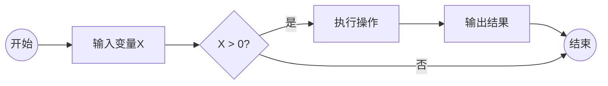
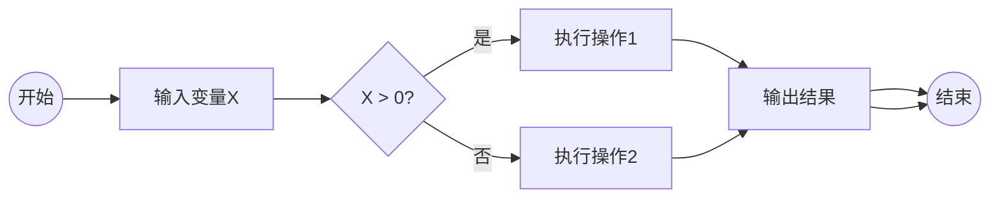
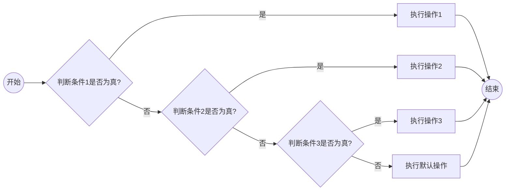
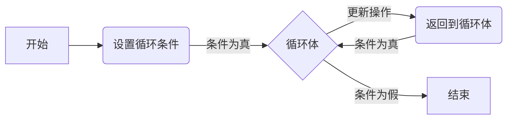
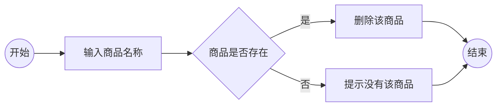
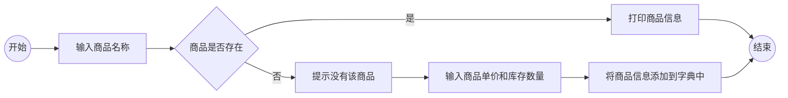
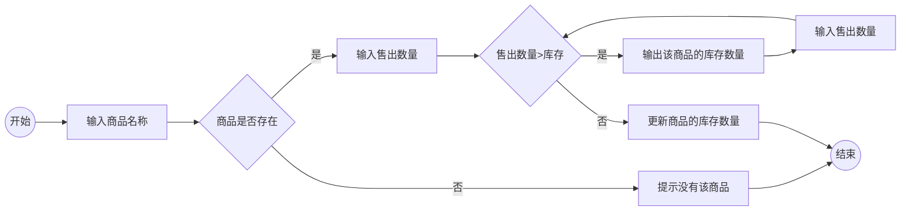

(需要先安装Python环境和jupyter)
# Python培训

## 1. Python基础知识
- 变量：存储各种文件信息和数据
- 数据类型：文本类型数字类型
- 流程控制语句：控制批量处理文件的过程
- 函数：封装需要重复使用的代码
- 模块：办公自动化模块、openpyxl数据处理模块、pandas
### 1.1 Hello Python
print() 函数用于将指定的内容打印到标准输出（通常是控制台）。
#### 1.1.1 打印字符串：
print('Hello!欢迎来到Python世界！')
- 如果你想在字符串中插入一个<font color="red">包含引号的字符</font>，可以：
1) 使用反斜杠转义:print('Hello!yelcone to the python\'s worldi')
2) 使用双引号：print("Hello!yelcone to the python's worldi")
*<font color="red">在Python中，单引号（'）、双引号（"）和三引号（'''或"""）都可以用来表示字符串。</font>*
- 单引号和双引号之间没有实质性的区别，你可以根据个人偏好选择使用其中之一。以下是单引号和双引号的示例：
```python
single_quoted_string = '这是一个单引号字符串'
double_quoted_string = "这是一个双引号字符串"

print(single_quoted_string)
print(double_quoted_string)
```
```python
# 输出结果为：
这是一个单引号字符串
这是一个双引号字符串
```

- 当字符串中有单引号时，该字符串必须用双引号或三引号表示 
```python
string_with_single_quote = "这是一个包含 ' 单引号的字符串"
triple_single_quoted_string = '''这是一个包含 ' 单引号的字符串'''
print(string_with_single_quote)
print(triple_single_quoted_string)
```
```python
# 输出结果为：
这是一个包含 ' 单引号的字符串
这是一个包含 ' 单引号的字符串
```
- 而三引号可以用来创建多行字符串，其中可以包含换行符等特殊字符。三引号可以使用单引号或双引号。以下是三引号的示例：
```python
triple_single_quoted_string = '''这是一个
多行单引号字符串'''
triple_double_quoted_string = """这是一个
多行双引号字符串"""

print(triple_single_quoted_string)
print(triple_double_quoted_string)
```
```python
# 输出结果为：
这是一个
多行单引号字符串
这是一个
多行双引号字符串
```

#### 1.1.2 打印数字：
```python
number = 8900
print(number)
```
输出结果为:
```python
8900
```
*给数字加上引号：*
```python
number = '8900'
print(number)
```
输出结果为:
```python
8900
```

<span style="color:red">8900表示的是数字，是可以进行加减乘除的数字<br>8900'表示的一串由"8"、"9"、"0"、"0"4个字符组成的字符串</span>

#### 1.1.3 打印数学表达式：
```python
# 打印加法表达式
print("加法表达式: 5 + 3")

# 打印减法表达式
print("减法表达式: 5 - 3")

# 打印乘法表达式
print("乘法表达式: 5 * 3")

# 打印除法表达式
print("除法表达式: 5 / 3")

# 打印指数表达式
print("指数表达式: 5 ** 3")

```
```python
# 输出结果为：
加法表达式: 5 + 3
减法表达式: 5 - 3
乘法表达式: 5 * 3
除法表达式: 5 / 3
指数表达式: 5 ** 3
```
#### 1.1.4 打印数学表达式运算结果：
```python
print("加法表达式:", 5 + 3)
print("减法表达式:", 5 - 3)
print("乘法表达式:", 5 * 3)
print("除法表达式:", 5 / 3)
print("指数表达式:", 5 ** 3)
```
```python
# 输出结果为：
加法表达式: 8
减法表达式: 2
乘法表达式: 15
除法表达式: 1.6666666666666667
指数表达式: 125
```
#### 1.1.5 行尾结束符end
*默认情况下，end 参数的值是 '\n'，即换行符。你可以将其更改为其他字符串来指定行尾结束符。*
```python
# 使用感叹号作为行尾结束符
print("Hello, world!", end='!')

# 使用问号作为行尾结束符
print("How are you?", end='?')

# 使用冒号作为行尾结束符
print("This is a sentence.", end=':')

# 使用换行符作为行尾结束符
print("This is another sentence.")

# 使用换行符作为行尾结束符
print("第一行\n第二行\n第三行")

```
```python
# 输出结果为：
Hello, world!!How are you?This is a sentence.:This is another sentence.
第一行
第二行
第三行
```
#### 1.1.6 分隔符
*如果你想要自定义 print() 函数的分隔符，可以使用 sep 参数。默认情况下，sep 参数的值是一个空格字符 ' '。你可以将其更改为其他字符串来指定不同的分隔符。*
```python
# 使用逗号作为分隔符
print("苹果", "橙子", "香蕉", sep=',')

# 使用制表符作为分隔符
print("狗", "猫", "鸟", sep='\t')

# 使用冒号和空格作为分隔符
print("红色", "蓝色", "绿色", sep=': ')

# 使用自定义字符串作为分隔符
print("One", "Two", "Three", sep='---')

# 设置分隔符为逗号，行尾结束符为感叹号
print("苹果", "橙子", "香蕉", sep=',', end=' ')

```
```python
# 输出结果为：
苹果,橙子,香蕉
狗	猫	鸟
红色: 蓝色: 绿色
One---Two---Three
苹果,橙子,香蕉!
```

### 1.2 变量与运算
Python 中的变量是用来存储数据的标识符。它们可以存储不同类型的值，并且可以在程序中进行引用和操作。
<font color="red">引用变量时，确保该变量已经被定义！</font>
- 变量的命名规则：
1) 变量名只能包含字母、数字和下划线。
2) 变量名不能以数字开头。
3) 变量名区分大小写，例如 count 和 Count 是不同的变量。
4) 避免使用 Python 的关键字（if、while、for）作为变量名。
```python
    # 以下是Python的一些关键字列表：
    False      class      finally    is         return
    None       continue   for        lambda     try
    True       def        from       nonlocal   while
    and        del        global     not        with
    as         elif       if         or         yield
    assert     else       import     pass
    break      except     in         raise
```

#### 1.2.1 变量的赋值：
使用赋值运算符 = 可以将值赋给变量。
```python
# 变量赋值
text = "小张的薪资"
salary = 8900
print(text)
print(salary)
print("员工：",text,salary)
```
```python
# 输出结果为：
小张的薪资
8900
员工： 小张的薪资 8900
```
```python
# 变量之间相互赋值
salary = 8900
salary_copy=salary
print(salary_copy)
```
```python
# 输出结果为：
8900
```
```python
# 给变量加上引号
salary_copy= salary
print('salary_copy')
```
```python
# 输出结果为：
salary_copy
```
#### 1.2.2 变量的特性
变量每次只能赋值一个值，要赋值另一个值时，当前这个值就会被替换掉。
```python
text=“小张的薪资”
text=8900
print(text)
```
```python
# 输出结果为：
8900
```
#### 1.2.3 巧用变量
```python
# 原message_1和message_2的值
message_1 ="25岁 男 数据分析师"
message_2 ="29岁 男 课程设计师"
print('小张:',message_1)
print('小李:',message_2)
```
```python
# 输出结果为：
小张: 25岁 男 数据分析师
小李: 29岁 男 课程设计师
```
```python
# 将message_1和message_2中的值互换
message_1 ="25岁 男 数据分析师"
message_2 ="29岁 男 课程设计师"
message_1,message_2 = message_2,message_1
print('小张:',message_1)
print('小李:',message_2)
```
```python
# 输出结果为：
小张: 29岁 男 课程设计师
小李: 25岁 男 数据分析师
```
#### 1.2.4 数据类型
- *整数（int）：* 表示整数值，例如 1、2、-3 等。
- *浮点数（float）* ：表示带有小数部分的数值，例如 3.14、2.71828 等。
- *字符串（str）：* 表示文本数据，由字符序列组成，使用单引号或双引号括起来，例如 'hello'、"world" 等。
- *布尔值（bool）：* 表示逻辑值，可以是 True（真）或 False（假），用于条件判断和控制流程。
- *列表（list）：* 表示一组有序的元素，可以包含不同类型的对象，使用方括号括起来，例如 [1, 2, 3]、['apple', 'banana', 'orange'] 等。
- *元组（tuple）：* 类似于列表，但是元组是不可变的，即不能修改其元素的值。使用圆括号括起来，例如 (1, 2, 3)、('a', 'b', 'c') 等。
- *集合（set）：* 表示一组唯一且无序的元素，用于去重和数学运算，使用大括号或 set() 函数创建，例如 {1, 2, 3}、set([4, 5, 6]) 等。
- *字典（dict）：* 表示键值对的集合，每个元素由一个键和对应的值组成，键是唯一的且不可变，使用大括号或 dict() 函数创建，例如 {'name': 'Alice', 'age': 25}、dict(zip(['a', 'b', 'c'], [1, 2, 3])) 等。
- *字节串（bytes）：* 表示二进制数据。
- *字节数组（bytearray）：* 类似于字节串，但是是可变的。
- *空值（None）：* 表示空对象或缺失值。

#### 1.2.5 算术运算符
- *加减乘除*
    **加法**
    ```python
    # 加法运算：使用加法运算符（+）可以将两个数相加，并返回它们的和。
    a = 5
    b = 3
    c = a + b
    print(c)  # 输出结果 c，即 8

    # 自加运算：自加运算符（+=）结合了加法运算和赋值运算。它将一个变量与另一个值相加，并将结果赋给变量本身。
    a = 5
    b = 3
    a += b  # 等同于 a = a + b
    print(a)  # 输出结果 a，即 8
    ```
    **减法**
    ```python
    # 减法运算：使用减法运算符可以将一个数减去另一个数，并返回它们的差。
    a = 5
    b = 3
    c = a - b
    print(c)  # 输出结果 c，即 2

    # 自减运算：自减运算符（-=）结合了减法运算和赋值运算。它可以将一个变量减去另一个值，并将结果赋给该变量本身。
    a = 5
    b = 3
    a -= b  # 等同于 a = a - b
    print(a)  # 输出结果 a，即 2
    ```

    **乘法**
    ```python
    # a * b 表示将变量 a 的值乘以变量 b 的值，并将结果赋值给变量 c
    a = 5
    b = 3
    c = a * b
    print(c)  # 输出结果 c，即 15
    ```

    **除法**
    ```python
    # 计算小张的日平均新资，8900加100加上2乘1000的总工资，再除以22天
    sa1ary=(8900+100+2*1000)/22
    print(sa1ary) # salary的值为500.0

    a = 10
    b = 3
    # 使用普通除法运算符（/），结果为浮点数
    c = a / b  # c 的值为 3.3333333333333335
    
    # 使用整除运算符（//），结果为整数
    d = a // b  # d 的值为 3

    # 使用取余运算符（%），得到除法的余数
    e = a % b  # e 的值为 1
    ```
    **幂运算**
    ```python
    # 幂运算使用双星号（**）符号执行一个数的指数操作
    a = 2
    b = 3
    c = a ** b
    print(c)  # 输出结果 c，即 8
    ```

### 1.3 输入数据与数据类型
#### 1.3.1 输入函数
input()函数是Python中用于从用户获取输入的内置函数。它会显示一个提示信息，并等待用户在控制台输入内容，然后将输入内容作为字符串返回给程序。
```python
# 使用 input() 函数的一般语法如下：
variable = input(prompt)
# 其中，prompt 是一个可选的参数，用于显示给用户的提示信息。用户在控制台输入的内容会被存储在变量 variable 中。

# 用input()函数接收从键盘输入的小张的基本新资
salary = input()
# 运行程序时，弹出一个输入框，输入8900，按下回车
```
```python
# 输出结果为：
8900
```
*jupyter编辑器：input()函数默认输出接收的内容*
*其他编辑器：input()接收的内容须通过print()输出*
```python
name = input("请输入您的名字：")
print("您好，" + name)
# 当运行这段代码时，控制台会显示 "请输入您的名字：" 提示信息，然后等待用户输入名字。用户输入名字后按下回车键，
# 输入内容就会存储在 name 变量中，并打印出类似于 "您好，[用户输入的名字]" 的消息。
```
<span style="color:red;">请注意，在使用 input() 函数时，返回的始终是字符串类型的数据。如果需要将输入的内容转换为其他类型（如整数或浮点数），可以使用相应的类型转换函数，例如 int() 或 float()。</span>

#### 1.3.2 type()函数
type() 函数是Python中用于获取变量或值的类型信息的内置函数。它返回一个表示对象类型的值，通常是一个内置类型或自定义类的名称。
```python
# 使用 type() 函数的一般语法如下：
type(object)
# 其中，object 是要获取类型的对象或值。
```
```python
x = 10
y = 3.14
z = "Hello"

print(type(x))   # 输出：<class 'int'>
print(type(y))   # 输出：<class 'float'>
print(type(z))   # 输出：<class 'str'>

```
#### 1.3.3 类型转换函数
1. int()：用于将一个数值或字符串转换为整数类型。
```python
x = int(3.14)  # x 的值为 3
y = int("5")   # y 的值为 5
```

2. float()：用于将一个数值或字符串转换为浮点数类型。
```python
x = float(3)    # x 的值为 3.0
y = float("5.8")  # y 的值为 5.8
```

3. str()：用于将其他数据类型转换为字符串类型。
```python
x = str(10)       # x 的值为 "10"
y = str(3.14)     # y 的值为 "3.14"
z = str(True)     # z 的值为 "True"
```

#### 1.3.4 eval() 函数
eval()函数是Python的内置函数之一，用于将字符串作为表达式进行求值，并返回计算结果。
```python
# eval() 函数的一般语法如下：
eval(expression, globals=None, locals=None)

# 其中，expression 是一个字符串，表示要求值的表达式。
# globals 和 locals 是可选参数，用于指定全局和局部变量的命名空间。
# 如果没有提供这两个参数，则使用当前调用 eval() 函数的命名空间。
```
1. 求值简单的数学表达式：
```python
result = eval("2 + 3 * 4")   # result 的值为 14
```
2. 给定变量，计算表达式的值：
```python
x = 10
y = 5
result = eval("x + y")       # result 的值为 15
```
3. 使用 eval() 处理更复杂的表达式：
```python
expression = "(x + y) * 2"
result = eval(expression)    # result 的值为 30
```
### 1.4 字符串的提取与运算
#### 1.4.1 索引和切片
1. 索引
- 字符串的索引从 0 开始，表示第一个字符。负数索引从字符串的末尾开始，表示倒数第一个字符。
- 使用方括号 [ ] 加上索引来访问特定位置的字符。
- 如果索引超出字符串的范围，将引发 IndexError 错误。

```python
# 提取学符串“李玲 女 班主任”中的性别“女“这个学符
string = "李玲 女 班主任"

print(string[3])     # Output: 女
```
|  访问字符 |  李 | 玲  | ' '  | 女  | ' '  | 班  | 主  | 任  |
| ------------ | ------------ | ------------ | ------------ | ------------ | ------------ | ------------ | ------------ | ------------ |
| 正向索引  |  0 |  1 |  2 |  3 | 4  |  5 |  6 | 7  |
| 反向索引  |  -8 |  -7 | -6  |  -5 | -4  | -3  |  -2 | -1  |
2. 切片
- 切片允许您提取字符串的一部分。它使用冒号 : 分隔起始索引和结束索引。
- 切片时包含起始索引对应的字符，但不包含结束索引对应的字符。
- 如果不指定起始索引，默认为字符串的开头；如果不指定结束索引，默认为字符串的末尾。
- 可以使用负数索引进行切片。
切片的基本格式是在方括号中使用起始索引、结束索引和可选的步长来提取字符串的子串。下面是切片操作的基本格式：
`string[start:end:step]`
start：起始索引，表示切片的开始位置。
end：结束索引，表示切片的结束位置（不包含在切片结果中）。
step：可选参数，表示切片的步长，默认为 1。
<span style="color:red;"> 需要注意的是，切片时包含起始索引对应的字符，但不包含结束索引对应的字符。</span>

```python
# 同时指定多个连续的索引值，来访问多个连续的字符
string = "李玲 女 班主任"

print(string[0:4])     # Output: 李玲 女
```

```python
# 使用反向索引
string = "李玲 女 班主任"

print(string[-8:-6])     # Output: 李玲
```
<span style="color:red;">需要注意的是，索引和切片操作返回的结果仍然是字符串</span>

- 在切片操作中，如果省略了起始索引或者结束索引，Python 会自动使用默认值：
如果省略了起始索引，则默认起始索引为字符串的开头（索引0）。
如果省略了结束索引，则默认结束索引为字符串的末尾（最后一个字符的后面）。
```python 
string = "李玲 女 班主任"

print(string[:4])     # Output: 李玲 女
print(string[5:])     # Output: 班主任
```
#### 1.4.2 len()函数
len() 函数是Python内置函数之一，用于返回一个对象（如字符串、列表、元组等）的长度或元素个数。
```python
string = "Hello, World!"
length = len(string)
print(length)   # Output: 13
```

#### 1.4.3 字符串运算
1. 字符串连接：可以使用 + 运算符将两个字符串连接起来。
```python
str1 = "Hello"
str2 = "World"
result = str1 + ", " + str2
print(result)   # Output: Hello, World
```

2. 重复字符串：可以使用 * 运算符将一个字符串重复多次。
```python
str1 = "Hello"
result = str1 * 3
print(result)   # Output: HelloHelloHello
```

3. 获取字符串长度：可以使用 len() 函数获取字符串的长度。
```python
string = "Hello, World!"
length = len(string)
print(length)   # Output: 13
```

4. 切片操作：可以使用切片操作提取字符串的子串。
```python
string = "Hello, World!"
sub_string = string[7:12]
print(sub_string)   # Output: World
```

5. 字符串格式化：可以使用字符串的 format() 方法或者f-string来进行字符串的格式化。
```python
name = "Alice"
age = 25
result = "My name is {} and I am {} years old.".format(name, age)
print(result)   # Output: My name is Alice and I am 25 years old.

# 或者使用 f-string 格式化字符串
result = f"My name is {name} and I am {age} years old."
print(result)   # Output: My name is Alice and I am 25 years old.
```

#### 1.4.4 in 成员运算符
in 是一个成员运算符，用于检查一个值是否存在于某个集合（如字符串、列表、元组、集合或字典）中。它返回一个布尔值，如果值存在于集合中，则返回 True，否则返回 False。
*检查字符串中的字符是否存在：*
```python
string = "Hello, World!"
print("H" in string)    # Output: True
print("x" in string)    # Output: False
```
#### 1.4.5 not in
 not in是成员运算符的一个变种，与 in 相反。它用于检查一个值是否不存在于某个集合（如字符串、列表、元组、集合或字典）中。它返回一个布尔值，如果值不存在于集合中，则返回 True，否则返回 False。
*检查字符串中的字符是否不存在：*
```python
string = "Hello, World!"
print("H" not in string)     # Output: False
print("x" not in string)     # Output: True
```
### 1.5 字符串常用方法
#### 1.5.1 字符串格式化
字符串格式化是指在输出或拼接字符串时，根据一定的格式规则将变量或表达式的值插入到字符串中的特定位置。
在Python中，字符串格式化有多种方式，以下是其中几种常用的方法：
1. 使用占位符：可以使用占位符（例如%s、%d等）来表示要插入的值的类型，并将变量或表达式作为参数传递给字符串的%操作符。
```python 
name = "Alice"
age = 25
message = "My name is %s and I'm %d years old." % (name, age)
print(message)
```
```python 
# 输出结果：
My name is Alice and I'm 25 years old.
```
2. 使用format方法：可以使用字符串的format方法，通过花括号{}和位置索引或关键字来指定插入的值。
```python 
name = "Bob"
age = 30
message = "My name is {} and I'm {} years old.".format(name, age)
print(message)
```
```python 
# 输出结果：
My name is Bob and I'm 30 years old.
```
```python
# 通过在花括号 {} 内添加索引号来指定要插入的变量的顺序
name = "Alice"
age = 25
country = "China"

print("My name is {1}, I am {0} years old, and I am from {2}.".format(age, name, country))
# Output: My name is Alice, I am 25 years old, and I am from China.
```
```python
# 通过在花括号 {} 内添加格式说明符来指定值的格式
# 以下是一些常用的格式说明符示例：
# {:d}：整数类型
# {:f}：浮点数类型
# {:s}：字符串类型
# {:x}：十六进制整数类型
# {:b}：二进制整数类型
num = 42
pi = 3.1415926
name = "Alice"

print("My number is {:d}".format(num))
# Output: My number is 42

print("The value of pi is {:.2f}".format(pi))
# Output: The value of pi is 3.14

print("Hello, {}!".format(name))
# Output: Hello, Alice!

# {:d} 表示整数类型，{:.2f} 表示浮点数类型并保留两位小数，{:s} 表示字符串类型。
```
```python
num = 42

print("My number is {:>5}".format(num))
# Output: My number is    42

print("My number is {:0>5}".format(num))
# Output: My number is 00042

# {:>5} 表示向右对齐，并使用空格填充到宽度为 5，{:0>5} 表示向右对齐，并使用零填充到宽度为 5。
```
3. 使用f-string（格式化字符串字面值）：在Python 3.6及以上版本中，可以使用以f开头的字符串，在其中直接嵌入变量或表达式，并使用花括号{}来表示插入点。
```python
name = "Charlie"
age = 35
message = f"My name is {name} and I'm {age} years old."
print(message)
```
```python
# 输出结果：
My name is Charlie and I'm 35 years old.
```
#### 1.5.2 replace() 函数
replace() 函数是字符串的内置方法，用于替换字符串中的子字符串。它接受两个参数：旧子字符串和新子字符串，并返回一个替换后的新字符串。
以下是 replace() 函数的语法：
*original_string：原始的字符串，需要被替换的字符串。*
*old_str：需要被替换的子字符串。*
*new_str：用于替换的新子字符串。*
*new_string：替换后的新字符串。*
`new_string = original_string.replace(old_str, new_str)`
```python
# 将原始字符串 text 中的所有 "Hello" 替换为 "Hi"，并将结果存储在 new_text 中。
text = "Hello, World! Hello, Python!"
new_text = text.replace("Hello", "Hi")

print(new_text)
# Output: Hi, World! Hi, Python!
```
<span style="color:red;">需要注意的是，replace() 方法返回的是一个新的字符串，原始字符串不会受到影响。另外，replace() 方法是区分大小写的，如果要进行大小写不敏感的替换，可以先使用 .lower() 或 .upper() 方法转换大小写。</span>

```python
# 先将字符串转换为小写，然后再进行替换。
text = "Hello, World! hello, python!"
new_text = text.lower().replace("hello", "Hi")

print(new_text)
# Output: hi, world! hi, python!
```
#### 1.5.3 split() 函数
split() 函数是字符串的内置方法，用于将一个字符串拆分成多个子字符串，并以列表的形式返回这些子字符串。
以下是 split() 函数的语法：
*original_string：原始的字符串，需要被拆分的字符串。*
*separator：可选参数，用于指定拆分字符串的分隔符，默认为空白字符（空格、制表符、换行符等）。*
`string_list = original_string.split(separator)`
```python
# 使用 split() 方法将字符串 text 拆分成多个子字符串，并将结果存储在列表中
text = "Hello, World! This is Python."

# 使用空格作为分隔符拆分字符串
words = text.split()

print(words)
# Output: ['Hello,', 'World!', 'This', 'is', 'Python.']


# 使用逗号作为分隔符拆分字符串
phrases = text.split(',')

print(phrases)
# Output: ['Hello', ' World! This is Python.']
```
```python
# 通过指定 maxsplit 参数来限制拆分的次数
text = "one two three four five"

# 拆分字符串，最多拆分两次
words = text.split(maxsplit=2)

print(words)
# Output: ['one', 'two', 'three four five']
```
### 1.6 分岔路口
#### 1.6.1 if分支结构
- if单分支结构
if 单分支结构是 if 条件语句的一种形式，它只包含一个 if 语句，用于在给定条件为真时执行相应的代码块。
以下是 if 单分支结构的基本语法：
```python
if condition:
    # 如果条件为真，则执行这里的代码
```
在单分支结构中，condition 是一个表达式或值，用于判断条件是否成立。如果条件成立（即为真），则执行代码块；如果条件不成立（即为假），则跳过代码块。
```python
# 根据条件判断年龄是否大于等于 18 岁。如果年龄大于等于 18 岁，则打印一条消息。
age = 25

if age >= 18:
    print("您已经成年，可以参加选举。")

```


*比较运算符*
<style>
table {
    border-collapse: collapse;
    width: 100%;
}
th {
    background-color: lightblue;
    color: white;
    font-weight: bold;
    padding: 8px;
    text-align: left;
}
td {
    padding: 8px;
    border: 1px solid #ddd;
}
</style>

<table>
<tr>
    <th>运算符</th>
    <th>描述</th>
    <th>示例</th>
    <th>结果</th>
</tr>
<tr>
    <td>==</td>
    <td>等于</td>
    <td>5 == 5</td>
    <td>True</td>
</tr>
<tr>
    <td>!=</td>
    <td>不等于</td>
    <td>5 != 3</td>
    <td>True</td>
</tr>
<tr>
    <td>&gt;</td>
    <td>大于</td>
    <td>7 &gt; 3</td>
    <td>True</td>
</tr>
<tr>
    <td>&lt;</td>
    <td>小于</td>
    <td>2 &lt; 4</td>
    <td>True</td>
</tr>
<tr>
    <td>&gt;=</td>
    <td>大于等于</td>
    <td>6 &gt;= 6</td>
    <td>True</td>
</tr>
<tr>
    <td>&lt;=</td>
    <td>小于等于</td>
    <td>4 &lt;= 3</td>
    <td>False</td>
</tr>
</table>

<span style="color:red;">注：=表示赋值符号，==表示等于符号</span>

- if双分支结构
if双分支结构是一种常见的编程控制结构，用于在程序中根据条件执行不同的操作。它基于一个条件表达式，如果条件为真，则执行一个代码块（通常称为"if块"或"if分支"），如果条件为假，则执行另一个代码块（通常称为"else块"或"else分支"）。
以下是描述if双分支结构的一般形式：
```python
if 条件:
    # 如果条件为真，则执行这个代码块
    执行操作1
else:
    # 如果条件为假，则执行这个代码块
    执行操作2
```
在 if 双分支结构中，首先判断条件的真假。如果条件为真，则执行代码块中的操作1；如果条件为假，则跳过代码块中的操作1，执行 else 块中的操作2。
```python
# 如果成绩大于等于90，条件score >= 90为真，那么程序将执行if块中的操作，即打印出"优秀"。
# 如果条件为假，即成绩小于90，那么程序将跳过if块，执行else块中的操作，即打印出"良好"。
score = float(input("请输入您的成绩: "))

if score >= 90:
    print("优秀")
else:
    print("良好")
```

- if elif..多分支结构
if-elif-else结构可以处理多个条件，并根据条件的判断结果选择相应的代码块执行。
以下是描述if-elif-else多分支结构的一般形式：
```python
if 条件1:
    # 如果条件1为真，则执行这个代码块
    执行操作1
elif 条件2:
    # 如果条件1为假而条件2为真，则执行这个代码块
    执行操作2
elif 条件3:
    # 如果条件1和条件2都为假而条件3为真，则执行这个代码块
    执行操作3
...
else:
    # 如果所有条件都为假，则执行这个代码块
    执行默认操作
```
在if-elif-else结构中，首先根据条件1的判断结果来确定是否执行操作1。如果条件1为真，则执行操作1，并跳过后续的elif和else块；如果条件1为假，则继续检查条件2，如果条件2为真，则执行操作2，并跳过后续的elif和else块；以此类推，直到找到第一个为真的条件，并执行相应的操作；如果所有条件都为假，则执行else块中的操作，作为默认操作。
```python
score = float(input("请输入您的成绩: "))

if score >= 90:
    print("优秀")
elif score >= 80:
    print("良好")
elif score >= 60:
    print("及格")
else:
    print("不及格")
```

#### 1.6.2 分支结构嵌套
分支嵌套是指在一个分支结构中嵌套另一个分支结构，以实现更复杂的条件判断和操作执行。以下是一个展示分支嵌套结果的示例：
```python
score = float(input("请输入您的成绩: "))

if score >= 60:
    if score >= 90:
        print("优秀")
    elif score >= 80:
        print("良好")
    else:
        print("及格")
else:
    print("不及格")
```
在这个示例中，首先程序会要求用户输入一个成绩，并将其保存在变量 score 中。

接下来，程序使用外部的 if 结构进行整体判断，即判断是否达到及格分数线（60 分）。如果满足外部的条件，程序将进入外部的 if 块。

在外部的 if 块中，又嵌套了一个内部的 if-elif-else 结构。在内部结构中，首先判断是否达到优秀分数线（90 分），如果是，则打印出"优秀"；如果不是，则继续判断是否达到良好分数线（80 分），如果是，则打印出"良好"；如果也不是，则执行内部结构的 else 块，打印出"及格"。

如果外部的 if 结构中的条件判断为假，即成绩低于及格分数线，那么程序将跳过外部的 if 块，直接执行外部结构的 else 块，打印出"不及格"。

#### 1.6.3 逻辑运算符
逻辑运算符用于在条件判断中组合多个条件，并根据这些条件的逻辑关系得出最终的判断结果。在Python中，常用的逻辑运算符包括以下三个：
1. 与运算符（and）：如果两个条件都为真，则返回真；否则返回假。
2. 或运算符（or）：如果两个条件中至少有一个为真，则返回真；否则返回假。
3. 非运算符（not）：如果条件为真，则返回假；如果条件为假，则返回真。
以下是逻辑运算符的使用示例：
```python
x = 5
y = 10

# 与运算符示例
if x > 0 and y > 0:
    print("x和y都大于0")

# 或运算符示例
if x > 0 or y > 0:
    print("x或者y大于0")

# 非运算符示例
if not x > 0:
    print("x不大于0")
```

### 1.7 有限次的for循环
#### 1.7.1 for 循环
for 循环是一种常用的循环结构，用于迭代遍历可迭代对象（如列表、元组、字符串等）中的元素。通过 for 循环，可以重复执行特定的代码块，直到迭代结束。
以下是 for 循环的基本语法：
```python
for 变量 in 可迭代对象:
    # 执行的代码块
```
```python
# 遍历字符串
string = "你好，世界！"

for char in string:
    print(char)
```
输出结果为：
```python
你
好
，
世
界
！
```
```python
# 遍历列表
fruits = ['apple', 'banana', 'cherry']

for fruit in fruits:
    print(fruit)
```
输出结果为：
```python
apple
banana
cherry
```
#### 1.7.2 range()函数
range() 是一个内置函数，用于创建一个整数序列。它可以接受一个或多个参数，并生成一个按指定范围的整数序列。
range() 函数的常见用法有三种形式：
1. range(stop)
这种形式只包含一个参数 stop，表示生成从 0 开始到 stop-1 的整数序列。
```python
for i in range(5):
    print(i)
```
输出：
```python
0
1
2
3
4
```
2. range(start, stop)
这种形式包含两个参数 start 和 stop，表示生成从 start 开始到 stop-1 的整数序列
```python
for i in range(2, 6):
    print(i)
```
输出：
```python 
2
3
4
5
```
3. range(start, stop, step)
这种形式包含三个参数 start、stop 和 step，表示以指定的步长 step 从 start 开始生成整数序列，直到不超过 stop-1。
```python
for i in range(1, 10, 2):
    print(i)
```
输出：
```python
1
3
5
7
9
```
<font color="red">需要注意的是，range() 函数生成的整数序列是左闭右开的，即不包括 stop 参数指定的值。</font>

#### 1.7.3 for...if...嵌套
当需要在嵌套的 for 循环中使用 if 语句进行条件筛选时，可以按照以下结构来编写代码：
```python
for outer_item in outer_sequence:
    # 外部循环操作
    
    for inner_item in inner_sequence:
        # 内部循环操作
        
        if condition:
            # 符合条件的处理逻辑
        else:
            # 不符合条件的处理逻辑
```
以下是一个示例，演示如何使用嵌套的 for 循环和 if 语句：
```python
# 通过嵌套的 for 循环遍历了 colors 和 sizes 列表，并根据特定条件进行不同的输出
colors = ['red', 'blue', 'green']
sizes = ['S', 'M', 'L']

for color in colors:
    for size in sizes:
        if color == 'blue' and size == 'M':
            print("Found blue M: color =", color, "size =", size)
        elif color == 'green':
            print("Found green: color =", color, "size =", size)
        else:
            print("Not found: color =", color, "size =", size)
```
输出：
```python
Not found: color = red size = S
Not found: color = red size = M
Not found: color = red size = L
Found blue M: color = blue size = M
Not found: color = blue size = S
Not found: color = blue size = L
Found green: color = green size = S
Found green: color = green size = M
Found green: color = green size = L
```
### 1.8 不限次的while循环
#### 1.8.1 while循环
while 循环是一个在给定条件为真的情况下重复执行代码块的控制结构。当条件不再满足时，循环停止。
```python
while condition:
    # 循环体
    
    # 更新条件
```
在每次循环迭代开始前，首先检查条件是否为真。如果条件为真，则执行循环体中的代码。然后，根据需要更新条件。如果更新后的条件仍然为真，循环会继续进行，直到条件变为假才停止。

```python
# 使用 while 循环计算数字的阶乘
num = 5
factorial = 1

while num > 0:
    factorial *= num
    num -= 1

print("Factorial:", factorial)
```
在上述示例中，我们使用 while 循环来计算给定数字 num 的阶乘。循环体中，将当前的 num 与 factorial 相乘，并将结果保存在 factorial 中。然后，将 num 减去 1，以便在下一次迭代时处理下一个数字。循环会在 num 不大于 0 的条件下一直进行。
输出：
```python
Factorial: 120
```
#### 1.8.2 while和for循环
while 循环和 for 循环是两种常见的循环结构，它们在使用方式和适用场景上有一些区别。

1. 使用方式：

while 循环：在每次迭代开始前，先判断条件是否为真，如果条件为真，则执行循环体中的代码，然后更新条件。如果条件仍然为真，则继续下一次迭代。因此，while 循环适用于不确定迭代次数、需要根据条件动态控制循环的情况。
for 循环：基于一个可迭代对象（如列表、元组或字符串）进行迭代，每次迭代从可迭代对象中取出一个元素，并执行循环体中的代码。for 循环适用于已知迭代次数的情况。

2. 控制变量：

while 循环：需要手动声明并更新控制条件的变量。在循环体内部需要显式地更新条件，以免无限循环。
for 循环：无需手动声明或更新控制变量，迭代过程由 for 循环自动管理。每次迭代时，会自动从可迭代对象中选择一个元素作为循环变量，直到迭代完所有元素。

3. 应用场景：

<font color="red"> while 循环：适用于那些需要根据条件灵活控制迭代次数的情况。</font>例如，处理不确定条件的输入，实现游戏循环，或者在特定条件满足时执行某项任务。
<font color="red"> for 循环：适用于已知迭代次数的情况。</font>当你需要对一个集合中的每个元素执行相同的操作时，使用 for 循环更加方便简洁。例如，遍历列表、计算序列的总和或平均值。
以下是一个使用 while 循环和 for 循环的示例，展示了它们的不同之处：
```python
count = 0
# 使用 while 循环
while count < 5:
    print("Count:", count)
    count += 1
print("-------------------")
# 使用 for 循环
for i in range(5):
    print("Count:", i)
```
输出：
```python
Count: 0
Count: 1
Count: 2
Count: 3
Count: 4
-------------------
Count: 0
Count: 1
Count: 2
Count: 3
Count: 4
```
#### 1.8.3 break语句
break 语句是一种在循环中使用的控制语句，用于立即终止当前所在的循环，跳出循环体。<font color="blue"> 当程序执行到 break 语句时，程序会立即退出循环，不再执行循环体中 break 语句之后的代码，而是继续执行循环体之后的代码。</font>
break 语句通常与条件语句结合使用，用于根据特定条件提前跳出循环，避免不必要的迭代。
```python
while True:
    user_input = input("请输入一个数字（输入'q'退出）：")

    if user_input == 'q':
        print("已退出循环")
        break

    number = int(user_input)
    print("平方:", number**2)

print("循环结束")
```
上述示例中，使用 while 循环来接受用户输入的数字，并计算输入数字的平方。如果用户输入的是字符 'q'，则使用 break 语句终止循环。否则，将用户输入的字符串转换为整数，并计算平方并输出。这个过程将持续进行，直到用户输入了 'q'。
输出示例：
```python
请输入一个数字（输入'q'退出）：3
平方: 9
请输入一个数字（输入'q'退出）：5
平方: 25
请输入一个数字（输入'q'退出）：q
已退出循环
循环结束
```
#### 1.8.4 continue语句
continue 语句是一种在循环中使用的控制语句，用于跳过当前迭代中剩余的代码，直接进入下一次迭代。<font color="blue"> 当程序执行到 continue 语句时，程序会立即停止当前迭代中 continue 语句之后的代码，并开始下一次循环迭代。</font>
continue 语句通常与条件语句结合使用，用于在满足特定条件时跳过某些指令，只执行下一次迭代。
```python
for i in range(1, 11):
    if i % 2 == 0:
        continue
    print(i)
```
上述示例中，使用 for 循环从 1 到 10 进行迭代。在每次迭代中，使用条件判断 if i % 2 == 0 来判断当前迭代的数值 i 是否为偶数。如果是偶数，那么 continue 语句将会跳过 print(i) 的执行，直接进行下一次迭代。如果是奇数，那么 print(i) 将会被执行。
输出示例：
```python
1
3
5
7
9
```
### 1.9 数据结构-列表
#### 1.9.1 列表
列表是Python中最常用的数据结构之一，用于存储一组有序的元素。
1. 创建列表：使用方括号 [] 来创建一个空列表，或者在方括号内放置逗号分隔的元素来初始化一个含有元素的列表
```python
empty_list = []
numbers = [1, 2, 3, 4, 5]
fruits = ["apple", "banana", "orange"]
mixed_list = [1, "apple", True, 2.5]
```
2. 一维列表:维列表是最简单的列表形式，只包含一组有序的元素。它是一个线性结构，元素按顺序排列，每个元素都有一个唯一的索引。
```python
# 创建一维列表
numbers = [1, 2, 3, 4, 5]
fruits = ["apple", "banana", "orange"]
```
一维列表中的元素按照索引从0开始递增，可以通过索引访问和修改其中的元素。
```python
print(numbers[0])  # 输出: 1
numbers[2] = 10
print(numbers)  # 输出: [1, 2, 10, 4, 5]
```
3. 二维列表：二维列表是一种表格形式的数据结构，其中的元素使用行和列进行排列。通常使用列表的嵌套来表示。
```python
# 创建二维列表
matrix = [[1, 2, 3],
          [4, 5, 6],
          [7, 8, 9]]
```
在二维列表中，每个元素由两个索引确定，第一个索引表示所在的行，第二个索引表示所在的列。可以通过双重索引访问和修改元素。
```python
print(matrix[0][0])  # 输出: 1
matrix[1][2] = 10
print(matrix)  # 输出: [[1, 2, 3], [4, 5, 10], [7, 8, 9]]
```
#### 1.9.2 索引和切片
1. 索引
列表中的元素通过索引进行访问，索引表示元素在列表中的位置。<font color="red"> 索引从0开始，依次递增。</font>
```python
fruits = ['苹果', '香蕉', '橙子', '葡萄', '西瓜', '草莓', '梨子']

print(fruits[0])    # 输出: '苹果'
print(fruits[3])    # 输出: '葡萄'
print(fruits[-1])   # 输出: '梨子'
```
2. 切片
切片用于获取列表中的一个子列表，可以通过指定起始索引和结束索引来定义切片。切片操作符是冒号 :。
在切片操作中，第一个索引（起始索引）指定了切片的起始位置（包含），第二个索引（结束索引）指定了切片的结束位置（不包含）。还可以提供第三个索引（步长），用于指定切片的步长，默认为1。
```python
fruits = ['苹果', '香蕉', '橙子', '葡萄', '西瓜', '草莓', '梨子']
print(fruits[2:5])    # 输出: ['橙子', '葡萄', '西瓜']（包含起始索引2，不包含结束索引5）
print(fruits[:3])     # 输出: ['苹果', '香蕉', '橙子']（从开头到索引2的子列表）
print(fruits[4:])     # 输出: ['西瓜', '草莓', '梨子']（从索引4到末尾的子列表）
print(fruits[::2])    # 输出: ['苹果', '橙子', '西瓜', '梨子']（每隔一个元素取一个子列表）
print(fruits[::-1])   # 输出: ['梨子', '草莓', '西瓜', '葡萄', '橙子', '香蕉', '苹果']（倒序排列的列表）
```
#### 1.9.3 列表的操作
1. 列表的长度
列表的长度是指列表中元素的个数。在Python中，可以使用内置函数len()来获取列表的长度。
```python
my_list = [1, 2, 3, 4, 5]
length = len(my_list)
print(length)  # 输出：5
```
对于二维列表，我们可以分别获取其外层列表和内层列表的长度。
外层列表的长度表示二维列表中含有多少个内层列表，可以使用len()函数来获取外层列表的长度。而内层列表的长度表示每个内层列表中含有多少个元素，同样可以使用len()函数来获取内层列表的长度。
```python
my_list = [[1, 2, 3], [4, 5, 6], [7, 8, 9]]
outer_length = len(my_list)
print("外层列表长度:", outer_length)  # 输出：外层列表长度: 3

inner_length = len(my_list[0])
print("内层列表长度:", inner_length)  # 输出：内层列表长度: 3
```
2. 修改元素
- 使用索引修改单个元素
```python
# 将索引为2的元素从原来的3修改为10
my_list = [1, 2, 3, 4, 5]
my_list[2] = 10
print(my_list)  # 输出：[1, 2, 10, 4, 5]
```
- 使用切片修改多个元素
```python
# 将索引为1到3的元素从原来的[2, 3, 4]修改为[10, 20, 30]
my_list = [1, 2, 3, 4, 5]
my_list[1:4] = [10, 20, 30]
print(my_list)  # 输出：[1, 10, 20, 30, 5]
```
3. 添加元素
- 使用append()方法添加单个元素到列表末尾
```python
# 使用append()方法将元素4添加到列表的末尾
my_list = [1, 2, 3]
my_list.append(4)
print(my_list)  # 输出：[1, 2, 3, 4]
```
- 使用extend()方法添加多个元素到列表末尾
```pyhton
# 使用extend()方法将包含多个元素的列表添加到原始列表的末尾
my_list = [1, 2, 3]
my_list.extend([4, 5, 6])
print(my_list)  # 输出：[1, 2, 3, 4, 5, 6]
```
- 使用"+"操作符连接两个列表
```python
my_list = [1, 2, 3]
new_elements = [4, 5, 6]
my_list = my_list + new_elements
print(my_list)  # 输出：[1, 2, 3, 4, 5, 6]
```
4. 检索元素
```python
my_list = [1, 2, 3, 4, 5]

# 使用 in 运算符检查元素是否存在
is_present = 3 in my_list
print(is_present)  # 输出：True

is_present = 6 in my_list
print(is_present)  # 输出：False

# 使用 not in 运算符检查元素是否不存在
is_absent = 3 not in my_list
print(is_absent)  # 输出：False

is_absent = 6 not in my_list
print(is_absent)  # 输出：True
```
5. 删除元素
- 使用del语句删除指定索引处的元素
```python
my_list = [1, 2, 3, 4, 5]
del my_list[2]
print(my_list)  # 输出：[1, 2, 4, 5]
```
- 使用remove()方法删除列表中的指定元素
```python
my_list = [1, 2, 3, 4, 5]
my_list.remove(3)
print(my_list)  # 输出：[1, 2, 4, 5]
```
- 使用pop()方法删除指定索引处的元素，并将其返回
```python
my_list = [1, 2, 3, 4, 5]
removed_element = my_list.pop(2)
print(removed_element)  # 输出：3
print(my_list)  # 输出：[1, 2, 4, 5]
```
*del语句适合根据索引删除元素，remove()方法适合根据元素的值删除元素，而pop()方法既可以根据索引删除元素，又可以将其返回。*
6. 列表排序
- 使用列表的sort()方法对列表进行排序
```python
# 使用sort()方法对列表进行排序。结果会直接修改原始列表，使其按升序排列。
my_list = [3, 1, 4, 2, 5]
my_list.sort()
print(my_list)  # 输出：[1, 2, 3, 4, 5]
```
- 使用内置的sorted()函数对列表进行排序
```python
# 使用sorted()函数对列表进行排序。sorted()函数会返回一个新的已排序的列表，而不会修改原始列表。
my_list = [3, 1, 4, 2, 5]
sorted_list = sorted(my_list)
print(sorted_list)  # 输出：[1, 2, 3, 4, 5]
```
<font color="red"> 需要注意的是，默认情况下，排序是按数字或字母的升序进行的。如果需要按降序进行排序，可以使用reverse=True参数。</font>

```python
# 将列表按降序排序
my_list = [3, 1, 4, 2, 5]
my_list.sort(reverse=True)
print(my_list)  # 输出：[5, 4, 3, 2, 1]

sorted_list = sorted(my_list, reverse=True)
print(sorted_list)  # 输出：[5, 4, 3, 2, 1]
```
#### 1.9.4 列表推导式
列表推导式（List Comprehension）是一种简洁的创建新列表的方法，它允许您使用简洁的语法从一个或多个现有列表中生成新列表。

列表推导式的基本语法如下：
`new_list = [expression for item in iterable if condition]`
其中：
*expression 是对每个 item 执行的操作或表达式，用于生成新列表中的元素。
item 是迭代过程中从 iterable 中取出的每个元素。
iterable 是一个可迭代的对象，例如列表、字符串等。
if condition 是可选的条件表达式，用于过滤元素。只有满足条件的元素才会被添加到新列表中。*
```python
# 将一个列表中的每个元素乘以2并生成新列表
old_list = [1, 2, 3, 4, 5]
new_list = [x * 2 for x in old_list]
print(new_list)  # 输出: [2, 4, 6, 8, 10]

# 从一个字符串中提取出所有大写字母并生成新列表
string = "Hello World"
new_list = [char for char in string if char.isupper()]
print(new_list)  # 输出: ['H', 'W']

# 生成一个包含1到10之间偶数的新列表
new_list = [x for x in range(1, 11) if x % 2 == 0]
print(new_list)  # 输出: [2, 4, 6, 8, 10]
```
#### 1.9.5 常见函数（数字列表的统计方法）
1. len(): 获取列表中元素的个数
```python
my_list = [1, 2, 3, 4, 5]
length = len(my_list)
print(length)  # 输出: 5
```
2. sum(): 计算列表中所有元素的和
```python
my_list = [1, 2, 3, 4, 5]
total = sum(my_list)
print(total)  # 输出: 15
```
3. max(): 获取列表中的最大值
```python
my_list = [1, 2, 3, 4, 5]
maximum = max(my_list)
print(maximum)  # 输出: 5
```
4. min(): 获取列表中的最小值
```python
my_list = [1, 2, 3, 4, 5]
minimum = min(my_list)
print(minimum)  # 输出: 1
```
5. sorted(): 对列表进行排序，并返回一个新的排序后的列表。
```python
my_list = [5, 2, 1, 4, 3]
sorted_list = sorted(my_list)
print(sorted_list)  # 输出: [1, 2, 3, 4, 5]
```
6. mean(): 计算列表中所有元素的平均值。需要导入 statistics 模块
```python
import statistics

my_list = [1, 2, 3, 4, 5]
average = statistics.mean(my_list)
print(average)  # 输出: 3
```
7. median(): 计算列表中所有元素的中位数。需要导入 statistics 模块。
```python
import statistics

my_list = [1, 2, 3, 4, 5]
median_value = statistics.median(my_list)
print(median_value)  # 输出: 3
```
### 1.10 数据结构-字典
#### 1.10.1 字典的定义
字典是一种无序的数据结构，用于存储键-值（key-value）对。字典通过键来索引和访问值，而不是使用传统的数字索引。
在Python中，字典使用花括号 {} 来定义，并使用冒号 : 来分隔键和值。每个键-值对之间使用逗号 , 分隔。
下面是一个字典的定义示例：
```python
my_dict = {"name": "Alice", "age": 25, "city": "Beijing"}
```
在上述示例中，我们定义了一个名为 my_dict 的字典，其中包含三个键-值对。键 "name" 对应的值是 "Alice"，键 "age" 对应的值是 25，键 "city" 对应的值是 "Beijing"。
<font color="red"> 字典中的键必须是唯一的，而值可以是任意类型的对象，例如字符串、整数、列表等。</font>

可以通过指定键来访问和操作字典中的值。例如，要获取字典中键 "name" 对应的值，可以使用以下方式：
```python
name_value = my_dict["name"]
print(name_value)  # 输出: "Alice"
```
#### 1.10.2 字典的增删查改
1. 增加键-值对：
可以通过直接赋值给新的键来添加新的键-值对，或者使用 update() 方法添加多个键-值对。
```python
my_dict = {}  # 创建空字典

my_dict["name"] = "Alice"  # 添加单个键-值对
my_dict["age"] = 25
my_dict["city"] = "Beijing"

# 或者使用 update() 方法添加多个键-值对
my_dict.update({"gender": "female", "occupation": "engineer"})
```
2. 删除键-值对：
可以使用 del 关键字删除指定的键及其对应的值，或者使用 pop() 方法删除指定键，并返回其对应的值。
```python
del my_dict["age"]  # 删除键 "age" 及其对应的值

popped_value = my_dict.pop("city")  # 删除键 "city" 并返回其对应的值
```
3. 查找键对应的值：
可以使用键来访问字典中对应的值，如果键不存在，会引发 KeyError 异常。另一种方法是使用 get() 方法，如果键不存在，可以返回一个默认值。
```python
name_value = my_dict["name"]  # 通过键获取值

age_value = my_dict.get("age")  # 通过 get() 方法获取值，如果键不存在返回 None

occupation_value = my_dict.get("occupation", "N/A")  # 获取值并指定默认值
```
4. 修改字典中的值：
可以通过赋值给指定的键来修改字典中对应的值。
```python
my_dict["name"] = "Bob"  # 修改键 "name" 对应的值
```
#### 1.10.3 字典的相关方法
1. keys() 方法：
该方法返回一个包含字典所有键的可迭代对象。
```python
my_dict = {"name": "Alice", "age": 25, "city": "Beijing"}
keys = my_dict.keys()
print(keys)  # 输出：dict_keys(['name', 'age', 'city'])
```
2. values() 方法：
该方法返回一个包含字典所有值的可迭代对象。
```python
my_dict = {"name": "Alice", "age": 25, "city": "Beijing"}
values = my_dict.values()
print(values)  # 输出：dict_values(['Alice', 25, 'Beijing'])
```
3. items() 方法：
该方法返回一个包含字典所有键值对的可迭代对象，每个键值对表示为一个元组。
```python
my_dict = {"name": "Alice", "age": 25, "city": "Beijing"}
items = my_dict.items()
print(items)  # 输出：dict_items([('name', 'Alice'), ('age', 25), ('city', 'Beijing')])
```
4. copy() 方法：
该方法创建并返回一个字典的浅拷贝副本。
```python
my_dict = {"name": "Alice", "age": 25, "city": "Beijing"}
new_dict = my_dict.copy()
```
5. clear() 方法：
该方法清空字典中所有的键-值对，使其变为空字典。
```python
my_dict = {"name": "Alice", "age": 25, "city": "Beijing"}
my_dict.clear()
print(my_dict)  # 输出：{}
```
### 1.11 数据结构-元组和集合
#### 1.11.1 元组
元组（Tuple）是Python中的一种有序、不可变的数据类型。与列表相似，但元组的元素不能被修改。元组使用圆括号 () 表示，元素之间用逗号分隔。
以下是一些关于元组的常用操作和特点：

1. 创建元组：
可以使用圆括号 () 来创建一个元组，并将元素用逗号分隔。
```python
my_tuple = (1, 2, 3, "apple", "banana")
```
2. 访问元组元素：
可以使用索引来访问元组中的元素，索引从0开始。
```python
first_element = my_tuple[0]  # 访问第一个元素，值为1
```
3. 元组的不可变性：
元组的元素不能被修改、添加或删除。一旦创建，元组的元素不能被更改。
```python
my_tuple[0] = 5  # 错误! 元组的元素无法修改
```
4. 元组的长度和切片：
使用 len() 函数获取元组的长度，并可以使用切片操作访问指定范围的元素。
```python
length = len(my_tuple)  # 获取元组的长度

sliced_tuple = my_tuple[1:4]  # 切片，获取索引1到3的元素，结果为 (2, 3, "apple")
```
5. 元组的解包：
可以将元组的元素解包（拆分）到多个变量中。
```python
a, b, c, d, e = my_tuple  # 将元组的元素分别赋值给变量 a, b, c, d, e
```
6. 元组的拼接和重复：
可以使用 + 运算符来拼接两个元组，使用 * 运算符将元组重复多次。
```python
tuple1 = (1, 2, 3)
tuple2 = (4, 5, 6)
merged_tuple = tuple1 + tuple2  # 拼接元组，结果为 (1, 2, 3, 4, 5, 6)

repeated_tuple = tuple1 * 3  # 元组重复三次，结果为 (1, 2, 3, 1, 2, 3, 1, 2, 3)
```
#### 1.11.2 zip()函数
zip() 函数接受任意多个可迭代对象作为参数，可以是列表、元组、集合等。它会将这些可迭代对象中的元素逐个配对组成元组，然后返回一个生成器对象，每次迭代产生一个元组。
需要注意以下几点：
- 如果传入的可迭代对象的长度不一致，zip() 函数会以最短的可迭代对象长度为准，超出部分的元素将被忽略。
- zip() 函数返回的是一个迭代器，可以使用 list() 函数将其转换为列表。
*（迭代器（Iterator）是一个用于遍历可迭代对象的对象。
迭代器的优点在于它可以在遍历过程中逐个获取元素，而不需要事先将所有的元素放入内存中。这对于处理大型数据集或者无法一次性加载到内存的数据非常有用。）*
```python
numbers = [1, 2, 3]
letters = ['a', 'b']
result = zip(numbers, letters)
print(list(result))  # 输出：[(1, 'a'), (2, 'b')]
```
zip() 函数常用于需要同时迭代多个可迭代对象的场景，例如需要同时遍历两个列表或元组，并进行相关操作。
```python
numbers = [1, 2, 3]
letters = ['a', 'b', 'c']

for number, letter in zip(numbers, letters):
    print(f"Number: {number}, Letter: {letter}")
```
输出：
```python
Number: 1, Letter: a
Number: 2, Letter: b
Number: 3, Letter: c
```
#### 1.11.3 集合
在 Python 中，集合是一个内置的数据类型，使用花括号 {} 或者 set() 函数来创建。以下是创建集合的示例：
```python
# 使用花括号创建集合
set1 = {1, 2, 3, 4, 5}

# 使用set()函数创建集合
set2 = set([1, 2, 3, 4, 5])

print(set1)  # 输出：{1, 2, 3, 4, 5}
print(set2)  # 输出：{1, 2, 3, 4, 5}
```
需要注意的是，创建空集合时必须使用 set() 函数，因为 {} 创建的是一个空字典。
```python
empty_set = {}
print(type(empty_set))  # 输出：dict（字典类型）

empty_set = set()
print(type(empty_set))  # 输出：set（集合类型）
```
集合的主要特点包括：
1. 无序性：集合中的元素没有固定的顺序，无法通过索引访问。
2. 唯一性：集合中的元素是唯一的，不会出现重复项。如果在创建集合时有重复的元素，那么最终集合中只会保留一个副本。
3. 可变性：集合是可变的，可以添加、删除和修改元素。但是集合本身是不可哈希的，所以不能作为字典的键。

集合提供了一系列的方法来进行常见的集合操作，例如并集、交集、差集等。以下是一些常用的集合操作示例：
```python
set1 = {1, 2, 3}
set2 = {3, 4, 5}

# 并集
union_set = set1.union(set2)
print(union_set)  # 输出：{1, 2, 3, 4, 5}

# 交集
intersection_set = set1.intersection(set2)
print(intersection_set)  # 输出：{3}

# 差集
difference_set = set1.difference(set2)
print(difference_set)  # 输出：{1, 2}

# 对称差集
symmetric_difference_set = set1.symmetric_difference(set2)
print(symmetric_difference_set)  # 输出：{1, 2, 4, 5}
```
除了常见的集合操作（如并集、交集、差集等），在 Python 中，集合还有一些其他有用的方法和属性。

以下是一些常用的集合方法和属性：
1. add(element): 向集合中添加一个元素。如果元素已经存在于集合中，则不会重复添加。
```python
set1 = {1, 2, 3}
set1.add(4)
print(set1)  # 输出：{1, 2, 3, 4}

set1.add(1)  # 重复元素
print(set1)  # 输出：{1, 2, 3, 4}
```
2. remove(element): 从集合中移除指定元素。如果元素不存在于集合中，会引发 KeyError 异常。
```python
set1 = {1, 2, 3}
set1.remove(2)
print(set1)  # 输出：{1, 3}

set1.remove(4)  # 不存在的元素
# 抛出 KeyError 异常：KeyError: 4
```
3. discard(element): 从集合中移除指定元素，如果元素不存在于集合中，则不会引发异常。
```python
set1 = {1, 2, 3}
set1.discard(2)
print(set1)  # 输出：{1, 3}

set1.discard(4)  # 不存在的元素
print(set1)  # 输出：{1, 3}，不会引发异常
```
4. pop(): 随机移除并返回集合中的一个元素。由于集合是无序的，因此无法预测将返回哪个元素。
```python
set1 = {1, 2, 3}
element = set1.pop()
print(element)  # 输出：1
print(set1)  # 输出：{2, 3}
```
5. clear(): 移除集合中的所有元素，使其变为空集合。
```python
set1 = {1, 2, 3}
set1.clear()
print(set1)  # 输出：set()
```
6. len(set): 返回集合中元素的数量。
```python
set1 = {1, 2, 3}
print(len(set1))  # 输出：3
```
7. set.copy(): 创建并返回集合的副本。
```python
set1 = {1, 2, 3}
set2 = set1.copy()
print(set2)  # 输出：{1, 2, 3}
```
8. set.isdisjoint(other_set): 检查两个集合是否不相交，即是否不存在共同的元素。如果不相交，则返回 True；否则返回 False。
```python
set1 = {1, 2, 3}
set2 = {4, 5, 6}
set3 = {3, 4, 5}

print(set1.isdisjoint(set2))  # 输出：True
print(set1.isdisjoint(set3))  # 输出：False
```
**集合与字典的区别：**

|  |  符号 |   元素| 是否可以重复  |
| :------------: | :------------: | :------------: | :------------: |
| <b>字典</b> | {}  |  由键值对组成 <br> Dict={"a":1 ,"b":2 ,"c":3} | 键是唯一的,不可重复  |
| <b>集合</b>  |  {} | 由单个元素组成 <br>  Set ={a,1,b,2,c,3)  | 元素不可重复  |

#### 1.11.4 相互转换
可以使用以下方法将列表（List）、元组（Tuple）和字典（Dictionary）相互转换。
1. 列表和元组之间的转换
*将列表转换为元组：使用tuple()函数来将列表转换为元组。*
```python
my_list = [1, 2, 3, 4, 5]
my_tuple = tuple(my_list)
print(my_tuple)
```
输出：
```python
(1, 2, 3, 4, 5)
```
*将元组转换为列表：使用list()函数来将元组转换为列表。*
```python
my_tuple = (1, 2, 3, 4, 5)
my_list = list(my_tuple)
print(my_list)
```
输出：
```python
[1, 2, 3, 4, 5]
```
2. 列表和字典之间的转换
*将列表转换为字典：使用dict()函数来将列表转换为字典。在转换时，要求列表中的元素必须成对出现，其中奇数索引的元素作为字典的键，偶数索引的元素作为字典的值。*
```python
my_list = ['a', 1, 'b', 2, 'c', 3]
my_dict = dict(zip(my_list[0::2], my_list[1::2]))
print(my_dict)
```
输出：
```python
{'a': 1, 'b': 2, 'c': 3}
```
*将字典转换为列表：使用list()函数来将字典转换为列表。转换结果是字典的键组成的列表。*
```python
my_dict = {'a': 1, 'b': 2, 'c': 3}
my_list = list(my_dict.keys())
print(my_list)
```
输出：
```python
['a', 'b', 'c']
```
<font color="red"> 请注意，字典是无序的，转换为列表时并不保证元素的顺序与字典中的顺序一致。</font>

|   | 符号  | 有序  | 可变  | 索引  | 重复元素  |
| :------------: | :------------: | :------------: | :------------: | :------------: | :------------: |
|  <b>列表</b> | [] |  <span style="font-size: 20px;color: green;">&#10004;</span> | <span style="font-size: 20px;color: green;">&#10004;</span> | <span style="font-size: 20px;color: green;">&#10004;</span>  |  <span style="font-size: 20px;color: green;">&#10004;</span> |
|  <b>元组</b> |  () |   <span style="font-size: 20px;color: green;">&#10004;</span>  |  <span style="color: red;">&#10060;</span> | <span style="font-size: 20px;color: green;">&#10004;</span> | <span style="font-size: 20px;color: green;">&#10004;</span> |
|  <b>字典</b> | {}  |  <span style="color: red;">&#10060;</span> |  <span style="font-size: 20px;color: green;">&#10004;</span> | <span style="font-size: 20px;color: green;">&#10004;</span>  | <span style="color: red;">&#10060;</span> |
|  <b>集合</b> |  {} |  <span style="color: red;">&#10060;</span> |  <span style="font-size: 20px;color: green;">&#10004;</span> | <span style="color: red;">&#10060;</span> | <span style="color: red;">&#10060;</span>  |

### 1.12 精简代码利器-函数
计算roi并根据roi判断是否亏本的功能代码
```python
sale = 20000
cost=10000
roi = sale/cost
print(roi)
if roi < 1:
    print("亏本啦")
elif roi == 1:
    print("刚好回本啦")
else:
    print("赚钱啦")
```
输出：
```python
2.0
赚钱啦
```
#### 1.12.1 函数的定义与调用
在Python中，我们可以使用 def 关键字来定义函数，并使用函数名和参数列表来调用函数。下面是函数定义和调用的基本语法：
```python
# 定义函数
def function_name(parameter1, parameter2, ...):
    # 函数体（执行的代码块）
    # 可以包含任意数量的语句

# 调用函数
function_name(argument1, argument2, ...)
```
在上述代码中，我们使用 def 关键字后面跟着函数名，然后是一对圆括号，括号内可以包含零个或多个参数，这些参数是函数的输入。函数体是由缩进的代码块组成，表示函数要执行的操作。当我们需要使用函数时，可以通过函数名后跟着一对圆括号，并传递相应的参数值作为函数的实参，这些参数值被称为实际参数。
<font color = "red"> 定义几个参数，调用时传入几个值,参数传多了或者传少了都会报错，值与参数位置一一对应</font>

```python
# ROI计算
def ROI(cost,sale):
    roi = sale/cost # ROI(投入产出比)=产出/投入
    print(roi)
    if roi < 1:
        print("亏本啦")
    elif roi == 1:
        print("刚好回本啦")
    else:
        print("赚钱啦")
# 调用函数
ROI(10000,20000)
```
输出：
```python
2.0
赚钱啦
```

#### 1.12.2 函数的参数
定义函数时，我们可以先给cost设置默认值10000，然后在调用函数时，投放成本不需要改变，就不给cost传值。
```python
def ROI(sale,cost = 10000):
    roi = sale/cost # ROI(投入产出比)=产出/投入
    print(roi)
    if roi < 1:
        print("亏本啦")
    elif roi == 1:
        print("刚好回本啦")
    else:
        print("赚钱啦")
# 调用函数
ROI(20000)
```
输出：
```python
2.0
赚钱啦
```
如果有特殊情况了，就重新传值，当成本变为20000的时候，我们就对cost重新赋值：
```python
ROI(20000,cost = 20000)
```
输出：
```python
1.0
刚好回本啦
```
#### 1.12.3 return语句
return 语句用于在函数内部返回结果，并将结果传递给函数的调用者。当函数执行到 return 语句时，它会立即结束函数的执行，并将指定的值作为函数的返回值返回。
以下是 return 语句的基本语法：
```python
return expression
```
*expression 是要返回的值或表达式*
在函数中使用 return 语句可以完成以下几个任务：
1. 返回值：通过 return 语句返回函数的计算结果。
2. 终止函数：当 return 语句执行时，函数会立即结束，不再执行后续的代码。
3. 多个返回值：可以返回多个值，以元组、列表或其他数据结构的形式返回。
```python
# 加入return语句，返回结果，参与之后的运算
def ROI(sale,cost = 10000):
    roi = sale/cost # ROI(投入产出比)=产出/投入
    return roi

    if roi < 1:
        print("亏本啦")
    elif roi == 1:
        print("刚好回本啦")
    else:
        print("赚钱啦")
# 调用函数
print(ROI(20000) + 2)
```
输出：
```python
4.0
```
```python
# 把return语句放在分支结构的后面
def ROI(sale,cost = 10000):
    roi = sale/cost # ROI(投入产出比)=产出/投入
    if roi < 1:
        print("亏本啦")
    elif roi == 1:
        print("刚好回本啦")
    else:
        print("赚钱啦")
    return roi
# 调用函数
print(ROI(20000) + 2)
```
输出：
```python
赚钱啦
4.0
```
#### 1.12.4 变量的作用域
在Python中，变量的作用域指的是变量在程序中可访问的范围。Python中存在以下几种变量作用域：
1. 全局作用域（Global scope）：在整个程序中定义的变量具有全局作用域，可以在程序的任何地方被访问。
2. 局部作用域（Local scope）：在函数或代码块内部定义的变量具有局部作用域，只能在函数或代码块内部被访问。
3. 嵌套作用域（Enclosing scope）：在嵌套函数中，内部函数可以访问外部函数中的变量。外部函数中的变量对内部函数来说具有嵌套作用域。
4. 内置作用域（Built-in scope）：Python内置的函数和变量拥有内置作用域，它们可以在任何地方被访问。
*当使用一个变量时，Python解释器首先在局部作用域中查找该变量，如果找不到，则继续在嵌套作用域中查找，再找不到则在全局作用域中查找，最后在内置作用域中查找。如果仍然找不到，则会引发 NameError。*
以下是一个示例，展示了变量作用域的概念
```python
x = 10  # 全局变量

def foo():
    y = 20  # 局部变量
    print(x)  # 可以访问全局变量 x
    print(y)  # 可以访问局部变量 y

foo()

def bar():
    z = 30  # 局部变量
    print(x)  # 可以访问全局变量 x
    print(z)  # 可以访问局部变量 z

bar()

def outer():
    a = 40  # 外部函数的局部变量

    def inner():
        b = 50  # 内部函数的局部变量
        print(a)  # 可以访问外部函数的局部变量 a
        print(b)  # 可以访问内部函数的局部变量 b

    inner()

outer()

def baz():
    print(len("Hello"))  # 可以访问内置作用域中的函数 len()

baz()
```
在这个例子中，x 是全局变量，在 foo() 和 bar() 函数中都可以访问。y 和 z 是函数内部的局部变量，只能在相应的函数内部访问。a 是外部函数 outer() 的局部变量，在 inner() 函数中可以访问。b 是内部函数 inner() 的局部变量。len() 是内置函数，可以在任何地方访问。
需要注意的是，在函数内部，如果要修改全局变量的值，需要使用 global 关键字进行声明，以告诉解释器该变量是全局变量。
```python
a = 123 # 全局变量
def ROI(sale,cost):
    roi = sale/cost # ROI(投入产出比)=产出/投入
ROI(10000,20000)
print(a) # out:123
```
```python
# 在函数内部将变量a修改为456
a = 123 # 全局变量
def ROI(sale,cost):
    roi = sale/cost # ROI(投入产出比)=产出/投入
    global a 
    a = 456
ROI(10000,20000)
print(a) # out:456
```
```python
# 在函数内部使用global声明a为全局变量，然后再将456赋值给a
a = 123 # 全局变量
def ROI(sale,cost):
    roi = sale/cost # ROI(投入产出比)=产出/投入
    a = 456
ROI(10000,20000)
print(a) # out:123
```
#### 1.12.5 lambda匿名函数
在Python中，lambda 是用于创建匿名函数的关键字。匿名函数是一种没有函数名的小型函数，通常用于简化代码或作为函数参数传递。
lambda 函数的语法格式如下：
```python
lambda arguments: expression
```
- arguments 是函数的参数列表，可以是零个或多个参数。
- expression 是函数的返回值表达式。
```python
ROI = lambda sale,cost : sale/cost
print(ROI(20000,10000))
```
#### 1.12.6 sorted函数 --参数key
sorted() 函数是用于对可迭代对象进行排序的内置函数。它接受一个可迭代对象作为输入，并返回一个新的已排序的列表（或可迭代对象）。
sorted() 函数还提供了一个可选的参数 key，用于指定排序的依据。key 参数接受一个函数，该函数将应用于可迭代对象中的每个元素，并返回一个用于排序的值。根据这个值进行排序后，返回排序后的结果。
以下是使用 key 参数进行排序的示例：
```python
salary_1ist=[14623,19860,11378,12033]
#升序
sorted(salary_1ist) # out: [11378, 12033, 14623, 19860]
``` 
```python
salary_1ist=[14623,19860,11378,12033]
#降序
sorted(salary_1ist,reverse = True) # out: [19860, 14623, 12033, 11378]
```
```python
# 将列表salary按照月份，即元组中的第一个值，进行升序
salary=[(1,14623),(3,19860),(2,11378),(4,12033)]
sorted(salary,key = lambda x:x[0]) # out: [(1, 14623), (2, 11378), (3, 19860), (4, 12033)]
```
```python
# 想按照月薪排序，只需要把lambda函数中的x[0]改为x[1]
salary=[(1,14623),(3,19860),(2,11378),(4,12033)]
sorted(salary,key = lambda x:x[1]) # out: [(2, 11378), (4, 12033), (1, 14623), (3, 19860)]
```
```python
# 根据字符串长度排序
fruits = ['apple', 'banana', 'cherry', 'date']
sorted_fruits = sorted(fruits, key=len)
print(sorted_fruits)  # 输出：['date', 'apple', 'banana', 'cherry']
```
### 1.13 类的相关知识
#### 1.13.1 类相关概念的介绍
类是用来创建对象的模板，它定义了对象的属性（数据）和行为（方法）。下面是一些与类相关的概念的介绍
1. 对象（Object）：对象是类的实例。它具有类定义的属性和方法，并可以通过创建类的实例来访问和操作这些属性和方法。
2. 类（Class）：类是一个代码模板，用于创建对象。它定义了对象的属性和方法。类是对象的蓝图，描述了对象应该具有的特征和行为。
3. 属性（Attribute）：属性是类中定义的数据。它们描述了对象的状态或特征。每个对象可以具有不同的属性值，但它们都属于同一个类，并且具有相同的属性名称。
4. 方法（Method）：方法是类中定义的函数。它们用于执行特定的操作或实现特定的行为。方法可以访问和操作对象的属性。
5. 实例化（Instantiation）：实例化是创建类的实例（对象）的过程。通过使用类名后跟一对圆括号，可以实例化一个类，并创建一个对象。
6. 继承（Inheritance）：继承是面向对象编程中的一种机制，它允许一个类（称为子类或派生类）继承另一个类（称为父类或基类）的属性和方法。子类可以继承父类的特征，并可以添加自己的特殊特征或重写继承的方法。
7. 封装（Encapsulation）：封装是面向对象编程的概念，它将相关的属性和方法封装在一个单独的实体（类）中，并通过访问修饰符来控制对这些属性和方法的访问。封装可以隐藏实现的细节，提供了更好的代码组织和模块化。
8. 多态（Polymorphism）：多态是指一个对象可以具有多种形态或类型。在多态中，可以使用父类的引用来引用子类的对象，从而实现不同对象的统一处理。

#### 1.13.2 类和对象的创建
在Python中，可以使用class关键字来创建一个类。类是对象的蓝图，用于定义对象的属性和行为。以下是创建类的基本语法：
```python
class ClassName:
    def __init__(self, parameter1, parameter2, ...):
        # 构造函数，用于初始化对象的属性
        self.attribute1 = parameter1
        self.attribute2 = parameter2
        # 其他属性的初始化

    def method1(self, parameter1, parameter2, ...):
        # 方法1的实现

    def method2(self, parameter1, parameter2, ...):
        # 方法2的实现

    # 其他方法的定义
```
#### 1.13.3 类的属性和方法
1. 属性（Attributes）：

<font color="blue"> 属性是类中定义的变量 </font>，用于存储对象的状态或特征。
在类的构造函数（通常是__init__方法）或其他方法中，可以使用self.attribute_name语法来定义和初始化属性。
属性可以在类的任何方法中使用，也可以在类外部通过对象进行访问。
例如，一个Person类可能有name和age属性：

```python
class Person:
    def __init__(self, name, age):
        self.name = name
        self.age = age
```
2. 方法（Methods）：

<font color="blue"> 方法是类中定义的函数 </font>，用于定义对象的行为或实现特定的功能。
方法可以访问和操作对象的属性。
方法的第一个参数通常是self，表示方法的调用者对象。
通过使用self.attribute_name语法，方法可以访问对象的属性。
例如，一个Person类可能有一个say_hello方法：

```python
class Person:
    def __init__(self, name, age):
        self.name = name
        self.age = age

    def say_hello(self):
        print(f"Hello, my name is {self.name} and I'm {self.age} years old.")
```
3. 访问属性和调用方法：

创建类的实例后，可以使用点号（.）语法来访问对象的属性和调用对象的方法。
例如，使用person.name可以访问Person对象的name属性，而使用person.say_hello()可以调用Person对象的say_hello方法。
下面是一个示例，展示了类的属性和方法的使用：
```python
class Circle:
    def __init__(self, radius):
        self.radius = radius

    def get_area(self):
        return 3.14 * self.radius**2

    def set_radius(self, new_radius):
        self.radius = new_radius

# 创建Circle类的实例
circle = Circle(5)
print(circle.radius)  # 输出：5

circle.set_radius(7)
print(circle.radius)  # 输出：7

area = circle.get_area()
print(area)  # 输出：153.86
```
### 1.14 玩转文件
#### 1.14.1 打开文件
使用 with open() 可以打开文件，并在代码块执行完毕后自动关闭文件，确保资源被正确释放。下面是使用 with open() 打开文件的示例：
```python
# 使用 with open() 打开文件
with open('example.txt', 'r') as file:
    # 在这里进行文件操作
    # 读取文件内容、写入数据等
    pass  # 这里可以编写具体的文件操作代码
```
在上述代码中，我们使用 with open() 打开名为 "example.txt" 的文件，并将文件对象赋值给变量 file。在代码块内部，我们可以执行各种文件操作，如读取文件内容、写入数据等。
使用 with open() 有以下几个优点：
- 自动关闭文件：不需要手动调用 close() 方法来关闭文件，当代码块执行完毕时，文件会自动关闭。
- 异常安全性：即使在文件操作过程中发生异常，也能确保文件被正确关闭，避免资源泄露。
- 简化代码：省去了手动关闭文件的步骤，使代码更简洁、易读。
此外，with open() 还可以指定文件的打开模式和编码方式。例如，with open('example.txt', 'r', encoding='utf-8') as file: 指定了以只读模式打开文件，并使用 UTF-8 编码解析文件内容。
#### 1.14.2 读取文件
使用 with open() 可以读取文件中的内容。下面是使用 with open() 来读取文件的示例：
```python
# 使用 with open() 读取文件
with open('example.txt', 'r') as file:
    content = file.read()
    print(content)
```
在上述代码中，我们使用 with open() 打开名为 "example.txt" 的文件，并将文件对象赋值给变量 file。在 with 代码块内部，我们使用 read() 方法读取整个文件的内容，并将结果赋值给 content 变量。然后我们打印出文件的内容。
需要注意以下几点：
- 第一个参数 'example.txt' 是文件的路径和名称。可以使用相对路径或绝对路径来指定文件位置。
- 'r' 是打开文件的模式参数，表示以只读模式打开文件。
- 代码块执行完毕后，with open() 会自动关闭文件，无需手动调用 close() 方法。

除了 read() 方法，还可以使用其他方法来读取文件内容。例如：
- readline()：逐行读取文件内容。
```python
# 逐行读取文件内容，并将每行内容打印出来。readline() 方法每次读取一行，直到读取完整个文件
with open('example.txt', 'r') as file:
    line = file.readline()
    while line:
        print(line)
        line = file.readline()
```
在上述示例中，我们使用 with open() 打开名为 "example.txt" 的文件，并将文件对象赋值给变量 file。然后，我们使用 readline() 方法读取文件的第一行，并将结果赋值给变量 line。接着，在一个 while 循环内，我们打印出当前行的内容，并再次调用 readline() 方法读取下一行。这个过程一直重复，直到 readline() 方法返回一个空字符串，表示已经读取完整个文件。

需要注意的是，readline() 方法会保留行末的换行符 \n，如果不想打印换行符，可以使用 print(line, end='') 来实现。

- readlines()：将文件内容以行为单位读取到一个列表中。
```python
# 文件的每一行读取到一个列表 lines 中，然后通过循环遍历列表并打印出每行内容。
with open('example.txt', 'r') as file:
    lines = file.readlines()
    for line in lines:
        print(line)
```
在上述示例中，我们使用 with open() 打开名为 "example.txt" 的文件，并将文件对象赋值给变量 file。然后，我们使用 readlines() 方法将文件的所有行读取到一个列表 lines 中。接下来，我们使用循环遍历列表，并打印出每一行的内容。

需要注意的是，readlines() 方法将每一行的末尾换行符 \n 保留在了列表元素中。如果不想打印换行符，可以使用 print(line, end='') 来实现。
#### 1.14.3 写入文件
1. 覆盖写入
- 使用写入模式 'w' 打开文件，如果文件已经存在，将会清空文件内容，并写入新的内容。
```python
# 覆盖写入
with open("example.txt", "w") as file:
    file.write("This will overwrite the existing content.\n")
```
2. 追加写入
- 使用追加模式 'a' 打开文件，如果文件已经存在，将会在文件末尾追加新的内容。
```python
# 追加写入
with open("example.txt", "a") as file:
    file.write("This will be appended to the existing content.\n")
```
在使用写入模式 'w' 打开文件时，如果文件不存在，则会创建一个新文件。在使用追加模式 'a' 打开文件时，如果文件不存在，则同样会创建一个新文件。
3. 多字符串写入
writelines() 是 Python 文件对象的一个方法，用于将字符串序列（列表、元组等）写入文件中。它会将序列中的每个字符串作为一行写入文件，不会自动添加换行符。以下是使用 writelines() 方法的示例：
```python
lines = ["Line 1\n", "Line 2\n", "Line 3\n"]

# 使用 writelines() 写入文件
with open("example.txt", "w") as file:
    file.writelines(lines)
```
### 1.15 精简代码神器-模块
1. 模块
在 Python 中，模块是一个包含了 Python 定义和语句的文件。模块使得代码的组织、重用和维护变得更加简单。模块可以包含函数、类、变量和其他可执行代码，它们可以在其他 Python 程序中导入和使用。
一个模块通常是一个以 .py 为扩展名的 Python 脚本文件，其中包含了 Python 代码。模块文件中的代码可以通过导入该模块来在其他地方使用。

以下是模块的一些常见用法：
1） 创建模块：
创建一个新的 Python 文件，并编写自己的代码，例如：
```python
# example_module.py

def say_hello(name):
    print(f"Hello, {name}!")

def add(a, b):
    return a + b

PI = 3.14159
```
2） 导入模块：
在其他 Python 文件中使用 import 关键字导入模块，然后就可以使用模块中的函数、变量等。
```python
# main.py

import example_module

example_module.say_hello("Alice")  # 输出：Hello, Alice!
result = example_module.add(10, 5)
print(result)  # 输出：15
print(example_module.PI)  # 输出：3.14159
```
3） 使用 from 导入：
可以使用 from 关键字从模块中导入特定的函数、变量等，而无需使用模块名前缀。
```python
# main.py

from example_module import say_hello, PI

say_hello("Bob")  # 输出：Hello, Bob!
print(PI)  # 输出：3.14159
```
4） 重命名导入：
可以使用 as 关键字为导入的模块或函数重命名，以便更方便地使用。
```python
# main.py

import example_module as ex

ex.say_hello("Charlie")  # 输出：Hello, Charlie!
```
5）dir() 函数：
dir() 函数是一个内置函数，用于查找并返回一个对象的所有属性和方法的列表。
```python
# 查找模块的所有属性和方法
import random

# 使用dir()函数获取math模块的所有属性和方法列表
print(dir(random))
```
输出：
```python
['BPF',
 'LOG4',
 'NV_MAGICCONST',
 'RECIP_BPF',
 'Random',
 'SG_MAGICCONST',
 'SystemRandom',
 'TWOPI',
 '_BuiltinMethodType',
 '_MethodType',
 '_Sequence',
 '_Set',
 '__all__',
 '__builtins__',
 '__cached__',
 '__doc__',
 '__file__',
 '__loader__',
 '__name__',
 '__package__',
 '__spec__',
 '_acos',
 '_bisect',
 '_ceil',
 '_cos',
 '_e',
 '_exp',
 '_inst',
 '_itertools',
 '_log',
 '_os',
 '_pi',
 '_random',
 '_sha512',
 '_sin',
 '_sqrt',
 '_test',
 '_test_generator',
 '_urandom',
 '_warn',
 'betavariate',
 'choice',
 'choices',
 'expovariate',
 'gammavariate',
 'gauss',
 'getrandbits',
 'getstate',
 'lognormvariate',
 'normalvariate',
 'paretovariate',
 'randint',
 'random',
 'randrange',
 'sample',
 'seed',
 'setstate',
 'shuffle',
 'triangular',
 'uniform',
 'vonmisesvariate',
 'weibullvariate']
```
6）help() 函数：
help() 函数是一个内置函数，用于获取关于对象、函数、模块等的帮助信息。它提供了对象的文档字符串（docstring）以及其他相关的帮助信息。
```python
# 获取内置函数的帮助信息
help(abs)
```
输出：
```python
Help on built-in function abs in module builtins:

abs(x, /)
    Return the absolute value of the argument.
```
2. 包
在 Python 中，包（Package）是一个包含了模块和子包的文件夹，用于更好地组织和管理 Python 代码。它是一种层次化的目录结构，允许你将相关的模块和子包放在同一个文件夹下，以便更好地组织和管理代码库。
3. 库
在 Python 中，我们可以将库分为三种类型：内置库、自定义库和第三方库。
1）内置库（Built-in Libraries）：
- Python 语言自带了一些内置库，它们是 Python 解释器的一部分，无需额外安装即可使用。
- 内置库提供了基本的功能，如文件操作、字符串处理、数学运算、日期时间处理等。
- 例如：os、math、datetime 等。
无需额外安装，可以直接导入使用。
```python
import os

# 使用内置库的功能
current_directory = os.getcwd()  # 获取当前工作目录
```
2）自定义库（Custom Libraries）：
- 自定义库是由开发人员自己编写的库，用于封装和重用自己写的代码。
- 将常用的功能封装在一个或多个模块中，可以在多个项目中重复使用，提高代码的可维护性和复用性。
- 开发人员可以根据项目的需求自行创建和组织自定义库。
- 需要先编写代码并保存为模块，然后在其他项目中导入使用。
```python
# my_module.py
def my_function():
    print("This is a custom function.")

# main.py
from my_module import my_function

my_function()  # 输出：This is a custom function.
```
3）第三方库（Third-party Libraries）：
- 第三方库是由其他开发者或组织编写的，供 Python 社区使用的库。
- 它们不是 Python 解释器的一部分，因此需要使用包管理器（如 pip）进行安装。
- 第三方库提供了各种功能，涵盖了数据科学、机器学习、Web 开发、图形界面、网络通信等众多领域。
- 开发人员可以根据项目的需求选择适合的第三方库，并通过 pip install 命令进行安装。
```python
pip install requests  # 安装 requests 第三方库

# main.py
import requests

response = requests.get('https://www.baidu.com')
```
<style>
    th {
        text-align: center;
    }
</style>
<table>
    <tr> <!-- 第一行数据 -->
        <th colspan="2">常用的pip命令 </th> <!-- 表头，用于居中显示；合并 9 行为 CBW 数据封包 -->
    </tr>
    <tr> <!-- 第二行数据 -->
    <td> pip install 库名 </td>
    <td> 安装可用的最细版本 </td>
    </tr>
    <tr> <!-- 第三行数据 -->
    <td> pip install 库名==版本号 </td>
    <td> 安装指定版本 </td>
    </tr>
	<tr> <!-- 第四行数据 -->
    <td> pip show 库名 </td>
    <td> 显示已安装库的信息 </td>
    </tr>
		<tr> <!-- 第五行数据 -->
    <td> pip uninstall 库名 </td>
    <td> 卸载 </td>
    </tr>
		<tr> <!-- 第六行数据 -->
    <td> pip list </td>
    <td> 列表列出已安装的库 </td>
    </tr>
		<tr> <!-- 第七行数据 -->
    <td>pip help </td>
    <td> 帮助显示命令的帮助 </td>
    </tr>
</table>

### 1.16 项目实战
#### 1.16.1 导入数据
商品信息.txt
```
商品,售价,库存
维他柠檬茶,3.5,100
特仑苏牛奶,7.5,50
王老吉凉茶,3.5,55
```
```python
with open(r"C:\Users\feng.jie\Desktop\商品信息.txt","r",encoding="utf-8") as file:
    linel = file.readline()
    line2= file.readline()
line2
```
输出
```python
'维他柠檬茶,3.5,100\n'
```
```python
# 先用切片方法去除行尾处的换行符，并使用Split()方法指定英文逗号为分隔符，将字符串中的商品，售价，库存等分割成一个个独立的字符串
info = line2[:-1].split(",")
info
```
输出
```python
['维他柠檬茶', '3.5', '100']
```
```python
# 创建一个字典data，将商品名作为key，售价和库存存放在一个列表中，作为字典的值
data = {}
data[info[0]] = [float(info[1]),int(info[2])]
data
```
输出
```python
{'维他柠檬茶': [3.5, 100]}
```
```python
#优化下代码，导入文件中的全部数据
with open(r"C:\Users\feng.jie\Desktop\商品信息.txt","r",encoding="utf-8") as file:
    content = file.readlines()

for line in content:
    info = line[:-1].split(",")
    # 剔除表头
    if info[0] != '商品':
        data[info[0]] = [float(info[1]),int(info[2])]
data
```
输出
```python
{'维他柠檬茶': [3.5, 100], '特仑苏牛奶': [7.5, 50], '王老吉凉茶': [3.5, 5]}
```
#### 1.16.2 功能设计
1. 展示商品
```python
def show_goods():
    for goods in data.keys():
        print(goods,data[goods][0],data[goods][1])
# 调用函数
show_goods()
```
输出
```python
维他柠檬茶 3.5 100
特仑苏牛奶 7.5 50
王老吉凉茶 3.5 5
```
```python
# 优化函数
def show_goods():
    print('-'*10 + '仓库' + '-'*10)
    print('商品名\t\t单价\t库存')
    for goods in data.keys():
        print(f'{goods}\t{data[goods][0]}\t{data[goods][1]}')
    print('-'*10 + '仓库' + '-'*10)
# 调用函数
show_goods()
```
输出
```python
----------仓库----------
商品名		单价	库存
维他柠檬茶	3.5	100
特仑苏牛奶	7.5	50
王老吉凉茶	3.5	5
----------仓库----------
```
2. 删除商品

```python
def del_goods():
    goods = input("请输入你要删除的商品名称：")
    if goods in data.keys():
        print("正在删除...")
        print(f"{goods}:\t单价:{data[goods][0]}\t库存:{data[goods][1]}")
        data.pop(goods)
        print("删除成功")
    else:
        print("没有该商品！")
# 调用函数
del_goods()
# 输入：维他柠檬茶
```
输出
```python
正在删除...
维他柠檬茶:	单价:3.5	库存:100
删除成功
```
3. 添加商品

```python
def add_goods():
    goods = input("请输入你要添加的商品名称：")
    if goods in data.keys():
        print("商品已存在")
        print(f"{goods}:\t单价:{data[goods][0]}\t库存:{data[goods][1]}") 
    else:
        price = input("请输入商品单价：")
        qty = input("请输入商品库存：")
        data[goods] = [float(price),int(qty)]
        print("添加成功")
# 调用函数
add_goods()
# 请输入你要添加的商品名称：娃哈哈
# 请输入商品单价：2
# 请输入商品库存：10
data # out:{'特仑苏牛奶': [7.5, 50], '王老吉凉茶': [3.5, 5], '娃哈哈': [2.0, 10]}
```
3. 售出商品

```python
def sale_goods():
    goods = input("请输入你要售出的商品名称：")
    if goods in data.keys():
        print(f"{goods}:\t单价:{data[goods][0]}\t库存:{data[goods][1]}") 
        sale_num = int(input("请输入你售出的数量："))
        while sale_num > data[goods][1]:
            print(f"仓库里面只有{data[goods][1]}个{goods}噢")
            sale_num = int(input("请输入你售出的数量:"))
            if sale_num == 0:
                break
            else:
                data[goods][1]-= sale_num
                print(f"已售出{sale_num}个{goods}，仓库剩余{data[goods][1]}个")
    else:
        print("没有该商品！")
# 调用函数
sale_goods()
```
4. 主程序
```python
while True:
    opts=input("请输出你要进行的操作,删除商品请输入del,添加商品请输入add,售出商品请输入sale,展示商品请输入show,退出系统请输入exit")
    show_goods()
    if opts =="del":
        del_goods()
    elif opts == "add":
        add_goods()
    elif opts =="sale":
        sale_goods()
    elif opts =="exit":
        print("正在退出系统......")
        print("已退出")
        break
    else:
        print('请按照提示重新输入！')
```
## 2. Python自动化办公
*主要解决Excel和word处理数据效率低以及步骤繁杂的问题。*
### 2.1 用Python高效处理Excel
openpyxl 是一个用于操作 Excel 文件（.xlsx 格式）的 Python 库。它提供了一组功能强大且易于使用的方法，用于读取、创建和修改 Excel 文件。
1. openpyxl安装
```python
!pip install openpyxl==3.0.7
```
或者win+R输入cmd，回车输入pip install openpyxl完成安装
2. 查看openpyxl的版本
```python
import openpyxl as ox
print(ox.__version__)
```
3. 新建工作簿
```python
import openpyxl as ox
workbook_1 = ox.Workbook(r"C:\Users\feng.jie\Desktop\文件1.xlsx") 
```
4. 保存创建的工作簿
```python
workbook_1.save(r"C:\Users\feng.jie\Desktop\文件1.xlsx") #保存工作簿
```
5. 打开工作簿
```python
import openpyxl as ox
book = ox.load_workbook("工资条.xlsx") # 替换为你的 Excel 文件路径
```
6. 打开工作表
```python
import openpyxl as ox
book = ox.load_workbook("工资条.xlsx")
sheet_1 = book["工资条"] #指定工作表
print(sheet_1) # out:<Worksheet "工资条">
```
7. 默认打开第一张工作表
```python
import openpyxl as ox
book = ox.load_workbook("工资条.xlsx")
sheet_1 = book.active
print(sheet_1) # out:<Worksheet "工资条">
```
8. 获取工作簿的所有工作表
在 openpyxl 中，worksheets 是一个属性，用于获取 Excel 工作簿中的所有工作表
```python
import openpyxl as ox
# 打开 Excel 文件
book = ox.load_workbook("工资条.xlsx")  # 替换为你的 Excel 文件路径
# 获取所有工作表
all_sheets  = book.worksheets 
# 打印所有工作表名称
print(all_sheets) #out:[<Worksheet "工资条">, <Worksheet "销售部">, <Worksheet "管理部">]
# 遍历工作表
for sheet in all_sheets:
    print(sheet.title)  # 打印工作表名称，out：工资条 销售部 管理部
```
9. 在工作簿中添加新的工作表
在 openpyxl 中，要创建一个新的工作表，可以使用 create_sheet() 方法。该方法属于 Workbook 对象，并接受一个可选的参数 title，用于指定新工作表的名称。如果未提供 title 参数，则会生成一个默认的名称。
```python
import openpyxl as ox
# 打开 Excel 文件
book = ox.load_workbook("工资条.xlsx")
# 创建一个新的工作表
new_sheet = book.create_sheet(title="行政部")
# 或者使用默认的名称
# new_sheet = book.create_sheet()

# 保存工作簿
book.save('工资条.xlsx')
```
10. 删除指定工作表
在 openpyxl 中，要移除（删除）一个工作表，可以使用 remove() 方法。该方法属于 Workbook 对象，接受一个参数 sheet，用于指定要移除的工作表。
```python
import openpyxl as ox
# 打开 Excel 文件
book = ox.load_workbook("工资条.xlsx")
# 删除指定工作表
sheet_to_remove  = book["行政部"]
book.remove(sheet_to_remove)
# 保存工作簿
book.save('工资条.xlsx')
```
11. 复制工作表
在 openpyxl 中，要复制一个工作表，可以使用 copy_worksheet() 方法。该方法属于 Workbook 对象，并接受一个参数 worksheet，用于指定要复制的工作表。
```python
import openpyxl as ox
# 打开 Excel 文件
book = ox.load_workbook("工资条.xlsx")
# 获取要复制的工作表
source_sheet = book['销售部']
# 创建新的工作表
book.copy_worksheet(source_sheet)
# 保存工作簿
book.save("工资条.xlsx")
```
```python
# 修改新工作表的名称
target_sheet.title = 'Copy of Sheet1'  # 替换为你想要的名称
```
12. 读取工作表其中一个单元格的值
```python
import openpyxl as ox
# 打开 Excel 文件
book = ox.load_workbook("工资条.xlsx")
sheet = book['工资条']
cell = sheet["A5"].value #获取A5单元格的值
print(cell)
```
12. 读取工作表其中一个单元格的值_2
```python
import openpyxl as ox
# 打开 Excel 文件
book = ox.load_workbook("工资条.xlsx")
sheet = book['工资条']
cell = sheet.cell(row = 5,column = 1).value  # 获取第5行，第1列的值
print(cell)
```
13. 读取工作表指定区域中单元格的值
```python
import openpyxl as ox
# 打开 Excel 文件
book = ox.load_workbook("工资条.xlsx")
sheet = book['工资条']
area_1=sheet['A1:D10']# 获取A1到D10单元格的值，一行一行获取
area_2= sheet['A:C'] # 获取A到C列的值，一列一列获取
area_3=sheet['1:10'] # 获取1到10行的值，按行获取
print(area_1)
```
14. 使用双层for循环来实现提取sheet['A1:D10']单元格中的值
```python
import openpyxl as ox
# 打开 Excel 文件
book = ox.load_workbook("工资条.xlsx")
sheet = book['工资条']
for i in sheet['A1:D10']:
    for j in i :
        print(j.value)
```
15. 按行按列的方法来确定单元格范围
iter_rows() 方法是 openpyxl 中的一个功能强大的方法，用于迭代工作表中的行。它可以接受多个参数来指定要迭代的区域和其他选项。
下面是 iter_rows() 方法的基本语法：
```python
iter_rows(min_row=None, max_row=None, min_col=None, max_col=None, values_only=False)
```
这些参数的含义如下：
- min_row：迭代的起始行号，默认为工作表的第一行。
- max_row：迭代的结束行号（包括该行），默认为工作表的最后一行。
- min_col：迭代的起始列字母，默认为工作表的第一列。
- max_col：迭代的结束列字母（包括该列），默认为工作表的最后一列。
- values_only：一个布尔值，指示是否仅返回单元格的值而不包括其他属性，默认为 False。
```python
import openpyxl as ox
# 打开 Excel 文件
book = ox.load_workbook("工资条.xlsx")
# 获取工作表
sheet = book['工资条']
# 遍历工作表的所有行并输出值
for row in sheet.iter_rows(min_row=1, max_row=3, min_col=1, max_col=3, values_only=True):
    for value in row:
        print(value)
```
16. 修改工作表中指定单元格的值
cell() 方法是 openpyxl 中用于访问单元格的方法。它可以接受一个或多个参数，以指定要访问的单元格的位置。
下面是 cell() 方法的基本语法：
```python
cell(row, column)
```
其中，row 表示行号，column 则表示列号（使用字母表示）。注意，行号和列号都是从 1 开始计数的，而不是从 0 开始。
```python
import openpyxl as ox
def open_xlsx():
    # 打开 Excel 文件
    book = ox.load_workbook("工资条.xlsx")
    # 获取工作表
    sheet = book['工资条']
open_xlsx()
# 打印修改前A1、B2、C3的值
A = sheet.cell(row=1, column=1).value # A1的值
B = sheet.cell(row=2, column=2).value # B2的值
C = sheet.cell(row=3, column=3).value # C3的值
print(f'修改前:{A}\t{B}\t{C}')

# 修改 B2 单元格的值
cell = sheet.cell(row=2, column=2)
cell.value = "New Value"

# 修改 C3 单元格的值
sheet['C3'] = "New Value"

# 保存修改后的文件
book.save("工资条.xlsx")

open_xlsx()
# 打印修改后A1、B2、C3的值
A = sheet.cell(row=1, column=1).value
B = sheet.cell(row=2, column=2).value
C = sheet.cell(row=3, column=3).value
print(f'修改后:{A}\t{B}\t{C}')
```
#### 2.1.1 自动创建和打开工作簿
#### 2.1.2 自动操作工作表
### 2.2 快速拆分工作表
### 2.3 Excel案例课
### 2.4 会议照片汇总与批量制作报销单
### 2.5 制作通知单
### 2.6 生成算术试题
### 2.7 批量生成邀请函和合同
### 2.8 整合报销单

## 3. Python数据处理
*主要解决数据杂乱、缺失、重复的问题。*
### 3.1 数据处理
### 3.2 数据筛选
### 3.3 数据清洗
### 3.4 数据填充
### 3.5 数据汇总
### 3.6 统计分析
### 3.7 综合应用(一)
### 3.8 综合应用(二)

## 4. Python可视化
*主要解决制作动态、具有交互能力的图表。*
### 4.1 走进数据可视化的世界
### 4.2 简单图形展示复杂数据
### 4.3 数据的美化工作
### 4.4 用文字说明核心问题
### 4.5 专业问题专业图形
### 4.6 组合图形展示多方面观点
### 4.7 数据可视化的高阶殿堂
### 4.8 简洁专业的基本图形
### 4.9 展示出数据的风格
### 4.10 复杂问题分解展示

## 5. Python爬虫
*主要解决数据来源不足的问题。*
### 5.1 爬虫知识准备
### 5.2 利用urllib爬取古诗文网
### 5.3 利用requests快捷爬取京东商品
### 5.4 利用好看视频网站学习isonpath
### 5.5 利用xpath提取百度贴吧网页信息
### 5.6 爬取动态小说网站
