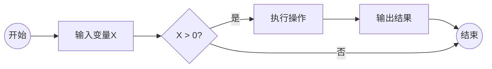
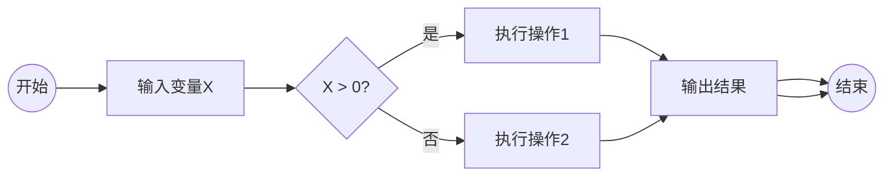
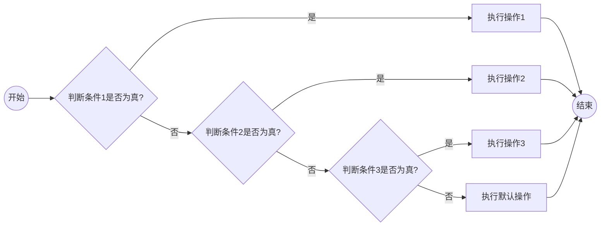
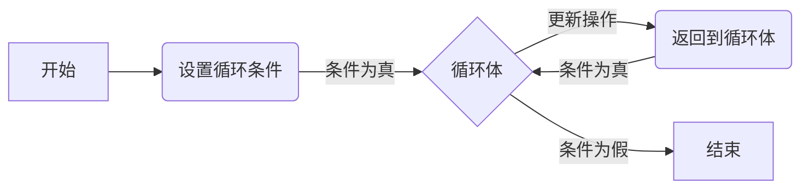
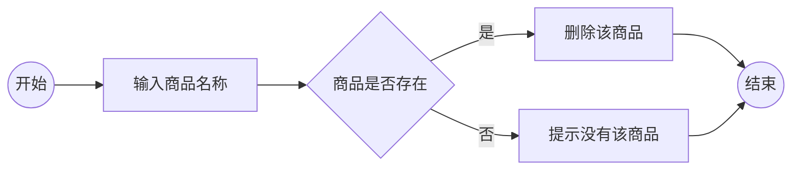
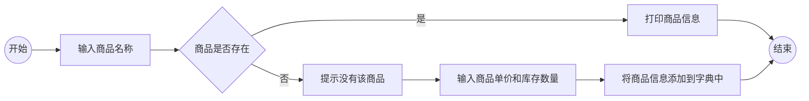
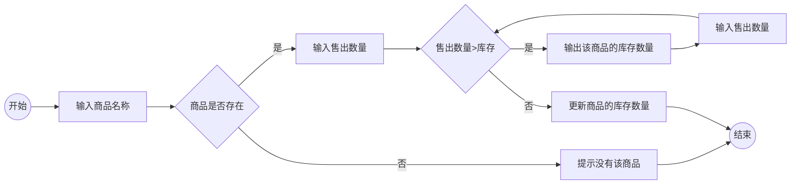

---
html:
    toc: true
---
(需要先安装Python环境和jupyter)
# Python学习

## 1. Python基础知识
- 变量：存储各种文件信息和数据
- 数据类型：文本类型数字类型
- 流程控制语句：控制批量处理文件的过程
- 函数：封装需要重复使用的代码
- 模块：办公自动化模块、openpyxl数据处理模块、pandas
### 1.1 Hello Python
print() 函数用于将指定的内容打印到标准输出（通常是控制台）。
#### 1.1.1 打印字符串：
print('Hello!欢迎来到Python世界！')
- 如果你想在字符串中插入一个<font color="red">包含引号的字符</font>，可以：
1) 使用反斜杠转义:print('Hello!yelcone to the python\'s worldi')
2) 使用双引号：print("Hello!yelcone to the python's worldi")
*<font color="red">在Python中，单引号（'）、双引号（"）和三引号（'''或"""）都可以用来表示字符串。</font>*
- 单引号和双引号之间没有实质性的区别，你可以根据个人偏好选择使用其中之一。以下是单引号和双引号的示例：
```python
single_quoted_string = '这是一个单引号字符串'
double_quoted_string = "这是一个双引号字符串"

print(single_quoted_string)
print(double_quoted_string)
```
```python
# 输出结果为：
这是一个单引号字符串
这是一个双引号字符串
```

- 当字符串中有单引号时，该字符串必须用双引号或三引号表示 
```python
string_with_single_quote = "这是一个包含 ' 单引号的字符串"
triple_single_quoted_string = '''这是一个包含 ' 单引号的字符串'''
print(string_with_single_quote)
print(triple_single_quoted_string)
```
```python
# 输出结果为：
这是一个包含 ' 单引号的字符串
这是一个包含 ' 单引号的字符串
```
- 而三引号可以用来创建多行字符串，其中可以包含换行符等特殊字符。三引号可以使用单引号或双引号。以下是三引号的示例：
```python
triple_single_quoted_string = '''这是一个
多行单引号字符串'''
triple_double_quoted_string = """这是一个
多行双引号字符串"""

print(triple_single_quoted_string)
print(triple_double_quoted_string)
```
```python
# 输出结果为：
这是一个
多行单引号字符串
这是一个
多行双引号字符串
```

#### 1.1.2 打印数字：
```python
number = 8900
print(number)
```
输出结果为:
```python
8900
```
*给数字加上引号：*
```python
number = '8900'
print(number)
```
输出结果为:
```python
8900
```

<span style="color:red">8900表示的是数字，是可以进行加减乘除的数字<br>8900'表示的一串由"8"、"9"、"0"、"0"4个字符组成的字符串</span>

#### 1.1.3 打印数学表达式：
```python
# 打印加法表达式
print("加法表达式: 5 + 3")

# 打印减法表达式
print("减法表达式: 5 - 3")

# 打印乘法表达式
print("乘法表达式: 5 * 3")

# 打印除法表达式
print("除法表达式: 5 / 3")

# 打印指数表达式
print("指数表达式: 5 ** 3")

```
```python
# 输出结果为：
加法表达式: 5 + 3
减法表达式: 5 - 3
乘法表达式: 5 * 3
除法表达式: 5 / 3
指数表达式: 5 ** 3
```
#### 1.1.4 打印数学表达式运算结果：
```python
print("加法表达式:", 5 + 3)
print("减法表达式:", 5 - 3)
print("乘法表达式:", 5 * 3)
print("除法表达式:", 5 / 3)
print("指数表达式:", 5 ** 3)
```
```python
# 输出结果为：
加法表达式: 8
减法表达式: 2
乘法表达式: 15
除法表达式: 1.6666666666666667
指数表达式: 125
```
#### 1.1.5 行尾结束符end
*默认情况下，end 参数的值是 '\n'，即换行符。你可以将其更改为其他字符串来指定行尾结束符。*
```python
# 使用感叹号作为行尾结束符
print("Hello, world!", end='!')

# 使用问号作为行尾结束符
print("How are you?", end='?')

# 使用冒号作为行尾结束符
print("This is a sentence.", end=':')

# 使用换行符作为行尾结束符
print("This is another sentence.")

# 使用换行符作为行尾结束符
print("第一行\n第二行\n第三行")

```
```python
# 输出结果为：
Hello, world!!How are you?This is a sentence.:This is another sentence.
第一行
第二行
第三行
```
#### 1.1.6 分隔符
*如果你想要自定义 print() 函数的分隔符，可以使用 sep 参数。默认情况下，sep 参数的值是一个空格字符 ' '。你可以将其更改为其他字符串来指定不同的分隔符。*
```python
# 使用逗号作为分隔符
print("苹果", "橙子", "香蕉", sep=',')

# 使用制表符作为分隔符
print("狗", "猫", "鸟", sep='\t')

# 使用冒号和空格作为分隔符
print("红色", "蓝色", "绿色", sep=': ')

# 使用自定义字符串作为分隔符
print("One", "Two", "Three", sep='---')

# 设置分隔符为逗号，行尾结束符为感叹号
print("苹果", "橙子", "香蕉", sep=',', end=' ')

```
```python
# 输出结果为：
苹果,橙子,香蕉
狗	猫	鸟
红色: 蓝色: 绿色
One---Two---Three
苹果,橙子,香蕉!
```

### 1.2 变量与运算
Python 中的变量是用来存储数据的标识符。它们可以存储不同类型的值，并且可以在程序中进行引用和操作。
<font color="red">引用变量时，确保该变量已经被定义！</font>
- 变量的命名规则：
1) 变量名只能包含字母、数字和下划线。
2) 变量名不能以数字开头。
3) 变量名区分大小写，例如 count 和 Count 是不同的变量。
4) 避免使用 Python 的关键字（if、while、for）作为变量名。
```python
    # 以下是Python的一些关键字列表：
    False      class      finally    is         return
    None       continue   for        lambda     try
    True       def        from       nonlocal   while
    and        del        global     not        with
    as         elif       if         or         yield
    assert     else       import     pass
    break      except     in         raise
```

#### 1.2.1 变量的赋值：
使用赋值运算符 = 可以将值赋给变量。
```python
# 变量赋值
text = "小张的薪资"
salary = 8900
print(text)
print(salary)
print("员工：",text,salary)
```
```python
# 输出结果为：
小张的薪资
8900
员工： 小张的薪资 8900
```
```python
# 变量之间相互赋值
salary = 8900
salary_copy=salary
print(salary_copy)
```
```python
# 输出结果为：
8900
```
```python
# 给变量加上引号
salary_copy= salary
print('salary_copy')
```
```python
# 输出结果为：
salary_copy
```
#### 1.2.2 变量的特性
变量每次只能赋值一个值，要赋值另一个值时，当前这个值就会被替换掉。
```python
text=“小张的薪资”
text=8900
print(text)
```
```python
# 输出结果为：
8900
```
#### 1.2.3 巧用变量
```python
# 原message_1和message_2的值
message_1 ="25岁 男 数据分析师"
message_2 ="29岁 男 课程设计师"
print('小张:',message_1)
print('小李:',message_2)
```
```python
# 输出结果为：
小张: 25岁 男 数据分析师
小李: 29岁 男 课程设计师
```
```python
# 将message_1和message_2中的值互换
message_1 ="25岁 男 数据分析师"
message_2 ="29岁 男 课程设计师"
message_1,message_2 = message_2,message_1
print('小张:',message_1)
print('小李:',message_2)
```
```python
# 输出结果为：
小张: 29岁 男 课程设计师
小李: 25岁 男 数据分析师
```
#### 1.2.4 数据类型
- *整数（int）：* 表示整数值，例如 1、2、-3 等。
- *浮点数（float）* ：表示带有小数部分的数值，例如 3.14、2.71828 等。
- *字符串（str）：* 表示文本数据，由字符序列组成，使用单引号或双引号括起来，例如 'hello'、"world" 等。
- *布尔值（bool）：* 表示逻辑值，可以是 True（真）或 False（假），用于条件判断和控制流程。
- *列表（list）：* 表示一组有序的元素，可以包含不同类型的对象，使用方括号括起来，例如 [1, 2, 3]、['apple', 'banana', 'orange'] 等。
- *元组（tuple）：* 类似于列表，但是元组是不可变的，即不能修改其元素的值。使用圆括号括起来，例如 (1, 2, 3)、('a', 'b', 'c') 等。
- *集合（set）：* 表示一组唯一且无序的元素，用于去重和数学运算，使用大括号或 set() 函数创建，例如 {1, 2, 3}、set([4, 5, 6]) 等。
- *字典（dict）：* 表示键值对的集合，每个元素由一个键和对应的值组成，键是唯一的且不可变，使用大括号或 dict() 函数创建，例如 {'name': 'Alice', 'age': 25}、dict(zip(['a', 'b', 'c'], [1, 2, 3])) 等。
- *字节串（bytes）：* 表示二进制数据。
- *字节数组（bytearray）：* 类似于字节串，但是是可变的。
- *空值（None）：* 表示空对象或缺失值。

#### 1.2.5 算术运算符
- *加减乘除*
    **加法**
    ```python
    # 加法运算：使用加法运算符（+）可以将两个数相加，并返回它们的和。
    a = 5
    b = 3
    c = a + b
    print(c)  # 输出结果 c，即 8

    # 自加运算：自加运算符（+=）结合了加法运算和赋值运算。它将一个变量与另一个值相加，并将结果赋给变量本身。
    a = 5
    b = 3
    a += b  # 等同于 a = a + b
    print(a)  # 输出结果 a，即 8
    ```
    **减法**
    ```python
    # 减法运算：使用减法运算符可以将一个数减去另一个数，并返回它们的差。
    a = 5
    b = 3
    c = a - b
    print(c)  # 输出结果 c，即 2

    # 自减运算：自减运算符（-=）结合了减法运算和赋值运算。它可以将一个变量减去另一个值，并将结果赋给该变量本身。
    a = 5
    b = 3
    a -= b  # 等同于 a = a - b
    print(a)  # 输出结果 a，即 2
    ```

    **乘法**
    ```python
    # a * b 表示将变量 a 的值乘以变量 b 的值，并将结果赋值给变量 c
    a = 5
    b = 3
    c = a * b
    print(c)  # 输出结果 c，即 15
    ```

    **除法**
    ```python
    # 计算小张的日平均新资，8900加100加上2乘1000的总工资，再除以22天
    sa1ary=(8900+100+2*1000)/22
    print(sa1ary) # salary的值为500.0

    a = 10
    b = 3
    # 使用普通除法运算符（/），结果为浮点数
    c = a / b  # c 的值为 3.3333333333333335
    
    # 使用整除运算符（//），结果为整数
    d = a // b  # d 的值为 3

    # 使用取余运算符（%），得到除法的余数
    e = a % b  # e 的值为 1
    ```
    **幂运算**
    ```python
    # 幂运算使用双星号（**）符号执行一个数的指数操作
    a = 2
    b = 3
    c = a ** b
    print(c)  # 输出结果 c，即 8
    ```

### 1.3 输入数据与数据类型
#### 1.3.1 输入函数
input()函数是Python中用于从用户获取输入的内置函数。它会显示一个提示信息，并等待用户在控制台输入内容，然后将输入内容作为字符串返回给程序。
```python
# 使用 input() 函数的一般语法如下：
variable = input(prompt)
# 其中，prompt 是一个可选的参数，用于显示给用户的提示信息。用户在控制台输入的内容会被存储在变量 variable 中。

# 用input()函数接收从键盘输入的小张的基本新资
salary = input()
# 运行程序时，弹出一个输入框，输入8900，按下回车
```
```python
# 输出结果为：
8900
```
*jupyter编辑器：input()函数默认输出接收的内容*
*其他编辑器：input()接收的内容须通过print()输出*
```python
name = input("请输入您的名字：")
print("您好，" + name)
# 当运行这段代码时，控制台会显示 "请输入您的名字：" 提示信息，然后等待用户输入名字。用户输入名字后按下回车键，
# 输入内容就会存储在 name 变量中，并打印出类似于 "您好，[用户输入的名字]" 的消息。
```
<span style="color:red;">请注意，在使用 input() 函数时，返回的始终是字符串类型的数据。如果需要将输入的内容转换为其他类型（如整数或浮点数），可以使用相应的类型转换函数，例如 int() 或 float()。</span>

#### 1.3.2 type()函数
type() 函数是Python中用于获取变量或值的类型信息的内置函数。它返回一个表示对象类型的值，通常是一个内置类型或自定义类的名称。
```python
# 使用 type() 函数的一般语法如下：
type(object)
# 其中，object 是要获取类型的对象或值。
```
```python
x = 10
y = 3.14
z = "Hello"

print(type(x))   # 输出：<class 'int'>
print(type(y))   # 输出：<class 'float'>
print(type(z))   # 输出：<class 'str'>

```
#### 1.3.3 类型转换函数
1. int()：用于将一个数值或字符串转换为整数类型。
```python
x = int(3.14)  # x 的值为 3
y = int("5")   # y 的值为 5
```

2. float()：用于将一个数值或字符串转换为浮点数类型。
```python
x = float(3)    # x 的值为 3.0
y = float("5.8")  # y 的值为 5.8
```

3. str()：用于将其他数据类型转换为字符串类型。
```python
x = str(10)       # x 的值为 "10"
y = str(3.14)     # y 的值为 "3.14"
z = str(True)     # z 的值为 "True"
```

#### 1.3.4 eval() 函数
eval()函数是Python的内置函数之一，用于将字符串作为表达式进行求值，并返回计算结果。
```python
# eval() 函数的一般语法如下：
eval(expression, globals=None, locals=None)

# 其中，expression 是一个字符串，表示要求值的表达式。
# globals 和 locals 是可选参数，用于指定全局和局部变量的命名空间。
# 如果没有提供这两个参数，则使用当前调用 eval() 函数的命名空间。
```
1. 求值简单的数学表达式：
```python
result = eval("2 + 3 * 4")   # result 的值为 14
```
2. 给定变量，计算表达式的值：
```python
x = 10
y = 5
result = eval("x + y")       # result 的值为 15
```
3. 使用 eval() 处理更复杂的表达式：
```python
expression = "(x + y) * 2"
result = eval(expression)    # result 的值为 30
```
### 1.4 字符串的提取与运算
#### 1.4.1 索引和切片
1. 索引
- 字符串的索引从 0 开始，表示第一个字符。负数索引从字符串的末尾开始，表示倒数第一个字符。
- 使用方括号 [ ] 加上索引来访问特定位置的字符。
- 如果索引超出字符串的范围，将引发 IndexError 错误。

```python
# 提取学符串“李玲 女 班主任”中的性别“女“这个学符
string = "李玲 女 班主任"

print(string[3])     # Output: 女
```
|  访问字符 |  李 | 玲  | ' '  | 女  | ' '  | 班  | 主  | 任  |
| ------------ | ------------ | ------------ | ------------ | ------------ | ------------ | ------------ | ------------ | ------------ |
| 正向索引  |  0 |  1 |  2 |  3 | 4  |  5 |  6 | 7  |
| 反向索引  |  -8 |  -7 | -6  |  -5 | -4  | -3  |  -2 | -1  |
2. 切片
- 切片允许您提取字符串的一部分。它使用冒号 : 分隔起始索引和结束索引。
- 切片时包含起始索引对应的字符，但不包含结束索引对应的字符。
- 如果不指定起始索引，默认为字符串的开头；如果不指定结束索引，默认为字符串的末尾。
- 可以使用负数索引进行切片。
切片的基本格式是在方括号中使用起始索引、结束索引和可选的步长来提取字符串的子串。下面是切片操作的基本格式：
`string[start:end:step]`
start：起始索引，表示切片的开始位置。
end：结束索引，表示切片的结束位置（不包含在切片结果中）。
step：可选参数，表示切片的步长，默认为 1。
<span style="color:red;"> 需要注意的是，切片时包含起始索引对应的字符，但不包含结束索引对应的字符。</span>

```python
# 同时指定多个连续的索引值，来访问多个连续的字符
string = "李玲 女 班主任"

print(string[0:4])     # Output: 李玲 女
```

```python
# 使用反向索引
string = "李玲 女 班主任"

print(string[-8:-6])     # Output: 李玲
```
<span style="color:red;">需要注意的是，索引和切片操作返回的结果仍然是字符串</span>

- 在切片操作中，如果省略了起始索引或者结束索引，Python 会自动使用默认值：
如果省略了起始索引，则默认起始索引为字符串的开头（索引0）。
如果省略了结束索引，则默认结束索引为字符串的末尾（最后一个字符的后面）。
```python 
string = "李玲 女 班主任"

print(string[:4])     # Output: 李玲 女
print(string[5:])     # Output: 班主任
```
#### 1.4.2 len()函数
len() 函数是Python内置函数之一，用于返回一个对象（如字符串、列表、元组等）的长度或元素个数。
```python
string = "Hello, World!"
length = len(string)
print(length)   # Output: 13
```

#### 1.4.3 字符串运算
1. 字符串连接：可以使用 + 运算符将两个字符串连接起来。
```python
str1 = "Hello"
str2 = "World"
result = str1 + ", " + str2
print(result)   # Output: Hello, World
```

2. 重复字符串：可以使用 * 运算符将一个字符串重复多次。
```python
str1 = "Hello"
result = str1 * 3
print(result)   # Output: HelloHelloHello
```

3. 获取字符串长度：可以使用 len() 函数获取字符串的长度。
```python
string = "Hello, World!"
length = len(string)
print(length)   # Output: 13
```

4. 切片操作：可以使用切片操作提取字符串的子串。
```python
string = "Hello, World!"
sub_string = string[7:12]
print(sub_string)   # Output: World
```

5. 字符串格式化：可以使用字符串的 format() 方法或者f-string来进行字符串的格式化。
```python
name = "Alice"
age = 25
result = "My name is {} and I am {} years old.".format(name, age)
print(result)   # Output: My name is Alice and I am 25 years old.

# 或者使用 f-string 格式化字符串
result = f"My name is {name} and I am {age} years old."
print(result)   # Output: My name is Alice and I am 25 years old.
```

#### 1.4.4 in 成员运算符
in 是一个成员运算符，用于检查一个值是否存在于某个集合（如字符串、列表、元组、集合或字典）中。它返回一个布尔值，如果值存在于集合中，则返回 True，否则返回 False。
*检查字符串中的字符是否存在：*
```python
string = "Hello, World!"
print("H" in string)    # Output: True
print("x" in string)    # Output: False
```
#### 1.4.5 not in
 not in是成员运算符的一个变种，与 in 相反。它用于检查一个值是否不存在于某个集合（如字符串、列表、元组、集合或字典）中。它返回一个布尔值，如果值不存在于集合中，则返回 True，否则返回 False。
*检查字符串中的字符是否不存在：*
```python
string = "Hello, World!"
print("H" not in string)     # Output: False
print("x" not in string)     # Output: True
```
### 1.5 字符串常用方法
#### 1.5.1 字符串格式化
字符串格式化是指在输出或拼接字符串时，根据一定的格式规则将变量或表达式的值插入到字符串中的特定位置。
在Python中，字符串格式化有多种方式，以下是其中几种常用的方法：
1. 使用占位符：可以使用占位符（例如%s、%d等）来表示要插入的值的类型，并将变量或表达式作为参数传递给字符串的%操作符。
```python 
name = "Alice"
age = 25
message = "My name is %s and I'm %d years old." % (name, age)
print(message)
```
```python 
# 输出结果：
My name is Alice and I'm 25 years old.
```
2. 使用format方法：可以使用字符串的format方法，通过花括号{}和位置索引或关键字来指定插入的值。
```python 
name = "Bob"
age = 30
message = "My name is {} and I'm {} years old.".format(name, age)
print(message)
```
```python 
# 输出结果：
My name is Bob and I'm 30 years old.
```
```python
# 通过在花括号 {} 内添加索引号来指定要插入的变量的顺序
name = "Alice"
age = 25
country = "China"

print("My name is {1}, I am {0} years old, and I am from {2}.".format(age, name, country))
# Output: My name is Alice, I am 25 years old, and I am from China.
```
```python
# 通过在花括号 {} 内添加格式说明符来指定值的格式
# 以下是一些常用的格式说明符示例：
# {:d}：整数类型
# {:f}：浮点数类型
# {:s}：字符串类型
# {:x}：十六进制整数类型
# {:b}：二进制整数类型
num = 42
pi = 3.1415926
name = "Alice"

print("My number is {:d}".format(num))
# Output: My number is 42

print("The value of pi is {:.2f}".format(pi))
# Output: The value of pi is 3.14

print("Hello, {}!".format(name))
# Output: Hello, Alice!

# {:d} 表示整数类型，{:.2f} 表示浮点数类型并保留两位小数，{:s} 表示字符串类型。
```
```python
num = 42

print("My number is {:>5}".format(num))
# Output: My number is    42

print("My number is {:0>5}".format(num))
# Output: My number is 00042

# {:>5} 表示向右对齐，并使用空格填充到宽度为 5，{:0>5} 表示向右对齐，并使用零填充到宽度为 5。
```
3. 使用f-string（格式化字符串字面值）：在Python 3.6及以上版本中，可以使用以f开头的字符串，在其中直接嵌入变量或表达式，并使用花括号{}来表示插入点。
```python
name = "Charlie"
age = 35
message = f"My name is {name} and I'm {age} years old."
print(message)
```
```python
# 输出结果：
My name is Charlie and I'm 35 years old.
```
#### 1.5.2 replace() 函数
replace() 函数是字符串的内置方法，用于替换字符串中的子字符串。它接受两个参数：旧子字符串和新子字符串，并返回一个替换后的新字符串。
以下是 replace() 函数的语法：
*original_string：原始的字符串，需要被替换的字符串。*
*old_str：需要被替换的子字符串。*
*new_str：用于替换的新子字符串。*
*new_string：替换后的新字符串。*
`new_string = original_string.replace(old_str, new_str)`
```python
# 将原始字符串 text 中的所有 "Hello" 替换为 "Hi"，并将结果存储在 new_text 中。
text = "Hello, World! Hello, Python!"
new_text = text.replace("Hello", "Hi")

print(new_text)
# Output: Hi, World! Hi, Python!
```
<span style="color:red;">需要注意的是，replace() 方法返回的是一个新的字符串，原始字符串不会受到影响。另外，replace() 方法是区分大小写的，如果要进行大小写不敏感的替换，可以先使用 .lower() 或 .upper() 方法转换大小写。</span>

```python
# 先将字符串转换为小写，然后再进行替换。
text = "Hello, World! hello, python!"
new_text = text.lower().replace("hello", "Hi")

print(new_text)
# Output: hi, world! hi, python!
```
#### 1.5.3 split() 函数
split() 函数是字符串的内置方法，用于将一个字符串拆分成多个子字符串，并以列表的形式返回这些子字符串。
以下是 split() 函数的语法：
*original_string：原始的字符串，需要被拆分的字符串。*
*separator：可选参数，用于指定拆分字符串的分隔符，默认为空白字符（空格、制表符、换行符等）。*
`string_list = original_string.split(separator)`
```python
# 使用 split() 方法将字符串 text 拆分成多个子字符串，并将结果存储在列表中
text = "Hello, World! This is Python."

# 使用空格作为分隔符拆分字符串
words = text.split()

print(words)
# Output: ['Hello,', 'World!', 'This', 'is', 'Python.']


# 使用逗号作为分隔符拆分字符串
phrases = text.split(',')

print(phrases)
# Output: ['Hello', ' World! This is Python.']
```
```python
# 通过指定 maxsplit 参数来限制拆分的次数
text = "one two three four five"

# 拆分字符串，最多拆分两次
words = text.split(maxsplit=2)

print(words)
# Output: ['one', 'two', 'three four five']
```
### 1.6 分岔路口
#### 1.6.1 if分支结构
- if单分支结构
if 单分支结构是 if 条件语句的一种形式，它只包含一个 if 语句，用于在给定条件为真时执行相应的代码块。
以下是 if 单分支结构的基本语法：
```python
if condition:
    # 如果条件为真，则执行这里的代码
```
在单分支结构中，condition 是一个表达式或值，用于判断条件是否成立。如果条件成立（即为真），则执行代码块；如果条件不成立（即为假），则跳过代码块。
```python
# 根据条件判断年龄是否大于等于 18 岁。如果年龄大于等于 18 岁，则打印一条消息。
age = 25

if age >= 18:
    print("您已经成年，可以参加选举。")

```


*比较运算符*
<style>
table {
    border-collapse: collapse;
    width: 100%;
}
th {
    background-color: lightblue;
    color: white;
    font-weight: bold;
    padding: 8px;
    text-align: left;
}
td {
    padding: 8px;
    border: 1px solid #ddd;
}
</style>

<table>
<tr>
    <th>运算符</th>
    <th>描述</th>
    <th>示例</th>
    <th>结果</th>
</tr>
<tr>
    <td>==</td>
    <td>等于</td>
    <td>5 == 5</td>
    <td>True</td>
</tr>
<tr>
    <td>!=</td>
    <td>不等于</td>
    <td>5 != 3</td>
    <td>True</td>
</tr>
<tr>
    <td>&gt;</td>
    <td>大于</td>
    <td>7 &gt; 3</td>
    <td>True</td>
</tr>
<tr>
    <td>&lt;</td>
    <td>小于</td>
    <td>2 &lt; 4</td>
    <td>True</td>
</tr>
<tr>
    <td>&gt;=</td>
    <td>大于等于</td>
    <td>6 &gt;= 6</td>
    <td>True</td>
</tr>
<tr>
    <td>&lt;=</td>
    <td>小于等于</td>
    <td>4 &lt;= 3</td>
    <td>False</td>
</tr>
</table>

<span style="color:red;">注：=表示赋值符号，==表示等于符号</span>

- if双分支结构
if双分支结构是一种常见的编程控制结构，用于在程序中根据条件执行不同的操作。它基于一个条件表达式，如果条件为真，则执行一个代码块（通常称为"if块"或"if分支"），如果条件为假，则执行另一个代码块（通常称为"else块"或"else分支"）。
以下是描述if双分支结构的一般形式：
```python
if 条件:
    # 如果条件为真，则执行这个代码块
    执行操作1
else:
    # 如果条件为假，则执行这个代码块
    执行操作2
```
在 if 双分支结构中，首先判断条件的真假。如果条件为真，则执行代码块中的操作1；如果条件为假，则跳过代码块中的操作1，执行 else 块中的操作2。
```python
# 如果成绩大于等于90，条件score >= 90为真，那么程序将执行if块中的操作，即打印出"优秀"。
# 如果条件为假，即成绩小于90，那么程序将跳过if块，执行else块中的操作，即打印出"良好"。
score = float(input("请输入您的成绩: "))

if score >= 90:
    print("优秀")
else:
    print("良好")
```

- if elif..多分支结构
if-elif-else结构可以处理多个条件，并根据条件的判断结果选择相应的代码块执行。
以下是描述if-elif-else多分支结构的一般形式：
```python
if 条件1:
    # 如果条件1为真，则执行这个代码块
    执行操作1
elif 条件2:
    # 如果条件1为假而条件2为真，则执行这个代码块
    执行操作2
elif 条件3:
    # 如果条件1和条件2都为假而条件3为真，则执行这个代码块
    执行操作3
...
else:
    # 如果所有条件都为假，则执行这个代码块
    执行默认操作
```
在if-elif-else结构中，首先根据条件1的判断结果来确定是否执行操作1。如果条件1为真，则执行操作1，并跳过后续的elif和else块；如果条件1为假，则继续检查条件2，如果条件2为真，则执行操作2，并跳过后续的elif和else块；以此类推，直到找到第一个为真的条件，并执行相应的操作；如果所有条件都为假，则执行else块中的操作，作为默认操作。
```python
score = float(input("请输入您的成绩: "))

if score >= 90:
    print("优秀")
elif score >= 80:
    print("良好")
elif score >= 60:
    print("及格")
else:
    print("不及格")
```

#### 1.6.2 分支结构嵌套
分支嵌套是指在一个分支结构中嵌套另一个分支结构，以实现更复杂的条件判断和操作执行。以下是一个展示分支嵌套结果的示例：
```python
score = float(input("请输入您的成绩: "))

if score >= 60:
    if score >= 90:
        print("优秀")
    elif score >= 80:
        print("良好")
    else:
        print("及格")
else:
    print("不及格")
```
在这个示例中，首先程序会要求用户输入一个成绩，并将其保存在变量 score 中。

接下来，程序使用外部的 if 结构进行整体判断，即判断是否达到及格分数线（60 分）。如果满足外部的条件，程序将进入外部的 if 块。

在外部的 if 块中，又嵌套了一个内部的 if-elif-else 结构。在内部结构中，首先判断是否达到优秀分数线（90 分），如果是，则打印出"优秀"；如果不是，则继续判断是否达到良好分数线（80 分），如果是，则打印出"良好"；如果也不是，则执行内部结构的 else 块，打印出"及格"。

如果外部的 if 结构中的条件判断为假，即成绩低于及格分数线，那么程序将跳过外部的 if 块，直接执行外部结构的 else 块，打印出"不及格"。

#### 1.6.3 逻辑运算符
逻辑运算符用于在条件判断中组合多个条件，并根据这些条件的逻辑关系得出最终的判断结果。在Python中，常用的逻辑运算符包括以下三个：
1. 与运算符（and）：如果两个条件都为真，则返回真；否则返回假。
2. 或运算符（or）：如果两个条件中至少有一个为真，则返回真；否则返回假。
3. 非运算符（not）：如果条件为真，则返回假；如果条件为假，则返回真。
以下是逻辑运算符的使用示例：
```python
x = 5
y = 10

# 与运算符示例
if x > 0 and y > 0:
    print("x和y都大于0")

# 或运算符示例
if x > 0 or y > 0:
    print("x或者y大于0")

# 非运算符示例
if not x > 0:
    print("x不大于0")
```

### 1.7 有限次的for循环
#### 1.7.1 for 循环
for 循环是一种常用的循环结构，用于迭代遍历可迭代对象（如列表、元组、字符串等）中的元素。通过 for 循环，可以重复执行特定的代码块，直到迭代结束。
以下是 for 循环的基本语法：
```python
for 变量 in 可迭代对象:
    # 执行的代码块
```
```python
# 遍历字符串
string = "你好，世界！"

for char in string:
    print(char)
```
输出结果为：
```python
你
好
，
世
界
！
```
```python
# 遍历列表
fruits = ['apple', 'banana', 'cherry']

for fruit in fruits:
    print(fruit)
```
输出结果为：
```python
apple
banana
cherry
```
#### 1.7.2 range()函数
range() 是一个内置函数，用于创建一个整数序列。它可以接受一个或多个参数，并生成一个按指定范围的整数序列。
range() 函数的常见用法有三种形式：
1. range(stop)
这种形式只包含一个参数 stop，表示生成从 0 开始到 stop-1 的整数序列。
```python
for i in range(5):
    print(i)
```
输出：
```python
0
1
2
3
4
```
2. range(start, stop)
这种形式包含两个参数 start 和 stop，表示生成从 start 开始到 stop-1 的整数序列
```python
for i in range(2, 6):
    print(i)
```
输出：
```python 
2
3
4
5
```
3. range(start, stop, step)
这种形式包含三个参数 start、stop 和 step，表示以指定的步长 step 从 start 开始生成整数序列，直到不超过 stop-1。
```python
for i in range(1, 10, 2):
    print(i)
```
输出：
```python
1
3
5
7
9
```
<font color="red">需要注意的是，range() 函数生成的整数序列是左闭右开的，即不包括 stop 参数指定的值。</font>

#### 1.7.3 for...if...嵌套
当需要在嵌套的 for 循环中使用 if 语句进行条件筛选时，可以按照以下结构来编写代码：
```python
for outer_item in outer_sequence:
    # 外部循环操作
    
    for inner_item in inner_sequence:
        # 内部循环操作
        
        if condition:
            # 符合条件的处理逻辑
        else:
            # 不符合条件的处理逻辑
```
以下是一个示例，演示如何使用嵌套的 for 循环和 if 语句：
```python
# 通过嵌套的 for 循环遍历了 colors 和 sizes 列表，并根据特定条件进行不同的输出
colors = ['red', 'blue', 'green']
sizes = ['S', 'M', 'L']

for color in colors:
    for size in sizes:
        if color == 'blue' and size == 'M':
            print("Found blue M: color =", color, "size =", size)
        elif color == 'green':
            print("Found green: color =", color, "size =", size)
        else:
            print("Not found: color =", color, "size =", size)
```
输出：
```python
Not found: color = red size = S
Not found: color = red size = M
Not found: color = red size = L
Found blue M: color = blue size = M
Not found: color = blue size = S
Not found: color = blue size = L
Found green: color = green size = S
Found green: color = green size = M
Found green: color = green size = L
```
### 1.8 不限次的while循环
#### 1.8.1 while循环
while 循环是一个在给定条件为真的情况下重复执行代码块的控制结构。当条件不再满足时，循环停止。
```python
while condition:
    # 循环体
    
    # 更新条件
```
在每次循环迭代开始前，首先检查条件是否为真。如果条件为真，则执行循环体中的代码。然后，根据需要更新条件。如果更新后的条件仍然为真，循环会继续进行，直到条件变为假才停止。

```python
# 使用 while 循环计算数字的阶乘
num = 5
factorial = 1

while num > 0:
    factorial *= num
    num -= 1

print("Factorial:", factorial)
```
在上述示例中，我们使用 while 循环来计算给定数字 num 的阶乘。循环体中，将当前的 num 与 factorial 相乘，并将结果保存在 factorial 中。然后，将 num 减去 1，以便在下一次迭代时处理下一个数字。循环会在 num 不大于 0 的条件下一直进行。
输出：
```python
Factorial: 120
```
#### 1.8.2 while和for循环
while 循环和 for 循环是两种常见的循环结构，它们在使用方式和适用场景上有一些区别。

1. 使用方式：

while 循环：在每次迭代开始前，先判断条件是否为真，如果条件为真，则执行循环体中的代码，然后更新条件。如果条件仍然为真，则继续下一次迭代。因此，while 循环适用于不确定迭代次数、需要根据条件动态控制循环的情况。
for 循环：基于一个可迭代对象（如列表、元组或字符串）进行迭代，每次迭代从可迭代对象中取出一个元素，并执行循环体中的代码。for 循环适用于已知迭代次数的情况。

2. 控制变量：

while 循环：需要手动声明并更新控制条件的变量。在循环体内部需要显式地更新条件，以免无限循环。
for 循环：无需手动声明或更新控制变量，迭代过程由 for 循环自动管理。每次迭代时，会自动从可迭代对象中选择一个元素作为循环变量，直到迭代完所有元素。

3. 应用场景：

<font color="red"> while 循环：适用于那些需要根据条件灵活控制迭代次数的情况。</font>例如，处理不确定条件的输入，实现游戏循环，或者在特定条件满足时执行某项任务。
<font color="red"> for 循环：适用于已知迭代次数的情况。</font>当你需要对一个集合中的每个元素执行相同的操作时，使用 for 循环更加方便简洁。例如，遍历列表、计算序列的总和或平均值。
以下是一个使用 while 循环和 for 循环的示例，展示了它们的不同之处：
```python
count = 0
# 使用 while 循环
while count < 5:
    print("Count:", count)
    count += 1
print("-------------------")
# 使用 for 循环
for i in range(5):
    print("Count:", i)
```
输出：
```python
Count: 0
Count: 1
Count: 2
Count: 3
Count: 4
-------------------
Count: 0
Count: 1
Count: 2
Count: 3
Count: 4
```
#### 1.8.3 break语句
break 语句是一种在循环中使用的控制语句，用于立即终止当前所在的循环，跳出循环体。<font color="blue"> 当程序执行到 break 语句时，程序会立即退出循环，不再执行循环体中 break 语句之后的代码，而是继续执行循环体之后的代码。</font>
break 语句通常与条件语句结合使用，用于根据特定条件提前跳出循环，避免不必要的迭代。
```python
while True:
    user_input = input("请输入一个数字（输入'q'退出）：")

    if user_input == 'q':
        print("已退出循环")
        break

    number = int(user_input)
    print("平方:", number**2)

print("循环结束")
```
上述示例中，使用 while 循环来接受用户输入的数字，并计算输入数字的平方。如果用户输入的是字符 'q'，则使用 break 语句终止循环。否则，将用户输入的字符串转换为整数，并计算平方并输出。这个过程将持续进行，直到用户输入了 'q'。
输出示例：
```python
请输入一个数字（输入'q'退出）：3
平方: 9
请输入一个数字（输入'q'退出）：5
平方: 25
请输入一个数字（输入'q'退出）：q
已退出循环
循环结束
```
#### 1.8.4 continue语句
continue 语句是一种在循环中使用的控制语句，用于跳过当前迭代中剩余的代码，直接进入下一次迭代。<font color="blue"> 当程序执行到 continue 语句时，程序会立即停止当前迭代中 continue 语句之后的代码，并开始下一次循环迭代。</font>
continue 语句通常与条件语句结合使用，用于在满足特定条件时跳过某些指令，只执行下一次迭代。
```python
for i in range(1, 11):
    if i % 2 == 0:
        continue
    print(i)
```
上述示例中，使用 for 循环从 1 到 10 进行迭代。在每次迭代中，使用条件判断 if i % 2 == 0 来判断当前迭代的数值 i 是否为偶数。如果是偶数，那么 continue 语句将会跳过 print(i) 的执行，直接进行下一次迭代。如果是奇数，那么 print(i) 将会被执行。
输出示例：
```python
1
3
5
7
9
```
### 1.9 数据结构-列表
#### 1.9.1 列表
列表是Python中最常用的数据结构之一，用于存储一组有序的元素。
1. 创建列表：使用方括号 [] 来创建一个空列表，或者在方括号内放置逗号分隔的元素来初始化一个含有元素的列表
```python
empty_list = []
numbers = [1, 2, 3, 4, 5]
fruits = ["apple", "banana", "orange"]
mixed_list = [1, "apple", True, 2.5]
```
2. 一维列表:维列表是最简单的列表形式，只包含一组有序的元素。它是一个线性结构，元素按顺序排列，每个元素都有一个唯一的索引。
```python
# 创建一维列表
numbers = [1, 2, 3, 4, 5]
fruits = ["apple", "banana", "orange"]
```
一维列表中的元素按照索引从0开始递增，可以通过索引访问和修改其中的元素。
```python
print(numbers[0])  # 输出: 1
numbers[2] = 10
print(numbers)  # 输出: [1, 2, 10, 4, 5]
```
3. 二维列表：二维列表是一种表格形式的数据结构，其中的元素使用行和列进行排列。通常使用列表的嵌套来表示。
```python
# 创建二维列表
matrix = [[1, 2, 3],
          [4, 5, 6],
          [7, 8, 9]]
```
在二维列表中，每个元素由两个索引确定，第一个索引表示所在的行，第二个索引表示所在的列。可以通过双重索引访问和修改元素。
```python
print(matrix[0][0])  # 输出: 1
matrix[1][2] = 10
print(matrix)  # 输出: [[1, 2, 3], [4, 5, 10], [7, 8, 9]]
```
#### 1.9.2 索引和切片
1. 索引
列表中的元素通过索引进行访问，索引表示元素在列表中的位置。<font color="red"> 索引从0开始，依次递增。</font>
```python
fruits = ['苹果', '香蕉', '橙子', '葡萄', '西瓜', '草莓', '梨子']

print(fruits[0])    # 输出: '苹果'
print(fruits[3])    # 输出: '葡萄'
print(fruits[-1])   # 输出: '梨子'
```
2. 切片
切片用于获取列表中的一个子列表，可以通过指定起始索引和结束索引来定义切片。切片操作符是冒号 :。
在切片操作中，第一个索引（起始索引）指定了切片的起始位置（包含），第二个索引（结束索引）指定了切片的结束位置（不包含）。还可以提供第三个索引（步长），用于指定切片的步长，默认为1。
```python
fruits = ['苹果', '香蕉', '橙子', '葡萄', '西瓜', '草莓', '梨子']
print(fruits[2:5])    # 输出: ['橙子', '葡萄', '西瓜']（包含起始索引2，不包含结束索引5）
print(fruits[:3])     # 输出: ['苹果', '香蕉', '橙子']（从开头到索引2的子列表）
print(fruits[4:])     # 输出: ['西瓜', '草莓', '梨子']（从索引4到末尾的子列表）
print(fruits[::2])    # 输出: ['苹果', '橙子', '西瓜', '梨子']（每隔一个元素取一个子列表）
print(fruits[::-1])   # 输出: ['梨子', '草莓', '西瓜', '葡萄', '橙子', '香蕉', '苹果']（倒序排列的列表）
```
#### 1.9.3 列表的操作
1. 列表的长度
列表的长度是指列表中元素的个数。在Python中，可以使用内置函数len()来获取列表的长度。
```python
my_list = [1, 2, 3, 4, 5]
length = len(my_list)
print(length)  # 输出：5
```
对于二维列表，我们可以分别获取其外层列表和内层列表的长度。
外层列表的长度表示二维列表中含有多少个内层列表，可以使用len()函数来获取外层列表的长度。而内层列表的长度表示每个内层列表中含有多少个元素，同样可以使用len()函数来获取内层列表的长度。
```python
my_list = [[1, 2, 3], [4, 5, 6], [7, 8, 9]]
outer_length = len(my_list)
print("外层列表长度:", outer_length)  # 输出：外层列表长度: 3

inner_length = len(my_list[0])
print("内层列表长度:", inner_length)  # 输出：内层列表长度: 3
```
2. 修改元素
- 使用索引修改单个元素
```python
# 将索引为2的元素从原来的3修改为10
my_list = [1, 2, 3, 4, 5]
my_list[2] = 10
print(my_list)  # 输出：[1, 2, 10, 4, 5]
```
- 使用切片修改多个元素
```python
# 将索引为1到3的元素从原来的[2, 3, 4]修改为[10, 20, 30]
my_list = [1, 2, 3, 4, 5]
my_list[1:4] = [10, 20, 30]
print(my_list)  # 输出：[1, 10, 20, 30, 5]
```
3. 添加元素
- 使用append()方法添加单个元素到列表末尾
```python
# 使用append()方法将元素4添加到列表的末尾
my_list = [1, 2, 3]
my_list.append(4)
print(my_list)  # 输出：[1, 2, 3, 4]
```
- 使用extend()方法添加多个元素到列表末尾
```pyhton
# 使用extend()方法将包含多个元素的列表添加到原始列表的末尾
my_list = [1, 2, 3]
my_list.extend([4, 5, 6])
print(my_list)  # 输出：[1, 2, 3, 4, 5, 6]
```
- 使用"+"操作符连接两个列表
```python
my_list = [1, 2, 3]
new_elements = [4, 5, 6]
my_list = my_list + new_elements
print(my_list)  # 输出：[1, 2, 3, 4, 5, 6]
```
4. 检索元素
```python
my_list = [1, 2, 3, 4, 5]

# 使用 in 运算符检查元素是否存在
is_present = 3 in my_list
print(is_present)  # 输出：True

is_present = 6 in my_list
print(is_present)  # 输出：False

# 使用 not in 运算符检查元素是否不存在
is_absent = 3 not in my_list
print(is_absent)  # 输出：False

is_absent = 6 not in my_list
print(is_absent)  # 输出：True
```
5. 删除元素
- 使用del语句删除指定索引处的元素
```python
my_list = [1, 2, 3, 4, 5]
del my_list[2]
print(my_list)  # 输出：[1, 2, 4, 5]
```
- 使用remove()方法删除列表中的指定元素
```python
my_list = [1, 2, 3, 4, 5]
my_list.remove(3)
print(my_list)  # 输出：[1, 2, 4, 5]
```
- 使用pop()方法删除指定索引处的元素，并将其返回
```python
my_list = [1, 2, 3, 4, 5]
removed_element = my_list.pop(2)
print(removed_element)  # 输出：3
print(my_list)  # 输出：[1, 2, 4, 5]
```
*del语句适合根据索引删除元素，remove()方法适合根据元素的值删除元素，而pop()方法既可以根据索引删除元素，又可以将其返回。*
6. 列表排序
- 使用列表的sort()方法对列表进行排序
```python
# 使用sort()方法对列表进行排序。结果会直接修改原始列表，使其按升序排列。
my_list = [3, 1, 4, 2, 5]
my_list.sort()
print(my_list)  # 输出：[1, 2, 3, 4, 5]
```
- 使用内置的sorted()函数对列表进行排序
```python
# 使用sorted()函数对列表进行排序。sorted()函数会返回一个新的已排序的列表，而不会修改原始列表。
my_list = [3, 1, 4, 2, 5]
sorted_list = sorted(my_list)
print(sorted_list)  # 输出：[1, 2, 3, 4, 5]
```
<font color="red"> 需要注意的是，默认情况下，排序是按数字或字母的升序进行的。如果需要按降序进行排序，可以使用reverse=True参数。</font>

```python
# 将列表按降序排序
my_list = [3, 1, 4, 2, 5]
my_list.sort(reverse=True)
print(my_list)  # 输出：[5, 4, 3, 2, 1]

sorted_list = sorted(my_list, reverse=True)
print(sorted_list)  # 输出：[5, 4, 3, 2, 1]
```
#### 1.9.4 列表推导式
列表推导式（List Comprehension）是一种简洁的创建新列表的方法，它允许您使用简洁的语法从一个或多个现有列表中生成新列表。

列表推导式的基本语法如下：
`new_list = [expression for item in iterable if condition]`
其中：
*expression 是对每个 item 执行的操作或表达式，用于生成新列表中的元素。
item 是迭代过程中从 iterable 中取出的每个元素。
iterable 是一个可迭代的对象，例如列表、字符串等。
if condition 是可选的条件表达式，用于过滤元素。只有满足条件的元素才会被添加到新列表中。*
```python
# 将一个列表中的每个元素乘以2并生成新列表
old_list = [1, 2, 3, 4, 5]
new_list = [x * 2 for x in old_list]
print(new_list)  # 输出: [2, 4, 6, 8, 10]

# 从一个字符串中提取出所有大写字母并生成新列表
string = "Hello World"
new_list = [char for char in string if char.isupper()]
print(new_list)  # 输出: ['H', 'W']

# 生成一个包含1到10之间偶数的新列表
new_list = [x for x in range(1, 11) if x % 2 == 0]
print(new_list)  # 输出: [2, 4, 6, 8, 10]
```
#### 1.9.5 常见函数（数字列表的统计方法）
1. len(): 获取列表中元素的个数
```python
my_list = [1, 2, 3, 4, 5]
length = len(my_list)
print(length)  # 输出: 5
```
2. sum(): 计算列表中所有元素的和
```python
my_list = [1, 2, 3, 4, 5]
total = sum(my_list)
print(total)  # 输出: 15
```
3. max(): 获取列表中的最大值
```python
my_list = [1, 2, 3, 4, 5]
maximum = max(my_list)
print(maximum)  # 输出: 5
```
4. min(): 获取列表中的最小值
```python
my_list = [1, 2, 3, 4, 5]
minimum = min(my_list)
print(minimum)  # 输出: 1
```
5. sorted(): 对列表进行排序，并返回一个新的排序后的列表。
```python
my_list = [5, 2, 1, 4, 3]
sorted_list = sorted(my_list)
print(sorted_list)  # 输出: [1, 2, 3, 4, 5]
```
6. mean(): 计算列表中所有元素的平均值。需要导入 statistics 模块
```python
import statistics

my_list = [1, 2, 3, 4, 5]
average = statistics.mean(my_list)
print(average)  # 输出: 3
```
7. median(): 计算列表中所有元素的中位数。需要导入 statistics 模块。
```python
import statistics

my_list = [1, 2, 3, 4, 5]
median_value = statistics.median(my_list)
print(median_value)  # 输出: 3
```
### 1.10 数据结构-字典
#### 1.10.1 字典的定义
字典是一种无序的数据结构，用于存储键-值（key-value）对。字典通过键来索引和访问值，而不是使用传统的数字索引。
在Python中，字典使用花括号 {} 来定义，并使用冒号 : 来分隔键和值。每个键-值对之间使用逗号 , 分隔。
下面是一个字典的定义示例：
```python
my_dict = {"name": "Alice", "age": 25, "city": "Beijing"}
```
在上述示例中，我们定义了一个名为 my_dict 的字典，其中包含三个键-值对。键 "name" 对应的值是 "Alice"，键 "age" 对应的值是 25，键 "city" 对应的值是 "Beijing"。
<font color="red"> 字典中的键必须是唯一的，而值可以是任意类型的对象，例如字符串、整数、列表等。</font>

可以通过指定键来访问和操作字典中的值。例如，要获取字典中键 "name" 对应的值，可以使用以下方式：
```python
name_value = my_dict["name"]
print(name_value)  # 输出: "Alice"
```
#### 1.10.2 字典的增删查改
1. 增加键-值对：
可以通过直接赋值给新的键来添加新的键-值对，或者使用 update() 方法添加多个键-值对。
```python
my_dict = {}  # 创建空字典

my_dict["name"] = "Alice"  # 添加单个键-值对
my_dict["age"] = 25
my_dict["city"] = "Beijing"

# 或者使用 update() 方法添加多个键-值对
my_dict.update({"gender": "female", "occupation": "engineer"})
```
2. 删除键-值对：
可以使用 del 关键字删除指定的键及其对应的值，或者使用 pop() 方法删除指定键，并返回其对应的值。
```python
del my_dict["age"]  # 删除键 "age" 及其对应的值

popped_value = my_dict.pop("city")  # 删除键 "city" 并返回其对应的值
```
3. 查找键对应的值：
可以使用键来访问字典中对应的值，如果键不存在，会引发 KeyError 异常。另一种方法是使用 get() 方法，如果键不存在，可以返回一个默认值。
```python
name_value = my_dict["name"]  # 通过键获取值

age_value = my_dict.get("age")  # 通过 get() 方法获取值，如果键不存在返回 None

occupation_value = my_dict.get("occupation", "N/A")  # 获取值并指定默认值
```
4. 修改字典中的值：
可以通过赋值给指定的键来修改字典中对应的值。
```python
my_dict["name"] = "Bob"  # 修改键 "name" 对应的值
```
#### 1.10.3 字典的相关方法
1. keys() 方法：
该方法返回一个包含字典所有键的可迭代对象。
```python
my_dict = {"name": "Alice", "age": 25, "city": "Beijing"}
keys = my_dict.keys()
print(keys)  # 输出：dict_keys(['name', 'age', 'city'])
```
2. values() 方法：
该方法返回一个包含字典所有值的可迭代对象。
```python
my_dict = {"name": "Alice", "age": 25, "city": "Beijing"}
values = my_dict.values()
print(values)  # 输出：dict_values(['Alice', 25, 'Beijing'])
```
3. items() 方法：
该方法返回一个包含字典所有键值对的可迭代对象，每个键值对表示为一个元组。
```python
my_dict = {"name": "Alice", "age": 25, "city": "Beijing"}
items = my_dict.items()
print(items)  # 输出：dict_items([('name', 'Alice'), ('age', 25), ('city', 'Beijing')])
```
4. copy() 方法：
该方法创建并返回一个字典的浅拷贝副本。
```python
my_dict = {"name": "Alice", "age": 25, "city": "Beijing"}
new_dict = my_dict.copy()
```
5. clear() 方法：
该方法清空字典中所有的键-值对，使其变为空字典。
```python
my_dict = {"name": "Alice", "age": 25, "city": "Beijing"}
my_dict.clear()
print(my_dict)  # 输出：{}
```
### 1.11 数据结构-元组和集合
#### 1.11.1 元组
元组（Tuple）是Python中的一种有序、不可变的数据类型。与列表相似，但元组的元素不能被修改。元组使用圆括号 () 表示，元素之间用逗号分隔。
以下是一些关于元组的常用操作和特点：

1. 创建元组：
可以使用圆括号 () 来创建一个元组，并将元素用逗号分隔。
```python
my_tuple = (1, 2, 3, "apple", "banana")
```
2. 访问元组元素：
可以使用索引来访问元组中的元素，索引从0开始。
```python
first_element = my_tuple[0]  # 访问第一个元素，值为1
```
3. 元组的不可变性：
元组的元素不能被修改、添加或删除。一旦创建，元组的元素不能被更改。
```python
my_tuple[0] = 5  # 错误! 元组的元素无法修改
```
4. 元组的长度和切片：
使用 len() 函数获取元组的长度，并可以使用切片操作访问指定范围的元素。
```python
length = len(my_tuple)  # 获取元组的长度

sliced_tuple = my_tuple[1:4]  # 切片，获取索引1到3的元素，结果为 (2, 3, "apple")
```
5. 元组的解包：
可以将元组的元素解包（拆分）到多个变量中。
```python
a, b, c, d, e = my_tuple  # 将元组的元素分别赋值给变量 a, b, c, d, e
```
6. 元组的拼接和重复：
可以使用 + 运算符来拼接两个元组，使用 * 运算符将元组重复多次。
```python
tuple1 = (1, 2, 3)
tuple2 = (4, 5, 6)
merged_tuple = tuple1 + tuple2  # 拼接元组，结果为 (1, 2, 3, 4, 5, 6)

repeated_tuple = tuple1 * 3  # 元组重复三次，结果为 (1, 2, 3, 1, 2, 3, 1, 2, 3)
```
#### 1.11.2 zip()函数
zip() 函数接受任意多个可迭代对象作为参数，可以是列表、元组、集合等。它会将这些可迭代对象中的元素逐个配对组成元组，然后返回一个生成器对象，每次迭代产生一个元组。
需要注意以下几点：
- 如果传入的可迭代对象的长度不一致，zip() 函数会以最短的可迭代对象长度为准，超出部分的元素将被忽略。
- zip() 函数返回的是一个迭代器，可以使用 list() 函数将其转换为列表。
*（迭代器（Iterator）是一个用于遍历可迭代对象的对象。
迭代器的优点在于它可以在遍历过程中逐个获取元素，而不需要事先将所有的元素放入内存中。这对于处理大型数据集或者无法一次性加载到内存的数据非常有用。）*
```python
numbers = [1, 2, 3]
letters = ['a', 'b']
result = zip(numbers, letters)
print(list(result))  # 输出：[(1, 'a'), (2, 'b')]
```
zip() 函数常用于需要同时迭代多个可迭代对象的场景，例如需要同时遍历两个列表或元组，并进行相关操作。
```python
numbers = [1, 2, 3]
letters = ['a', 'b', 'c']

for number, letter in zip(numbers, letters):
    print(f"Number: {number}, Letter: {letter}")
```
输出：
```python
Number: 1, Letter: a
Number: 2, Letter: b
Number: 3, Letter: c
```
#### 1.11.3 集合
在 Python 中，集合是一个内置的数据类型，使用花括号 {} 或者 set() 函数来创建。以下是创建集合的示例：
```python
# 使用花括号创建集合
set1 = {1, 2, 3, 4, 5}

# 使用set()函数创建集合
set2 = set([1, 2, 3, 4, 5])

print(set1)  # 输出：{1, 2, 3, 4, 5}
print(set2)  # 输出：{1, 2, 3, 4, 5}
```
需要注意的是，创建空集合时必须使用 set() 函数，因为 {} 创建的是一个空字典。
```python
empty_set = {}
print(type(empty_set))  # 输出：dict（字典类型）

empty_set = set()
print(type(empty_set))  # 输出：set（集合类型）
```
集合的主要特点包括：
1. 无序性：集合中的元素没有固定的顺序，无法通过索引访问。
2. 唯一性：集合中的元素是唯一的，不会出现重复项。如果在创建集合时有重复的元素，那么最终集合中只会保留一个副本。
3. 可变性：集合是可变的，可以添加、删除和修改元素。但是集合本身是不可哈希的，所以不能作为字典的键。

集合提供了一系列的方法来进行常见的集合操作，例如并集、交集、差集等。以下是一些常用的集合操作示例：
```python
set1 = {1, 2, 3}
set2 = {3, 4, 5}

# 并集
union_set = set1.union(set2)
print(union_set)  # 输出：{1, 2, 3, 4, 5}

# 交集
intersection_set = set1.intersection(set2)
print(intersection_set)  # 输出：{3}

# 差集
difference_set = set1.difference(set2)
print(difference_set)  # 输出：{1, 2}

# 对称差集
symmetric_difference_set = set1.symmetric_difference(set2)
print(symmetric_difference_set)  # 输出：{1, 2, 4, 5}
```
除了常见的集合操作（如并集、交集、差集等），在 Python 中，集合还有一些其他有用的方法和属性。

以下是一些常用的集合方法和属性：
1. add(element): 向集合中添加一个元素。如果元素已经存在于集合中，则不会重复添加。
```python
set1 = {1, 2, 3}
set1.add(4)
print(set1)  # 输出：{1, 2, 3, 4}

set1.add(1)  # 重复元素
print(set1)  # 输出：{1, 2, 3, 4}
```
2. remove(element): 从集合中移除指定元素。如果元素不存在于集合中，会引发 KeyError 异常。
```python
set1 = {1, 2, 3}
set1.remove(2)
print(set1)  # 输出：{1, 3}

set1.remove(4)  # 不存在的元素
# 抛出 KeyError 异常：KeyError: 4
```
3. discard(element): 从集合中移除指定元素，如果元素不存在于集合中，则不会引发异常。
```python
set1 = {1, 2, 3}
set1.discard(2)
print(set1)  # 输出：{1, 3}

set1.discard(4)  # 不存在的元素
print(set1)  # 输出：{1, 3}，不会引发异常
```
4. pop(): 随机移除并返回集合中的一个元素。由于集合是无序的，因此无法预测将返回哪个元素。
```python
set1 = {1, 2, 3}
element = set1.pop()
print(element)  # 输出：1
print(set1)  # 输出：{2, 3}
```
5. clear(): 移除集合中的所有元素，使其变为空集合。
```python
set1 = {1, 2, 3}
set1.clear()
print(set1)  # 输出：set()
```
6. len(set): 返回集合中元素的数量。
```python
set1 = {1, 2, 3}
print(len(set1))  # 输出：3
```
7. set.copy(): 创建并返回集合的副本。
```python
set1 = {1, 2, 3}
set2 = set1.copy()
print(set2)  # 输出：{1, 2, 3}
```
8. set.isdisjoint(other_set): 检查两个集合是否不相交，即是否不存在共同的元素。如果不相交，则返回 True；否则返回 False。
```python
set1 = {1, 2, 3}
set2 = {4, 5, 6}
set3 = {3, 4, 5}

print(set1.isdisjoint(set2))  # 输出：True
print(set1.isdisjoint(set3))  # 输出：False
```
**集合与字典的区别：**

|  |  符号 |   元素| 是否可以重复  |
| :------------: | :------------: | :------------: | :------------: |
| <b>字典</b> | {}  |  由键值对组成 <br> Dict={"a":1 ,"b":2 ,"c":3} | 键是唯一的,不可重复  |
| <b>集合</b>  |  {} | 由单个元素组成 <br>  Set ={a,1,b,2,c,3)  | 元素不可重复  |

#### 1.11.4 相互转换
可以使用以下方法将列表（List）、元组（Tuple）和字典（Dictionary）相互转换。
1. 列表和元组之间的转换
*将列表转换为元组：使用tuple()函数来将列表转换为元组。*
```python
my_list = [1, 2, 3, 4, 5]
my_tuple = tuple(my_list)
print(my_tuple)
```
输出：
```python
(1, 2, 3, 4, 5)
```
*将元组转换为列表：使用list()函数来将元组转换为列表。*
```python
my_tuple = (1, 2, 3, 4, 5)
my_list = list(my_tuple)
print(my_list)
```
输出：
```python
[1, 2, 3, 4, 5]
```
2. 列表和字典之间的转换
*将列表转换为字典：使用dict()函数来将列表转换为字典。在转换时，要求列表中的元素必须成对出现，其中奇数索引的元素作为字典的键，偶数索引的元素作为字典的值。*
```python
my_list = ['a', 1, 'b', 2, 'c', 3]
my_dict = dict(zip(my_list[0::2], my_list[1::2]))
print(my_dict)
```
输出：
```python
{'a': 1, 'b': 2, 'c': 3}
```
*将字典转换为列表：使用list()函数来将字典转换为列表。转换结果是字典的键组成的列表。*
```python
my_dict = {'a': 1, 'b': 2, 'c': 3}
my_list = list(my_dict.keys())
print(my_list)
```
输出：
```python
['a', 'b', 'c']
```
<font color="red"> 请注意，字典是无序的，转换为列表时并不保证元素的顺序与字典中的顺序一致。</font>

|   | 符号  | 有序  | 可变  | 索引  | 重复元素  |
| :------------: | :------------: | :------------: | :------------: | :------------: | :------------: |
|  <b>列表</b> | [] |  <span style="font-size: 20px;color: green;">&#10004;</span> | <span style="font-size: 20px;color: green;">&#10004;</span> | <span style="font-size: 20px;color: green;">&#10004;</span>  |  <span style="font-size: 20px;color: green;">&#10004;</span> |
|  <b>元组</b> |  () |   <span style="font-size: 20px;color: green;">&#10004;</span>  |  <span style="color: red;">&#10060;</span> | <span style="font-size: 20px;color: green;">&#10004;</span> | <span style="font-size: 20px;color: green;">&#10004;</span> |
|  <b>字典</b> | {}  |  <span style="color: red;">&#10060;</span> |  <span style="font-size: 20px;color: green;">&#10004;</span> | <span style="font-size: 20px;color: green;">&#10004;</span>  | <span style="color: red;">&#10060;</span> |
|  <b>集合</b> |  {} |  <span style="color: red;">&#10060;</span> |  <span style="font-size: 20px;color: green;">&#10004;</span> | <span style="color: red;">&#10060;</span> | <span style="color: red;">&#10060;</span>  |

### 1.12 精简代码利器-函数
计算roi并根据roi判断是否亏本的功能代码
```python
sale = 20000
cost=10000
roi = sale/cost
print(roi)
if roi < 1:
    print("亏本啦")
elif roi == 1:
    print("刚好回本啦")
else:
    print("赚钱啦")
```
输出：
```python
2.0
赚钱啦
```
#### 1.12.1 函数的定义与调用
在Python中，我们可以使用 def 关键字来定义函数，并使用函数名和参数列表来调用函数。下面是函数定义和调用的基本语法：
```python
# 定义函数
def function_name(parameter1, parameter2, ...):
    # 函数体（执行的代码块）
    # 可以包含任意数量的语句

# 调用函数
function_name(argument1, argument2, ...)
```
在上述代码中，我们使用 def 关键字后面跟着函数名，然后是一对圆括号，括号内可以包含零个或多个参数，这些参数是函数的输入。函数体是由缩进的代码块组成，表示函数要执行的操作。当我们需要使用函数时，可以通过函数名后跟着一对圆括号，并传递相应的参数值作为函数的实参，这些参数值被称为实际参数。
<font color = "red"> 定义几个参数，调用时传入几个值,参数传多了或者传少了都会报错，值与参数位置一一对应</font>

```python
# ROI计算
def ROI(cost,sale):
    roi = sale/cost # ROI(投入产出比)=产出/投入
    print(roi)
    if roi < 1:
        print("亏本啦")
    elif roi == 1:
        print("刚好回本啦")
    else:
        print("赚钱啦")
# 调用函数
ROI(10000,20000)
```
输出：
```python
2.0
赚钱啦
```

#### 1.12.2 函数的参数
定义函数时，我们可以先给cost设置默认值10000，然后在调用函数时，投放成本不需要改变，就不给cost传值。
```python
def ROI(sale,cost = 10000):
    roi = sale/cost # ROI(投入产出比)=产出/投入
    print(roi)
    if roi < 1:
        print("亏本啦")
    elif roi == 1:
        print("刚好回本啦")
    else:
        print("赚钱啦")
# 调用函数
ROI(20000)
```
输出：
```python
2.0
赚钱啦
```
如果有特殊情况了，就重新传值，当成本变为20000的时候，我们就对cost重新赋值：
```python
ROI(20000,cost = 20000)
```
输出：
```python
1.0
刚好回本啦
```
#### 1.12.3 return语句
return 语句用于在函数内部返回结果，并将结果传递给函数的调用者。当函数执行到 return 语句时，它会立即结束函数的执行，并将指定的值作为函数的返回值返回。
以下是 return 语句的基本语法：
```python
return expression
```
*expression 是要返回的值或表达式*
在函数中使用 return 语句可以完成以下几个任务：
1. 返回值：通过 return 语句返回函数的计算结果。
2. 终止函数：当 return 语句执行时，函数会立即结束，不再执行后续的代码。
3. 多个返回值：可以返回多个值，以元组、列表或其他数据结构的形式返回。
```python
# 加入return语句，返回结果，参与之后的运算
def ROI(sale,cost = 10000):
    roi = sale/cost # ROI(投入产出比)=产出/投入
    return roi

    if roi < 1:
        print("亏本啦")
    elif roi == 1:
        print("刚好回本啦")
    else:
        print("赚钱啦")
# 调用函数
print(ROI(20000) + 2)
```
输出：
```python
4.0
```
```python
# 把return语句放在分支结构的后面
def ROI(sale,cost = 10000):
    roi = sale/cost # ROI(投入产出比)=产出/投入
    if roi < 1:
        print("亏本啦")
    elif roi == 1:
        print("刚好回本啦")
    else:
        print("赚钱啦")
    return roi
# 调用函数
print(ROI(20000) + 2)
```
输出：
```python
赚钱啦
4.0
```
#### 1.12.4 变量的作用域
在Python中，变量的作用域指的是变量在程序中可访问的范围。Python中存在以下几种变量作用域：
1. 全局作用域（Global scope）：在整个程序中定义的变量具有全局作用域，可以在程序的任何地方被访问。
2. 局部作用域（Local scope）：在函数或代码块内部定义的变量具有局部作用域，只能在函数或代码块内部被访问。
3. 嵌套作用域（Enclosing scope）：在嵌套函数中，内部函数可以访问外部函数中的变量。外部函数中的变量对内部函数来说具有嵌套作用域。
4. 内置作用域（Built-in scope）：Python内置的函数和变量拥有内置作用域，它们可以在任何地方被访问。
*当使用一个变量时，Python解释器首先在局部作用域中查找该变量，如果找不到，则继续在嵌套作用域中查找，再找不到则在全局作用域中查找，最后在内置作用域中查找。如果仍然找不到，则会引发 NameError。*
以下是一个示例，展示了变量作用域的概念
```python
x = 10  # 全局变量

def foo():
    y = 20  # 局部变量
    print(x)  # 可以访问全局变量 x
    print(y)  # 可以访问局部变量 y

foo()

def bar():
    z = 30  # 局部变量
    print(x)  # 可以访问全局变量 x
    print(z)  # 可以访问局部变量 z

bar()

def outer():
    a = 40  # 外部函数的局部变量

    def inner():
        b = 50  # 内部函数的局部变量
        print(a)  # 可以访问外部函数的局部变量 a
        print(b)  # 可以访问内部函数的局部变量 b

    inner()

outer()

def baz():
    print(len("Hello"))  # 可以访问内置作用域中的函数 len()

baz()
```
在这个例子中，x 是全局变量，在 foo() 和 bar() 函数中都可以访问。y 和 z 是函数内部的局部变量，只能在相应的函数内部访问。a 是外部函数 outer() 的局部变量，在 inner() 函数中可以访问。b 是内部函数 inner() 的局部变量。len() 是内置函数，可以在任何地方访问。
需要注意的是，在函数内部，如果要修改全局变量的值，需要使用 global 关键字进行声明，以告诉解释器该变量是全局变量。
```python
a = 123 # 全局变量
def ROI(sale,cost):
    roi = sale/cost # ROI(投入产出比)=产出/投入
ROI(10000,20000)
print(a) # out:123
```
```python
# 在函数内部将变量a修改为456
a = 123 # 全局变量
def ROI(sale,cost):
    roi = sale/cost # ROI(投入产出比)=产出/投入
    global a 
    a = 456
ROI(10000,20000)
print(a) # out:456
```
```python
# 在函数内部使用global声明a为全局变量，然后再将456赋值给a
a = 123 # 全局变量
def ROI(sale,cost):
    roi = sale/cost # ROI(投入产出比)=产出/投入
    a = 456
ROI(10000,20000)
print(a) # out:123
```
#### 1.12.5 lambda匿名函数
在Python中，lambda 是用于创建匿名函数的关键字。匿名函数是一种没有函数名的小型函数，通常用于简化代码或作为函数参数传递。
lambda 函数的语法格式如下：
```python
lambda arguments: expression
```
- arguments 是函数的参数列表，可以是零个或多个参数。
- expression 是函数的返回值表达式。
```python
ROI = lambda sale,cost : sale/cost
print(ROI(20000,10000))
```
#### 1.12.6 sorted函数 --参数key
sorted() 函数是用于对可迭代对象进行排序的内置函数。它接受一个可迭代对象作为输入，并返回一个新的已排序的列表（或可迭代对象）。
sorted() 函数还提供了一个可选的参数 key，用于指定排序的依据。key 参数接受一个函数，该函数将应用于可迭代对象中的每个元素，并返回一个用于排序的值。根据这个值进行排序后，返回排序后的结果。
以下是使用 key 参数进行排序的示例：
```python
salary_1ist=[14623,19860,11378,12033]
#升序
sorted(salary_1ist) # out: [11378, 12033, 14623, 19860]
``` 
```python
salary_1ist=[14623,19860,11378,12033]
#降序
sorted(salary_1ist,reverse = True) # out: [19860, 14623, 12033, 11378]
```
```python
# 将列表salary按照月份，即元组中的第一个值，进行升序
salary=[(1,14623),(3,19860),(2,11378),(4,12033)]
sorted(salary,key = lambda x:x[0]) # out: [(1, 14623), (2, 11378), (3, 19860), (4, 12033)]
```
```python
# 想按照月薪排序，只需要把lambda函数中的x[0]改为x[1]
salary=[(1,14623),(3,19860),(2,11378),(4,12033)]
sorted(salary,key = lambda x:x[1]) # out: [(2, 11378), (4, 12033), (1, 14623), (3, 19860)]
```
```python
# 根据字符串长度排序
fruits = ['apple', 'banana', 'cherry', 'date']
sorted_fruits = sorted(fruits, key=len)
print(sorted_fruits)  # 输出：['date', 'apple', 'banana', 'cherry']
```
### 1.13 类的相关知识
#### 1.13.1 类相关概念的介绍
类是用来创建对象的模板，它定义了对象的属性（数据）和行为（方法）。下面是一些与类相关的概念的介绍
1. 对象（Object）：对象是类的实例。它具有类定义的属性和方法，并可以通过创建类的实例来访问和操作这些属性和方法。
2. 类（Class）：类是一个代码模板，用于创建对象。它定义了对象的属性和方法。类是对象的蓝图，描述了对象应该具有的特征和行为。
3. 属性（Attribute）：属性是类中定义的数据。它们描述了对象的状态或特征。每个对象可以具有不同的属性值，但它们都属于同一个类，并且具有相同的属性名称。
4. 方法（Method）：方法是类中定义的函数。它们用于执行特定的操作或实现特定的行为。方法可以访问和操作对象的属性。
5. 实例化（Instantiation）：实例化是创建类的实例（对象）的过程。通过使用类名后跟一对圆括号，可以实例化一个类，并创建一个对象。
6. 继承（Inheritance）：继承是面向对象编程中的一种机制，它允许一个类（称为子类或派生类）继承另一个类（称为父类或基类）的属性和方法。子类可以继承父类的特征，并可以添加自己的特殊特征或重写继承的方法。
7. 封装（Encapsulation）：封装是面向对象编程的概念，它将相关的属性和方法封装在一个单独的实体（类）中，并通过访问修饰符来控制对这些属性和方法的访问。封装可以隐藏实现的细节，提供了更好的代码组织和模块化。
8. 多态（Polymorphism）：多态是指一个对象可以具有多种形态或类型。在多态中，可以使用父类的引用来引用子类的对象，从而实现不同对象的统一处理。

#### 1.13.2 类和对象的创建
在Python中，可以使用class关键字来创建一个类。类是对象的蓝图，用于定义对象的属性和行为。以下是创建类的基本语法：
```python
class ClassName:
    def __init__(self, parameter1, parameter2, ...):
        # 构造函数，用于初始化对象的属性
        self.attribute1 = parameter1
        self.attribute2 = parameter2
        # 其他属性的初始化

    def method1(self, parameter1, parameter2, ...):
        # 方法1的实现

    def method2(self, parameter1, parameter2, ...):
        # 方法2的实现

    # 其他方法的定义
```
#### 1.13.3 类的属性和方法
1. 属性（Attributes）：

<font color="blue"> 属性是类中定义的变量 </font>，用于存储对象的状态或特征。
在类的构造函数（通常是__init__方法）或其他方法中，可以使用self.attribute_name语法来定义和初始化属性。
属性可以在类的任何方法中使用，也可以在类外部通过对象进行访问。
例如，一个Person类可能有name和age属性：

```python
class Person:
    def __init__(self, name, age):
        self.name = name
        self.age = age
```
2. 方法（Methods）：

<font color="blue"> 方法是类中定义的函数 </font>，用于定义对象的行为或实现特定的功能。
方法可以访问和操作对象的属性。
方法的第一个参数通常是self，表示方法的调用者对象。
通过使用self.attribute_name语法，方法可以访问对象的属性。
例如，一个Person类可能有一个say_hello方法：

```python
class Person:
    def __init__(self, name, age):
        self.name = name
        self.age = age

    def say_hello(self):
        print(f"Hello, my name is {self.name} and I'm {self.age} years old.")
```
3. 访问属性和调用方法：

创建类的实例后，可以使用点号（.）语法来访问对象的属性和调用对象的方法。
例如，使用person.name可以访问Person对象的name属性，而使用person.say_hello()可以调用Person对象的say_hello方法。
下面是一个示例，展示了类的属性和方法的使用：
```python
class Circle:
    def __init__(self, radius):
        self.radius = radius

    def get_area(self):
        return 3.14 * self.radius**2

    def set_radius(self, new_radius):
        self.radius = new_radius

# 创建Circle类的实例
circle = Circle(5)
print(circle.radius)  # 输出：5

circle.set_radius(7)
print(circle.radius)  # 输出：7

area = circle.get_area()
print(area)  # 输出：153.86
```
### 1.14 玩转文件
#### 1.14.1 打开文件
使用 with open() 可以打开文件，并在代码块执行完毕后自动关闭文件，确保资源被正确释放。下面是使用 with open() 打开文件的示例：
```python
# 使用 with open() 打开文件
with open('example.txt', 'r') as file:
    # 在这里进行文件操作
    # 读取文件内容、写入数据等
    pass  # 这里可以编写具体的文件操作代码
```
在上述代码中，我们使用 with open() 打开名为 "example.txt" 的文件，并将文件对象赋值给变量 file。在代码块内部，我们可以执行各种文件操作，如读取文件内容、写入数据等。
使用 with open() 有以下几个优点：
- 自动关闭文件：不需要手动调用 close() 方法来关闭文件，当代码块执行完毕时，文件会自动关闭。
- 异常安全性：即使在文件操作过程中发生异常，也能确保文件被正确关闭，避免资源泄露。
- 简化代码：省去了手动关闭文件的步骤，使代码更简洁、易读。
此外，with open() 还可以指定文件的打开模式和编码方式。例如，with open('example.txt', 'r', encoding='utf-8') as file: 指定了以只读模式打开文件，并使用 UTF-8 编码解析文件内容。
#### 1.14.2 读取文件
使用 with open() 可以读取文件中的内容。下面是使用 with open() 来读取文件的示例：
```python
# 使用 with open() 读取文件
with open('example.txt', 'r') as file:
    content = file.read()
    print(content)
```
在上述代码中，我们使用 with open() 打开名为 "example.txt" 的文件，并将文件对象赋值给变量 file。在 with 代码块内部，我们使用 read() 方法读取整个文件的内容，并将结果赋值给 content 变量。然后我们打印出文件的内容。
需要注意以下几点：
- 第一个参数 'example.txt' 是文件的路径和名称。可以使用相对路径或绝对路径来指定文件位置。
- 'r' 是打开文件的模式参数，表示以只读模式打开文件。
- 代码块执行完毕后，with open() 会自动关闭文件，无需手动调用 close() 方法。

除了 read() 方法，还可以使用其他方法来读取文件内容。例如：
- readline()：逐行读取文件内容。
```python
# 逐行读取文件内容，并将每行内容打印出来。readline() 方法每次读取一行，直到读取完整个文件
with open('example.txt', 'r') as file:
    line = file.readline()
    while line:
        print(line)
        line = file.readline()
```
在上述示例中，我们使用 with open() 打开名为 "example.txt" 的文件，并将文件对象赋值给变量 file。然后，我们使用 readline() 方法读取文件的第一行，并将结果赋值给变量 line。接着，在一个 while 循环内，我们打印出当前行的内容，并再次调用 readline() 方法读取下一行。这个过程一直重复，直到 readline() 方法返回一个空字符串，表示已经读取完整个文件。

需要注意的是，readline() 方法会保留行末的换行符 \n，如果不想打印换行符，可以使用 print(line, end='') 来实现。

- readlines()：将文件内容以行为单位读取到一个列表中。
```python
# 文件的每一行读取到一个列表 lines 中，然后通过循环遍历列表并打印出每行内容。
with open('example.txt', 'r') as file:
    lines = file.readlines()
    for line in lines:
        print(line)
```
在上述示例中，我们使用 with open() 打开名为 "example.txt" 的文件，并将文件对象赋值给变量 file。然后，我们使用 readlines() 方法将文件的所有行读取到一个列表 lines 中。接下来，我们使用循环遍历列表，并打印出每一行的内容。

需要注意的是，readlines() 方法将每一行的末尾换行符 \n 保留在了列表元素中。如果不想打印换行符，可以使用 print(line, end='') 来实现。
#### 1.14.3 写入文件
1. 覆盖写入
- 使用写入模式 'w' 打开文件，如果文件已经存在，将会清空文件内容，并写入新的内容。
```python
# 覆盖写入
with open("example.txt", "w") as file:
    file.write("This will overwrite the existing content.\n")
```
2. 追加写入
- 使用追加模式 'a' 打开文件，如果文件已经存在，将会在文件末尾追加新的内容。
```python
# 追加写入
with open("example.txt", "a") as file:
    file.write("This will be appended to the existing content.\n")
```
在使用写入模式 'w' 打开文件时，如果文件不存在，则会创建一个新文件。在使用追加模式 'a' 打开文件时，如果文件不存在，则同样会创建一个新文件。
3. 多字符串写入
writelines() 是 Python 文件对象的一个方法，用于将字符串序列（列表、元组等）写入文件中。它会将序列中的每个字符串作为一行写入文件，不会自动添加换行符。以下是使用 writelines() 方法的示例：
```python
lines = ["Line 1\n", "Line 2\n", "Line 3\n"]

# 使用 writelines() 写入文件
with open("example.txt", "w") as file:
    file.writelines(lines)
```
### 1.15 精简代码神器-模块
1. 模块
在 Python 中，模块是一个包含了 Python 定义和语句的文件。模块使得代码的组织、重用和维护变得更加简单。模块可以包含函数、类、变量和其他可执行代码，它们可以在其他 Python 程序中导入和使用。
一个模块通常是一个以 .py 为扩展名的 Python 脚本文件，其中包含了 Python 代码。模块文件中的代码可以通过导入该模块来在其他地方使用。

以下是模块的一些常见用法：
1） 创建模块：
创建一个新的 Python 文件，并编写自己的代码，例如：
```python
# example_module.py

def say_hello(name):
    print(f"Hello, {name}!")

def add(a, b):
    return a + b

PI = 3.14159
```
2） 导入模块：
在其他 Python 文件中使用 import 关键字导入模块，然后就可以使用模块中的函数、变量等。
```python
# main.py

import example_module

example_module.say_hello("Alice")  # 输出：Hello, Alice!
result = example_module.add(10, 5)
print(result)  # 输出：15
print(example_module.PI)  # 输出：3.14159
```
3） 使用 from 导入：
可以使用 from 关键字从模块中导入特定的函数、变量等，而无需使用模块名前缀。
```python
# main.py

from example_module import say_hello, PI

say_hello("Bob")  # 输出：Hello, Bob!
print(PI)  # 输出：3.14159
```
4） 重命名导入：
可以使用 as 关键字为导入的模块或函数重命名，以便更方便地使用。
```python
# main.py

import example_module as ex

ex.say_hello("Charlie")  # 输出：Hello, Charlie!
```
5）dir() 函数：
dir() 函数是一个内置函数，用于查找并返回一个对象的所有属性和方法的列表。
```python
# 查找模块的所有属性和方法
import random

# 使用dir()函数获取math模块的所有属性和方法列表
print(dir(random))
```
输出：
```python
['BPF',
 'LOG4',
 'NV_MAGICCONST',
 'RECIP_BPF',
 'Random',
 'SG_MAGICCONST',
 'SystemRandom',
 'TWOPI',
 '_BuiltinMethodType',
 '_MethodType',
 '_Sequence',
 '_Set',
 '__all__',
 '__builtins__',
 '__cached__',
 '__doc__',
 '__file__',
 '__loader__',
 '__name__',
 '__package__',
 '__spec__',
 '_acos',
 '_bisect',
 '_ceil',
 '_cos',
 '_e',
 '_exp',
 '_inst',
 '_itertools',
 '_log',
 '_os',
 '_pi',
 '_random',
 '_sha512',
 '_sin',
 '_sqrt',
 '_test',
 '_test_generator',
 '_urandom',
 '_warn',
 'betavariate',
 'choice',
 'choices',
 'expovariate',
 'gammavariate',
 'gauss',
 'getrandbits',
 'getstate',
 'lognormvariate',
 'normalvariate',
 'paretovariate',
 'randint',
 'random',
 'randrange',
 'sample',
 'seed',
 'setstate',
 'shuffle',
 'triangular',
 'uniform',
 'vonmisesvariate',
 'weibullvariate']
```
6）help() 函数：
help() 函数是一个内置函数，用于获取关于对象、函数、模块等的帮助信息。它提供了对象的文档字符串（docstring）以及其他相关的帮助信息。
```python
# 获取内置函数的帮助信息
help(abs)
```
输出：
```python
Help on built-in function abs in module builtins:

abs(x, /)
    Return the absolute value of the argument.
```
2. 包
在 Python 中，包（Package）是一个包含了模块和子包的文件夹，用于更好地组织和管理 Python 代码。它是一种层次化的目录结构，允许你将相关的模块和子包放在同一个文件夹下，以便更好地组织和管理代码库。
3. 库
在 Python 中，我们可以将库分为三种类型：内置库、自定义库和第三方库。
1）内置库（Built-in Libraries）：
- Python 语言自带了一些内置库，它们是 Python 解释器的一部分，无需额外安装即可使用。
- 内置库提供了基本的功能，如文件操作、字符串处理、数学运算、日期时间处理等。
- 例如：os、math、datetime 等。
无需额外安装，可以直接导入使用。
```python
import os

# 使用内置库的功能
current_directory = os.getcwd()  # 获取当前工作目录
```
2）自定义库（Custom Libraries）：
- 自定义库是由开发人员自己编写的库，用于封装和重用自己写的代码。
- 将常用的功能封装在一个或多个模块中，可以在多个项目中重复使用，提高代码的可维护性和复用性。
- 开发人员可以根据项目的需求自行创建和组织自定义库。
- 需要先编写代码并保存为模块，然后在其他项目中导入使用。
```python
# my_module.py
def my_function():
    print("This is a custom function.")

# main.py
from my_module import my_function

my_function()  # 输出：This is a custom function.
```
3）第三方库（Third-party Libraries）：
- 第三方库是由其他开发者或组织编写的，供 Python 社区使用的库。
- 它们不是 Python 解释器的一部分，因此需要使用包管理器（如 pip）进行安装。
- 第三方库提供了各种功能，涵盖了数据科学、机器学习、Web 开发、图形界面、网络通信等众多领域。
- 开发人员可以根据项目的需求选择适合的第三方库，并通过 pip install 命令进行安装。
```python
pip install requests  # 安装 requests 第三方库

# main.py
import requests

response = requests.get('https://www.baidu.com')
```
<style>
    th {
        text-align: center;
    }
</style>
<table>
    <tr> <!-- 第一行数据 -->
        <th colspan="2">常用的pip命令 </th> <!-- 表头，用于居中显示；合并 9 行为 CBW 数据封包 -->
    </tr>
    <tr> <!-- 第二行数据 -->
    <td> pip install 库名 </td>
    <td> 安装可用的最细版本 </td>
    </tr>
    <tr> <!-- 第三行数据 -->
    <td> pip install 库名==版本号 </td>
    <td> 安装指定版本 </td>
    </tr>
	<tr> <!-- 第四行数据 -->
    <td> pip show 库名 </td>
    <td> 显示已安装库的信息 </td>
    </tr>
		<tr> <!-- 第五行数据 -->
    <td> pip uninstall 库名 </td>
    <td> 卸载 </td>
    </tr>
		<tr> <!-- 第六行数据 -->
    <td> pip list </td>
    <td> 列表列出已安装的库 </td>
    </tr>
		<tr> <!-- 第七行数据 -->
    <td>pip help </td>
    <td> 帮助显示命令的帮助 </td>
    </tr>
</table>

### 1.16 项目实战
#### 1.16.1 导入数据
商品信息.txt
```
商品,售价,库存
维他柠檬茶,3.5,100
特仑苏牛奶,7.5,50
王老吉凉茶,3.5,55
```
```python
with open(r"C:\Users\feng.jie\Desktop\商品信息.txt","r",encoding="utf-8") as file:
    linel = file.readline()
    line2= file.readline()
line2
```
输出
```python
'维他柠檬茶,3.5,100\n'
```
```python
# 先用切片方法去除行尾处的换行符，并使用Split()方法指定英文逗号为分隔符，将字符串中的商品，售价，库存等分割成一个个独立的字符串
info = line2[:-1].split(",")
info
```
输出
```python
['维他柠檬茶', '3.5', '100']
```
```python
# 创建一个字典data，将商品名作为key，售价和库存存放在一个列表中，作为字典的值
data = {}
data[info[0]] = [float(info[1]),int(info[2])]
data
```
输出
```python
{'维他柠檬茶': [3.5, 100]}
```
```python
#优化下代码，导入文件中的全部数据
with open(r"C:\Users\feng.jie\Desktop\商品信息.txt","r",encoding="utf-8") as file:
    content = file.readlines()

for line in content:
    info = line[:-1].split(",")
    # 剔除表头
    if info[0] != '商品':
        data[info[0]] = [float(info[1]),int(info[2])]
data
```
输出
```python
{'维他柠檬茶': [3.5, 100], '特仑苏牛奶': [7.5, 50], '王老吉凉茶': [3.5, 5]}
```
#### 1.16.2 功能设计
1. 展示商品
```python
def show_goods():
    for goods in data.keys():
        print(goods,data[goods][0],data[goods][1])
# 调用函数
show_goods()
```
输出
```python
维他柠檬茶 3.5 100
特仑苏牛奶 7.5 50
王老吉凉茶 3.5 5
```
```python
# 优化函数
def show_goods():
    print('-'*10 + '仓库' + '-'*10)
    print('商品名\t\t单价\t库存')
    for goods in data.keys():
        print(f'{goods}\t{data[goods][0]}\t{data[goods][1]}')
    print('-'*10 + '仓库' + '-'*10)
# 调用函数
show_goods()
```
输出
```python
----------仓库----------
商品名		单价	库存
维他柠檬茶	3.5	100
特仑苏牛奶	7.5	50
王老吉凉茶	3.5	5
----------仓库----------
```
2. 删除商品

```python
def del_goods():
    goods = input("请输入你要删除的商品名称：")
    if goods in data.keys():
        print("正在删除...")
        print(f"{goods}:\t单价:{data[goods][0]}\t库存:{data[goods][1]}")
        data.pop(goods)
        print("删除成功")
    else:
        print("没有该商品！")
# 调用函数
del_goods()
# 输入：维他柠檬茶
```
输出
```python
正在删除...
维他柠檬茶:	单价:3.5	库存:100
删除成功
```
3. 添加商品

```python
def add_goods():
    goods = input("请输入你要添加的商品名称：")
    if goods in data.keys():
        print("商品已存在")
        print(f"{goods}:\t单价:{data[goods][0]}\t库存:{data[goods][1]}") 
    else:
        price = input("请输入商品单价：")
        qty = input("请输入商品库存：")
        data[goods] = [float(price),int(qty)]
        print("添加成功")
# 调用函数
add_goods()
# 请输入你要添加的商品名称：娃哈哈
# 请输入商品单价：2
# 请输入商品库存：10
data # out:{'特仑苏牛奶': [7.5, 50], '王老吉凉茶': [3.5, 5], '娃哈哈': [2.0, 10]}
```
3. 售出商品

```python
def sale_goods():
    goods = input("请输入你要售出的商品名称：")
    if goods in data.keys():
        print(f"{goods}:\t单价:{data[goods][0]}\t库存:{data[goods][1]}") 
        sale_num = int(input("请输入你售出的数量："))
        while sale_num > data[goods][1]:
            print(f"仓库里面只有{data[goods][1]}个{goods}噢")
            sale_num = int(input("请输入你售出的数量:"))
            if sale_num == 0:
                break
            else:
                data[goods][1]-= sale_num
                print(f"已售出{sale_num}个{goods}，仓库剩余{data[goods][1]}个")
    else:
        print("没有该商品！")
# 调用函数
sale_goods()
```
4. 主程序
```python
while True:
    opts=input("请输出你要进行的操作,删除商品请输入del,添加商品请输入add,售出商品请输入sale,展示商品请输入show,退出系统请输入exit")
    show_goods()
    if opts =="del":
        del_goods()
    elif opts == "add":
        add_goods()
    elif opts =="sale":
        sale_goods()
    elif opts =="exit":
        print("正在退出系统......")
        print("已退出")
        break
    else:
        print('请按照提示重新输入！')
```
## 2. Python数据处理
*主要解决数据杂乱、缺失、重复的问题。*
### 2.1 数据处理
1. 安装pandas库
查看pandas是否存在,在cmd中输入: pip show pandas，回车后，
如果pandas已安装，会显示版本等信息
如果pandas未安装,在cmd中输入： pip install pandas，回车后安装pandas库

2. 导入pandas模块
Pandas是一个在Python中广泛使用的数据处理和分析库。
```python
import pandas as pd
```
3. 读取"工资条.xlsx"
read_excel()是Pandas库中的一个函数，用于从Excel文件中读取数据并创建一个DataFrame对象。
read_excel()函数的基本语法如下：
```python
pandas.read_excel(io, sheet_name=0, header=0, names=None, index_col=None, usecols=None)
```
参数说明：
- io：要读取的Excel文件的路径（字符串）或已打开的Excel文件对象。
- sheet_name：要读取的工作表的名称或索引。默认为0，即第一个工作表。
- header：指定作为列名的行索引。默认为0，表示使用第一行作为列名。
- names：自定义列名的列表。如果不指定，则使用header参数指定的行作为列名。
- index_col：将某一列设置为索引列的列号或列名。
- usecols：要读取的列的列表。可以是列号或列名的列表。
```python
import pandas as pd 
# 读取Excel文件
df = pd.read_excel('工资条.xlsx')
```
4. 查看df类型
```python
type(df) #out:pandas.core.frame.DataFrame
```
5. 查看数据表信息
info()是Pandas库中DataFrame对象的一个方法，用于提供有关DataFrame的详细信息摘要。
info()方法的基本语法如下：
```python
DataFrame.info(verbose=True, null_counts=False)
```
参数说明：
- verbose：设置为True时，提供更详细的摘要信息，包括每一列的数据类型和非空值的数量。默认值为True。
- null_counts：设置为True时，在摘要信息中显示每一列的缺失值数量。默认值为False。
```python
df.info() 
```
输出:
```python
<class 'pandas.core.frame.DataFrame'>
RangeIndex: 24 entries, 0 to 23
Data columns (total 13 columns):
 #   Column  Non-Null Count  Dtype 
---  ------  --------------  ----- 
 0   姓名      24 non-null     object
 1   性别      24 non-null     object
 2   职务      24 non-null     object
 3   所属部门    24 non-null     object
 4   基本工资    24 non-null     int64 
 5   请假扣款    24 non-null     int64 
 6   加班费     24 non-null     int64 
 7   福利补贴    24 non-null     int64 
 8   五险一金    24 non-null     int64 
 9   应发工资    24 non-null     int64 
 10  应税所得额   24 non-null     int64 
 11  个人缴税    24 non-null     int64 
 12  实发工资    24 non-null     int64 
dtypes: int64(9), object(4)
memory usage: 2.6+ KB
```
6. 查看数据表的头部几行数据（默认5行）

head()是Pandas库中DataFrame对象的一个方法，用于显示DataFrame的前几行数据。

head()方法的基本语法如下：
参数说明：
- n：指定要显示的行数。默认为5。
```python
DataFrame.head(n=5)
```
```python
# 打印数据的前几行
print(df.head())
```
7. 查看数据表的前10行数据
```python
df.head(10)
```
8. 查看数据表的后几行数据（默认是5行）

tail()是Pandas库中DataFrame对象的一个方法，用于显示DataFrame的后几行数据。

tail()方法的基本语法如下：
```python
DataFra
```
参数说明：
- n：指定要显示的行数。默认为5。me.tail(n=5) 
```python
de.tail()
``` 
9. 查看数据表的后几行数据
```python
df.tail(10)
```
10. 查看数据表中任意行的数据

sample()是Pandas库中DataFrame对象的一个方法，用于从DataFrame中随机抽取指定数量或比例的数据。

sample()方法的基本语法如下：
```python
DataFrame.sample(n=None, frac=None, replace=False, random_state=None)
```
参数说明：
- n：要抽取的行数。如果未指定frac，则默认为1。
- frac：要抽取的比例。如果指定了n，则忽略此参数。
- replace：是否允许重复抽样。当设置为True时，可以多次抽取同一行。默认为False。
- random_state：随机数生成器的种子。
```python
# 查看一行数据
df.sample()
```
11. 查看数据表中多行随机数据
```python
# 输出任意3行数据
df.sample(3)
```
12. 查看数据表中各指标的统计数据（不带文本信息）

describe()是Pandas库中DataFrame对象的一个方法，用于计算并显示DataFrame中数值列的统计摘要信息。

describe()方法的基本语法如下:
```python
DataFrame.describe(percentiles=None, include=None, exclude=None)
```
参数说明：

- percentiles：指定显示某些百分位数的列表。默认显示25%，50%和75%的百分位数。
- include：指定要包括的数据类型。默认为None，表示包括所有数值列。
- exclude：指定要排除的数据类型。默认为None，表示不排除任何列。
```python
df.describe()
```
13. 查看数据表中各指标的统计数据（带文本信息）

如果将include参数设置为'all'，则describe()函数将包括所有列，无论其数据类型是数值型还是非数值型。这样，描述统计结果中将包括数值型列的统计信息（如计数、均值、标准差等），以及非数值型列的统计信息（如唯一值的数量、最常出现的值和频率）。
```python
df.describe(include = 'all')
```
14. 获取数据表的行索引，返回列表

索引（index）是用于唯一标识和定位数据的标签或标识符。

对于DataFrame对象，行索引表示每一行的标识符或标签。默认情况下，行索引是整数自动增量的形式。

在pandas中，可以使用.index属性获取DataFrame或Series对象的行索引。
```python
# 获取行索引
index = list(df.index)
# 以列表形式输出
print(index) # out:[0, 1, 2, 3, 4, 5, 6, 7, 8, 9, 10, 11, 12, 13, 14, 15, 16, 17, 18, 19, 20, 21, 22, 23]
```

15. 获取数据表的列索引，返回列表
在pandas中，可以使用.columns属性获取DataFrame对象的列索引。

列索引表示每一列的标识符或标签。默认情况下，列索引是由从0开始的整数自动增量的形式。
```python
# 获取行索引
columns = list(df.columns)
# 以列表形式输出
print(columns) # out:['姓名', '性别', '职务', '所属部门', '基本工资', '请假扣款', '加班费', '福利补贴', '五险一金 ', '应发工资', '应税所得额', '个人缴税', '实发工资']
```
16. 获取数据表中行索引为2，列索引为职务的元素信息

at[]是pandas中用于快速访问DataFrame或Series中单个元素的属性。
对于DataFrame对象，at[]属性可以通过指定行和列的标签来获取相应的元素值。
```python
print(df.at[2,'职务']) # out:副主管
```
17. 查看前3行数据
```python
# 修改前的数据
df.head(3)
```
18. 修改陈雨的数据
```python
# 修改陈雨的所属部门为生产部
df.at[1,'所属部门'] = '生产部'
# 修改后的数据
df.head(3)
```
19. 保存文件
to_excel()是pandas中DataFrame对象的一个方法，用于将数据保存到Excel文件中。
语法格式：
```python
DataFrame.to_excel(excel_writer, sheet_name='Sheet1', index=True, ...)
```
参数说明：
- excel_writer：要写入数据的Excel文件路径或已经打开的ExcelWriter对象。
- sheet_name：要写入的工作表名称，默认为'Sheet1'。
- index：是否将索引列写入Excel，默认为True。
其他参数：可以传递其他参数，例如设置单元格格式、合并单元格等。
```python
# 将DataFrame保存到Excel文件
df.to_excel('工资条_修改.xlsx',index=False)
```
### 2.2 数据筛选
1. 读取数据文件
read_csv() 是 pandas 库中用于读取 CSV 文件的函数。它可以将 CSV 文件中的数据读取到一个 pandas 的 DataFrame 对象中，方便进行数据分析和处理。下面是该方法的介绍和一些示例:
```python
# 语法
pandas.read_csv(filepath_or_buffer, sep=',', delimiter=None, header='infer', names=None, index_col=None, usecols=None, dtype=None, skiprows=None, na_values=None, comment=None, skip_blank_lines=True, encoding=None)
```
*参数说明*
以下是一些常用的参数：

- filepath_or_buffer：需要读取的 CSV 文件的路径或 URL，也可以直接传入文件对象。
- sep：读取csv文件时指定的分隔符，默认为逗号（','）。
- delimiter：分隔符的另一个名字，与 sep 功能相似。
- header：指定哪一行作为表头，通常为第一行。如果设置为 None，表示没有表头行，会默认将数据的第一行作为表头。
- names：自定义列名列表，用于替代原始数据中的表头行。
- index_col：将某列指定为索引列。
- usecols：指定需要读取的列，可以传入列的名称或列的索引号，还可以使用切片语法。
- dtype：用于指定每一列的数据类型。
- skiprows：跳过指定的行数，可以是一个整数或列表。
- na_values：用于将特定字符串识别为缺失值。
- comment：指定注释符号。
- skip_blank_lines：是否跳过空行，默认为 True。
- encoding：指定编码方式，默认为 None。
```python
import pandas as pd
df = pd.read_csv('data.csv',encoding='ansi')
```
2. 查看数据的基本信息
```python
df.info()
```
3. 查看前3行数据
```python
df.head(3)
```
4. 提取某列数据
```python
goods_name = df['商品名称']
```
5. 打印去重的列数据
```python
print(set(goods_name))
```
6. 统计货物的种类数
```python
print(len(set(goods_name)))
```
7. 多列提取
```python
goods_sales = df[['商品名称','销售数量']]
goods_sales.head()
```
8. 行提取
```python
# 提取所以为10,11的行（切片时不包括最大的索引值）
print(df[10:12])
```
9. 单行列选择
loc 是 Pandas 中用于基于标签（label）进行索引和选择数据的方法。它允许你按照行或列的标签（标签可以是单个值，也可以是范围、布尔数组等）来访问和修改 DataFrame 中的数据。
使用 loc 索引时，你可以提供一个或多个标签来指定要选择的行和列。语法如下：
```python
df.loc[row_label, column_label]
```
其中，df 是要操作的 DataFrame 对象，row_label 是要选择的行标签，column_label 是要选择的列标签。你可以使用单个标签、切片、布尔数组等各种方式来指定标签。
```python
# 提取索引为10的行
print(df.loc[10])
```
```python
# 选择索引为 10 的行和 '负责人' 列的交叉点数据
print(df.loc[10,'负责人'])
```
10. 多行列选择
```python
# 通过切片定位索引为10,11的行，再定位 '商品名称','销售数量'所在列 
print(df[10:12][['商品名称','销售数量']])
```
11. 多行列选择（连续多行）
```python
# 选择索引从 10 到 12 的行（包括 12），'商品名称','销售数量'列所在的数据
print(df.loc[10:12,['商品名称','销售数量']])
```
12. 多行列选择（不连续多行）
```python
# 选择索引1,5,10的行，'商品名称','销售数量'列所在的数据
print(df.loc[[1,5,10],['商品名称','销售数量']])
```
13. 行索引提取行数据
在 Pandas 中，DataFrame 和 Series 对象具有两种类型的索引：显示索引（explicit index）和隐式索引（implicit index）。
- 显式索引：显式索引是用户自定义的、可标识数据的索引。它可以是整数、字符串或其他数据类型。显式索引通过 index 属性来表示。
```python
# 设置显示索引为'订货日期'列
df1 = df.set_index('订货日期', inplace=False)
# 通过显式索引选择单个行
row = df1.loc['2023-9-1']
```
- 隐式索引：隐式索引是由 Pandas 自动生成的默认索引，从 0 开始递增。它通过 iloc 属性访问。

iloc 是 Pandas 中用于基于位置（整数索引）进行索引和选择数据的方法。它允许你按照行号和列号来访问和修改 DataFrame 中的数据。

使用 iloc 索引时，你可以提供一个或多个整数来指定要选择的行和列。语法如下：
```python
df.iloc[row_index, column_index]
```
其中，df 是要操作的 DataFrame 对象，row_index 是要选择的行索引，column_index 是要选择的列索引。
```python
# 选择第10行数据
print(df.iloc[10])
```
14. 用iloc()方法提取表格中的某个值
```python
# 选择索引为10的行的第1列数据
print(df.iloc[10,1])
```
15. 用iloc()方法按行做切片
```python
# 提取索引为7到9的行的数据
df3 = df.iloc[7:10]
df3.head()
```
16. iloc()方法提取列数据
```python
# 获取商品名称列的数据（：表示所有的行）
df.iloc[:,1]
```
17. iloc()同时对行和列进行切片
```python
# 选择行索引为2到4的行，列索引为1到3的列的单元格数据
df.iloc[2:5,1:4]
```
18. 单一条件筛选
```python
# 选择商品名称列的值为'商品1'的行
goods1 = df.loc[df['商品名称']=='商品1']
print(goods1)
```
```python
# 选择商品名称列的值为'商品1'的行,'订货日期'和'销售数量'的列的数据
goods1 = df.loc[df['商品名称']=='商品1',['订货日期','销售数量']]
print(goods1)
```
19. 多条件筛选
```python
# 选择商品名称列的值为'商品1'且'销售数量'大于1000的行,'订货日期'、'客户'和'销售数量'的列的数据
goods1 = df.loc[(df['商品名称']=='商品1') & (df['销售数量']>1000),['订货日期','客户','销售数量']]
print(goods1)
```
20. 将结果保存为CSV文件
to_csv() 是 Pandas 库中的一个方法，用于将 DataFrame 对象保存为 CSV（逗号分隔值）文件。CSV 文件是一种常见的文本文件格式，用于存储结构化的表格数据。
to_csv() 方法的语法如下：
```python
DataFrame.to_csv(path_or_buf, sep=',', na_rep='', columns=None, header=True, index=True, mode='w', encoding=None, date_format=None)
```
下面是一些常用参数的介绍：

- path_or_buf：指定要保存的文件路径或文件对象。可以是一个字符串（表示文件路径），也可以是一个文件对象（如文件描述符、StringIO 对象等）。

- sep：指定字段之间的分隔符，默认为逗号（,）。你可以使用其他字符作为分隔符，例如制表符（\t）。

- na_rep：指定在遇到缺失值（NaN）时在文件中表示缺失值的字符串，默认为空字符串。

- columns：指定要保存的列。可以传递一个列名列表，只保存指定的列；也可以传递一个布尔型序列，选择为 True 的列进行保存。

- header：指定是否包含列名，默认为 True，表示保存列名。如果设置为 False，则不保存列名到文件中。

- index：指定是否保存索引列，默认为 True，表示保存索引列。如果设置为 False，则不保存索引列到文件中。

- mode：指定打开文件的模式，默认为 'w'，表示覆盖写入。你还可以选择其他模式，例如 'a' 表示追加写入。

- encoding：指定保存文件时使用的字符编码，默认为 'utf-8'。

- date_format：指定日期格式化字符串，用于保存日期类型的列到文件中。默认为 None，表示使用默认的日期格式。
```python
# 将goods1的数据保存到goods1.csv
goods1.to_csv('goods1.csv',index=False,encoding='utf-8-sig')
```
### 2.3 数据清洗
数据清洗是对数据进行重新审查和校验的过程
目的：删除重复信息、错误，提供数据一致性。
1. 查看表格信息
```python
import pandas as pd
df = pd.read_csv('房屋数据.csv',encoding='ansi')
df.info()
```
2. 随机10行数据
```python
df.sample(10)
```
3. 去除序号列、去重
(1) drop() 是 Pandas 库中 DataFrame 和 Series 对象的一个方法，用于删除指定的行或列。

对于 DataFrame 对象，drop() 方法可以按照行或列的标签（或索引）进行删除操作。语法如下：
```python
DataFrame.drop(columns=None, axis=1, inplace=False)
```
- columns 参数用于指定要删除的列名，可以是单个列名的字符串，也可以是包含多个列名的列表或数组。
- axis 参数表示操作的轴方向，0 表示按行删除，1 表示按列删除，默认为 1（按列删除）。
- inplace 参数为 False 时表示返回一个删除指定列后的新 DataFrame，为 True 时表示就地修改原始 DataFrame，默认为 False。

*需要注意的是，drop() 方法默认不改变原始 DataFrame 或 Series，而是返回一个新的对象。如果想就地修改原始对象，可以将 inplace 参数设置为 True。*

(2) drop_duplicates() 是 Pandas 库中 DataFrame 和 Series 对象的一个方法，用于删除重复的行或列。

对于 DataFrame 对象，drop_duplicates() 方法可以按照指定列中的值来判断是否为重复行，并将重复的行删除。语法如下：
```python
DataFrame.drop_duplicates(subset=None, keep='first', inplace=False)
```
- subset 参数用于指定要检查重复值的列，默认检查所有列；
- keep 参数用于指定保留哪一个重复值，取值为 'first'（保留第一个出现的），'last'（保留最后一个出现的）或 False（全部删除），默认为 'first'；
- inplace 参数为 False 时表示返回一个删除重复行后的新 DataFrame，为 True 时表示就地修改原始 DataFrame，默认为 False。

*需要注意的是，drop_duplicates() 方法默认不改变原始 DataFrame 或 Series，而是返回一个新的对象。如果想就地修改原始对象，可以将 inplace 参数设置为 True。*
```python
# 删除序号列
# df.drop('序号',axis=1)
df = df.drop(columns=['序号'])
# 去除重复数据行
df.drop_duplicates(inplace=True)
df.head(3)
```
2. 对列重命名
rename() 是 Pandas 库中 DataFrame 对象的一个方法，用于重命名 DataFrame 的行索引或列索引。

语法如下：
```python
DataFrame.rename(index=None, columns=None, inplace=False)
```
- index 参数用于重命名行索引，可以是一个字典，将原始行索引映射到新的行索引。
- columns 参数用于重命名列索引，也可以是一个字典，将原始列索引映射到新的列索引。
- inplace 参数为 False 时表示返回一个重命名后的新 DataFrame，为 True 时表示就地修改原始 DataFrame，默认为 False。

*需要注意的是，rename() 方法默认不改变原始 DataFrame，而是返回一个新的对象。如果想就地修改原始对象，可以将 inplace 参数设置为 True*
```python
# 将列名'房屋名称'改为'房屋描述'
df  = df.rename(columns = {'房屋名称':'房屋描述'})
df.head(3)
```
3. 字符串提取字符
```python
x = '1室1厅1厨1卫1阳'
print(int(x[0]))
```
4. 提取所有的房间数
apply() 是 Pandas 库中 DataFrame 对象的一个方法，用于在指定的轴上应用自定义函数进行数据转换或计算。

语法如下：
```python
DataFrame.apply(func, axis=0, raw=False, result_type=None, args=(), **kwds)
```
- func 参数表示要应用的函数，可以是一个自定义函数、lambda 表达式或已定义的内置函数。
- axis 参数表示操作的轴方向，0 表示按列应用函数，1 表示按行应用函数，默认为 0（按列应用函数）。
- raw 参数表示是否将每行或每列以 Series 的形式传递给函数，默认为 False，即将每个元素作为单独的参数传递给函数。
- result_type 参数表示返回结果的类型，可以是 'expand'（展开）或 'reduce'（缩减），默认为 None，即根据返回值自动确定结果类型。
- args 和 **kwds 参数用于传递给函数的额外参数。
```python
df['房间'] = df['户型'].apply(lambda x:int(x[0]))
df.head(3)
```
5. 提取客厅餐厅数据
```pyhon
df['客厅餐厅'] = df['户型'].apply(lambda x:int(x[2]))
df.head(3)
```
6. 提取楼层数字
```python
def floor(string):
    sub = string.split('(') #按圆括号分割
    if len(sub)>1:
        sub = sub[1]
        return int(sub[1:-2])
    else:
        return 0
df['总楼层']  = df['楼层'].apply(floor)
df.head(3)
```
6. 按均价排名重新设置索引
rank() 函数是 Pandas 库中 DataFrame 和 Series 对象的一个方法，用于计算元素在序列中的排名。

在 DataFrame 中，rank() 方法的语法如下：
```python
DataFrame.rank(axis=0, method='average', numeric_only=None, na_option='keep', ascending=True, pct=False)
```
- axis 参数表示操作的轴方向，0 表示按列计算排名，1 表示按行计算排名，默认为 0（按列计算排名）。
- method 参数表示计算排名时的方法，可选值有 'average'、'min'、'max'、'first'，默认为 'average'。具体含义如下：
'average'：相同值的元素平均排名（默认方法）。
'min'：相同值的元素最小排名。
'max'：相同值的元素最大排名。
'first'：相同值的元素按照原始顺序排名。
- numeric_only 参数表示是否只考虑数值类型的元素，默认为 None，即包括所有类型的元素。
- na_option 参数表示如何处理缺失值，默认为 'keep'。具体含义如下：
'keep'：保留缺失值，并将其视为有效数据的一部分。
'top'：将缺失值排名为最高。
'bottom'：将缺失值排名为最低。
- ascending 参数表示排名的顺序，为 True 表示升序排列，为 False 表示降序排列，默认为 True。
- pct 参数表示是否返回排名的百分比形式，默认为 False。若为 True，则返回排名除以序列长度后的百分比。
```python
# 利用rank()计算排名
df['均价排名'] = df['均价'].rank(method='min',ascending=False)
# 将值转为int类型
df['均价排名'] = df['均价排名'].astype(int)
# 对'均价排名'进行由大到小的排序
df = df.sort_values(by  = '均价排名')
# 将均价排名设置为行索引
df = df.set_index('均价排名')
print(df.head())
```
### 2.4 数据填充
1. 读取数据
```python
import pandas as pd
df = pd.read_csv('订单.csv',encoding='ansi')
```
2. 补全日期
fillna() 函数是 pandas 库中的一个方法，用于填充数据中的缺失值。它可以根据指定的规则来替换缺失值，使数据集更完整。

fillna() 方法的常见用法如下：
```python
DataFrame.fillna(value=None, method=None, axis=None, inplace=False, limit=None, downcast=None)
Series.fillna(value=None, method=None, axis=None, inplace=False, limit=None, downcast=None)
```
其中，常用参数如下：

- value：用于替换缺失值的具体值，可以是标量（如数字或字符串），也可以是字典、Series 或 DataFrame，用于不同索引位置的替换。
- method：指定填充缺失值的方法，可选的值包括 'pad'、'ffill'（向前填充）和 'backfill'、'bfill'（向后填充）。
- axis：指定填充的方向，可选的值有 'index'（按行填充）和 'columns'（按列填充）。
- inplace：是否在原地修改数据，如果设置为 True，则会直接修改原始的 DataFrame 或 Series 对象，而不返回副本。
- limit：在指定的填充方向上连续填充的最大数量。
- downcast：如果指定了该参数，则尝试将填充结果强制转换为更低精度的数据类型。
```python
# 使用前一个非缺失值填充缺失值
df['销售日期'] = df['销售日期'].fillna(method='ffill')
df
```
3. 删除缺失值
isna() 方法是 pandas 库中的一个函数，用于检测数据中的缺失值。它返回一个布尔类型的掩码，表示数据中每个元素是否为缺失值。

isna() 方法的常见用法如下：
```python
DataFrame.isna()
Series.isna()
```
调用 isna() 方法后，返回一个与原始对象形状相同的布尔类型的对象，其中缺失值的位置为 True，非缺失值的位置为 False。

dropna() 函数是 pandas 库中的一个方法，用于删除数据中包含缺失值的行或列。

dropna() 方法的常见用法如下：
```python
DataFrame.dropna(axis=0, how='any', thresh=None, subset=None, inplace=False)
Series.dropna(axis=0, how='any', inplace=False)
```
其中，常用参数如下：

- axis：指定删除缺失值的方向，可选的值有 'index'（按行删除）和 'columns'（按列删除）。
- how：指定删除的条件，可选的值有 'any'（只要存在缺失值就删除）和 'all'（只有全部为缺失值才删除）。
- thresh：指定删除行或列时所需非缺失值的最小数量。如果设置为整数 n，则删除包含少于 n 个非缺失值的行或列。
- subset：指定要考虑的特定列或索引标签。
inplace：是否在原地修改数据，如果设置为 True，则会直接删除原始的 DataFrame 或 Series 对象中的相应行或列，而不返回副本。
```python
# 使用 df['销售信息'].isna() 条件可以得到一个布尔型 Series，其中缺失值对应的元素为 True，非缺失值对应的元素为 False。
df['销售信息'].isna()
# 筛选出 '销售信息' 列中包含缺失值的行。
df[df['销售信息'].isna()]
# 删除缺失值的所有行
df = df.dropna(subset=['销售信息'],how='any')
print(df)
```
4.信息补齐
(1) 提取订单信息
```python
def get_local(s):
    local =['广东','福建','北京','江苏','南京','安徽','浙江','上海']
    for l in local:
        if l in s:
            return l
# 新增'销售区域'列
df['销售区域']=df['销售信息'].apply(get_local)
```
```python
def get_channel(s):
    channel=['京东','拼多多','抖音','天猫','实体']
    for c in channel:
        if c in s:
            return c
# 新增'销售渠道'列
df['销售渠道']=df['销售信息'].apply(get_channel)

# 删除'销售信息'列
df = df.drop(columns = '销售信息')
```
(2) 提取不存在数据缺失问题的数据
```python
dffull = df[~df['销售数量'].isna()].copy() # ~ 是一个逻辑非（negation）运算符，用于对选择条件进行取反
# df.copy() 是一个用于复制 DataFrame 对象的方法
```
(3)销售数量均值汇总
groupby() 函数是 Pandas 中的一个非常重要的方法，用于对 DataFrame 进行分组操作。它可以根据一个或多个列中的数值将数据集拆分成若干组，然后对每组应用一个聚合函数（如求和、平均值、最大值、最小值等）进行计算。
- count()：计算每个组的大小。
- sum()：计算每个组的总和。
- mean()：计算每个组的均值。
- median()：计算每个组的中位数。
- min() / max()：计算每个组的最小值 / 最大值。
- std() / var()：计算每个组的标准差 / 方差。

to_frame() 是 Pandas 中的一个函数，用于将 Series 转换为 DataFrame。它将一个 Series 对象转换为只有一列的 DataFrame 对象，并且可以指定列名。

以下是 to_frame() 函数的语法：
```python
Series.to_frame(name=None)
```
参数说明：
- name：可选参数，表示生成的 DataFrame 的列名。如果不指定该参数，默认使用原始 Series 的名称。
下面是一个示例代码，演示了如何使用 to_frame() 函数：
```python 
import pandas as pd

# 创建一个示例 Series
s = pd.Series([1, 2, 3, 4, 5])

# 将 Series 转换为 DataFrame，并指定列名为 'Values'
df = s.to_frame(name='Values')

print(df)
```
输出：
```python
   Values
0       1
1       2
2       3
3       4
4       5
```
reset_index() 是 Pandas 中的一个函数，用于重新设置 DataFrame 的索引。它将当前的整数索引重置为默认的从 0 开始的递增索引，并将原来的索引作为一列添加到 DataFrame 中。
以下是 reset_index() 函数的语法：
```python
DataFrame.reset_index(level=None, drop=False, inplace=False)
```
参数说明：

- level：可选参数，表示要重置的级别。默认为 None，表示重置所有级别的索引。如果指定一个索引名或索引位置，只会重置该级别的索引。
- drop：可选参数，表示是否删除重置索引前的索引列，默认为 False，即保留重置前的索引列。
- inplace：可选参数，表示是否在原地修改 DataFrame。默认为 False，表示生成一个新的 DataFrame。
下面是一些示例代码，演示了如何使用 reset_index() 函数:
```python
import pandas as pd

# 创建一个示例 DataFrame
data = {'Name': ['Alice', 'Bob', 'Charlie'],
        'Age': [25, 30, 35]}
df = pd.DataFrame(data, index=['a', 'b', 'c'])

# 重置索引
df_reset = df.reset_index()

print(df_reset)
```
输出：
```python
  index     Name  Age
0     a    Alice   25
1     b      Bob   30
2     c  Charlie   35
```
```python
# 按'销售区域','销售渠道','品牌'分组后，打印每个组的大小
grouped_df = dffull.groupby(['销售区域','销售渠道','品牌'])
for name, group in grouped_df:
    print(name)
    print(group)
    print()

# 按'销售区域','销售渠道','品牌'分组后求均值    
gb = dffull.groupby(['销售区域','销售渠道','品牌']).mean()
print(gb.head())

# 改为普通的数据表,并重新设置索引
gbdf = gb['销售数量'].to_frame().reset_index()
gbdf
```
astype() 是 Pandas 中的一个函数，用于将 DataFrame 或 Series 的数据类型（dtype）进行转换。通过 astype() 函数可以将数据转换为指定的数据类型。
以下是 astype() 函数的语法：
```python
DataFrame.astype(dtype, copy=True, errors='raise')
Series.astype(dtype, copy=True, errors='raise')
```
参数说明：

- dtype：表示要转换的目标数据类型。可以是 Python 原生的数据类型（如 int、float、str），也可以是 Pandas 中的数据类型（如 'int64'、'float32'、'datetime64' 等）。
- copy：可选参数，表示是否创建副本。默认为 True，即创建转换后的副本。如果设置为 False，则会在原地进行转换。
- errors：可选参数，表示对于无法进行转换的值的处理方式。默认为 'raise'，即遇到无法转换的值时抛出异常。还可以设置为 'ignore'，忽略无法转换的值。
```python
# 将'销售数量'列中的所有值转为整数类型
gbdf['销售数量'] = gbdf['销售数量'].astype(int)
gbdf.head()

# 填充空值为0
df1 = df.copy()
df1['销售数量'] = df1['销售数量'].fillna(0)
df1.head
```
```python
# 填充空值为0
df1 = df.copy()
df1['销售数量'] = df1['销售数量'].fillna(0)
df1.head
# 填充销售额
for i in range(len(df1)):
    if not df1.iloc[i,3]: # 取每行的销售数量判断其值是不是0
        l = df1.loc[[i],['销售区域','销售渠道','品牌']].values[0].tolist() # 获取第一行数据，并转为列表
        value = gbdf.loc[(gbdf['销售区域']==l[0]) & (gbdf['销售渠道'] == l[1]) & (gbdf['品牌'] == l[2])]['销售数量'].values[0] #按条件取gbdf的销售数量 
        df1.iloc[i,3] = value #将值赋给df1的销售数量
df1['销售额']  = df1['售价'] * df1['销售数量'] #新增销售额列
df1.head()
df1.to_csv('订单_补全.csv',index=False,encoding='utf-8-sig')
```
### 2.5 数据汇总
1. 读取文件
```python
import pandas as pd
df1 = pd.read_csv('商超数据1.csv')
df2 = pd.read_csv('商超数据2.csv')
print(len(df1))
print(len(df2)) 
```
2.两个表格拼接
DataFrame.append() 是 Pandas 中的一个方法，用于将行或 DataFrame 追加到另一个 DataFrame 的末尾。
```python
df12 = df1.append(df2)
print(len(df12))
```
concat() 是 Pandas 中的一个函数，用于将多个 DataFrame 对象按照指定的轴进行连接。
concat() 函数的基本语法如下：
```python
pandas.concat(objs, axis=0, join='outer', ignore_index=False, keys=None, sort=False, copy=True)
```
常用参数说明如下：
- objs：需要连接的 Pandas 对象，可以是一个列表、元组或字典。
- axis：指定连接的轴方向，可以是 0 或 1，默认为 0（沿着行方向进行连接）。
- join：指定连接的方式，可以是 'outer'、'inner'、'left'、'right'。
'outer'：对所有输入列进行外连接，缺失值用 NaN 填充。
'inner'：对所有输入列进行内连接，只保留共有的列。
'left'：按照左侧输入列进行连接。
'right'：按照右侧输入列进行连接。
- ignore_index：是否忽略原始数据的索引值，默认为 False。如果设置为 True，则会重新生成新的索引。
- keys：用于形成层次化索引的级别数组，可以是任意有意义的值，默认为 None。
- sort：在连接操作之前是否对数据进行排序，默认为 False。
- copy：是否复制数据，默认为 True。如果设置为 False，则会在可能的情况下返回一个视图，而不是新的副本。
需要注意的是，在使用 concat() 函数时，要保证被连接的对象沿着指定轴具有相同的维度大小，否则会出现缺失值。此外，concat() 函数返回的是一个新的对象，而不会修改原始的数据。
```python
df12 = pd.concat([df1, df2])
print(df12) 
```
3. 多表格批量拼接
```python
# 生成文件名，存放到列表中
filenames = []
for i in range(1,10):
    filenames.append('商超数据' + str(i) + '.csv')
print(filenames)
# 或者使用列表推导式：
filenames = ['商超数据' + str(i) + '.csv' for i in range(1,10)]
print(filenames)
# 读取文件,内容存到列表中
files = [pd.read_csv(f) for f in filenames]
# 拼接各个文件
df = pd.concat(files)
print(len(df))
```
4. 横向拼接
```python
# 将参数axis设置为1
df_1 = pd.read_csv('商超数据_分表1.csv')
df_2 = pd.read_csv('商超数据_分表2.csv')
dff = pd.concat([df_1,df_2],axis = 1)
dff.head(2)
```
5. 按索引值拼接表格
用于指定多个表格中的列
按照指定列中相同的值进行横向拼接
```python
# 读取商超数据a1和a2表
dfa1 = pd.read_csv('商超数据a1.csv')
dfa2 = pd.read_csv('商超数据a2.csv')
dfa1.head(3)
dfa2.head(3)
```
merge() 方法是 Pandas 中的一个函数，用于根据一组共同的列将两个 DataFrame 进行合并。它提供了一种灵活和强大的方式来合并和连接数据。

merge() 方法的基本语法如下：
```python
DataFrame.merge(right, how='inner', on=None, left_on=None, right_on=None, left_index=False, right_index=False, sort=False)
```
常用参数说明如下：

- right：要合并的右侧 DataFrame。
- how：指定合并的方式，默认为 'inner'。可选值包括：
'inner'：执行内连接操作，只保留两个 DataFrame 共有的行。
'outer'：执行外连接操作，保留两个 DataFrame 的所有行，并在缺失值处填充 NaN。
'left'：保留左侧 DataFrame 的所有行，并添加右侧 DataFrame 的匹配行。
'right'：保留右侧 DataFrame 的所有行，并添加左侧 DataFrame 的匹配行。
- on：指定用于合并的共同列名，可以是单个列名的字符串或列名列表。如果未设置，则会使用两个 DataFrame 中具有相同列名的列。
- left_on 和 right_on：用于合并的左侧和右侧 DataFrame 的列名，如果左侧和右侧列名不同。
- left_index 和 right_index：指示是否使用左侧和右侧 DataFrame 的索引来进行合并，默认为 False。
- sort：是否对结果进行排序，默认为 False。
需要注意的是，merge() 方法返回一个新的 DataFrame 对象，而不会修改原始的 DataFrame。
```python
# 按行编号合并数据表
dfa = dfa1.merge(dfa2,left_on='行编号',right_on='行编号')
dfa.head(3)
```
```python
# 向左合并
dfc1 = pd.read_csv('商超数据c1.csv')
dfc2 = pd.read_csv('商超数据c2.csv')
# 指定how为left，舍弃右表多出的数据
dfc = dfc1.merge(dfc2,left_on='行编号',right_on='行编号',how = 'left')
```
```python
# 向右合并
dfd1 = pd.read_csv('商超数据d1.csv')
dfd2 = pd.read_csv('商超数据d2.csv')
# 指定how为right，舍弃左表多出的数据
dfd = dfd1.merge(dfd2,left_on='行编号',right_on='行编号',how = 'right')
```
```python
# 向内合并
dfe1 = pd.read_csv('商超数据e1.csv')
dfe2 = pd.read_csv('商超数据e2.csv')
# 指定how为inner,结果为左右两个表格中共有的数据行
dfe = dfe1.merge(dfe2,left_on='行编号',right_on='行编号',how = 'inner')
```
```python
# 汇总保存
dfall = pd.concat([df,dff,dfa,dfb,dfd,dfe])
dfall.drop_duplicates(inplace=True) # 去重
dfall.head(5)
dfall.to_csv('商超数据all.csv',index=False,encoding='utf-8-sig')
```
### 2.6 统计分析
1. 读取数据
```python
import pandas as pd
df = pd.read_csv('商超数据.csv')
df.info()
df.sample(10) #查看10行样本数据
```
2. 将订单日期信息从文本格式转化为时间格式
to_datetime() 是 Pandas 中的一个函数，用于将字符串或日期对象转换为 Timestamp 类型的时间序列。它可以将多种时间格式的数据转换为 Pandas 时间序列，并支持自定义格式和时区设置等功能。
to_datetime() 的基本语法如下：
```python
pandas.to_datetime(arg, format=None, errors='raise', dayfirst=False, yearfirst=False, utc=None, box=True, format=None, exact=True, unit=None, infer_datetime_format=False, origin='unix')
```
常用参数说明如下：
- arg：要转换为时间序列的值，可以是字符串、列表、元组、Series 或 DataFrame 等。
- format：指定输入日期的格式，默认为 None，表示尝试自动推断日期格式。如果指定了格式字符串，则使用该格式进行转换。
- errors：指定日期转换错误时的行为，默认为 'raise'，表示抛出异常。可选值包择：
- 'raise'：抛出异常。
- 'coerce'：将无效日期视为 NaT（Not a Time），即缺失值。
- 'ignore'：忽略无效日期，保留原始值。
- dayfirst 和 yearfirst：分别指示日期中第一个元素是日还是年，默认为 False。
- utc：指定时区设置，默认为 None，表示不更改时区。如果设置为 True，则使用 UTC。
- exact：是否强制精确匹配格式字符串，默认为 True。当值为 False 时，如果解析器无法匹配所有格式字符，则会使用部分匹配。
- unit：指定输入数据的时间单位，例如 's' 表示秒，'ms' 表示毫秒等。默认为 None，表示尝试自动推断时间单位。
- infer_datetime_format：是否尝试通过推断格式字符串来提高性能，默认为 False。如果设置为 True，则跳过格式字符串的解析过程，直接使用推测的日期格式进行转换。
- origin：指定时间戳的起点，如 'unix' 表示从 Unix 时间戳 1970-01-01 00:00:00 开始。默认为 'unix'。
```python
import pandas as pd

# 将字符串列表转换为时间序列
df['订单日期'] = pd.to_datetime(df['订单日期'] ,errors = 'coerce')
df.sample(10)
```
3. 获取年和月信息
year 和 month 都是 Pandas 中 Datetime 类型的方法，用于从日期时间对象中提取年份和月份。这两个方法都返回一个整数，表示对应日期时间对象的年份和月份。
year() 方法和 month() 方法的使用方法如下：
```python
datetime_obj.year  # 获取年份
datetime_obj.month  # 获取月份
```
```python
df['年'] = df['订单日期'].dt.year
df['月'] = df['订单日期'].dt.month
df.head()
```
4. 简单统计
```python 
df.describe() #计数、均值、标准差、最小值、25% 分位数、中位数（50% 分位数）、75% 分位数和最大值
```

5. 简单分类汇总
df.groupby() 是 Pandas 中 DataFrame 对象的一个函数，用于按照指定的列或列组合对数据进行分组。通过分组操作，可以对数据进行聚合、转换或筛选。
```python
gb = df.groupby(['市场大区']) # 按'市场大区'进行分组
gb
```
```python
# 查看平均值
gb[['销售额','销售数量','折扣','利润']].mean()
# 求和
gbdf = gb.sum()
# 按利润升序排序
gbdf[['销售额','销售数量','折扣','利润','运费']].sort_values(by = ['利润'])
```
6. 聚合操作
可以使用一个字典来指定对 DataFrame 中的不同列应用不同的聚合函数。字典的键表示要应用聚合函数的列名，而字典的值则表示该列应用的聚合函数。
具体语法如下：  
```python
df.agg({'column_name': function})
```
其中 column_name 是 DataFrame 中的列名，function 可以是以下几种形式之一：
- 内置聚合函数：可以直接使用 Pandas 提供的内置聚合函数，如 'sum'、'mean'、'max'、'min' 等。
- 自定义聚合函数：可以传递一个自定义函数，该函数将在相应的列上进行聚合计算。
```python
gbb = gb.agg({'行编号':'count','销售额':'sum','销售数量':'sum','折扣':'mean','利润':'sum','运费':'mean'}).sort_values(by = ['利润'])
gbb
```
```python
# 按利润升序
gbbb = gbb.sort_values(by = ['利润'])
# 设置数据类型为int
gbbb['行编号'] = gbbb['行编号'].astype(int)
gbbb['销售额'] = gbbb['销售额'].astype(int)
gbbb['销售数量'] = gbbb['销售数量'].astype(int)
gbbb['利润'] = gbbb['利润'].astype(int)
gbbb['运费'] = gbbb['运费'].astype(int)
gbbb
```
7. 利润分析
to_frame() 是 Pandas 中用于将 Series 转换为 DataFrame 的方法。它可以将一个 Series 对象转换为单列的 DataFrame。

to_frame() 方法的一般语法如下：
```python
series.to_frame(name=None)
```
参数说明：
- name：可选参数，用于指定转换后 DataFrame 的列名。默认为 None，表示使用原始 Series 的名称作为列名。

reset_index() 是 Pandas 中的一个方法，用于重置 DataFrame 或 Series 的索引。它会将索引重置为默认的整数索引，并将原始的索引转换为一列数据添加到 DataFrame 或 Series 中。
reset_index() 方法的一般语法如下：
```python
df.reset_index(level=None, drop=False, inplace=False)
```
参数说明：

- level：可选参数，用于指定要重置的索引级别。默认为 None，表示重置所有索引级别。
- drop：可选参数，用于指定是否删除重置前的索引。默认为 False，即保留重置前的索引，并将其作为一列添加到 DataFrame 或 Series 中。若设置为 True，则不保留重置前的索引。
- inplace：可选参数，指定是否在原地进行重置。默认为 False，即返回重置索引后的结果副本。若设置为 True，则直接在原 DataFrame 或 Series 上进行重置，并返回 None。

rename() 是 Pandas 中的一个方法，用于重命名 DataFrame 或 Series 中的列名或行名。
rename() 方法的一般语法如下：
```python
df.rename(columns=None, index=None, inplace=False)
```
参数说明：

- columns：可选参数，用于指定列名的字典，其中键为旧的列名，值为新的列名。
- index：可选参数，用于指定行名的字典，其中键为旧的行名，值为新的行名。
- inplace：可选参数，指定是否在原地进行重命名。默认为 False，即返回重命名后的结果副本。若设置为 True，则直接在原 DataFrame 或 Series 上进行重命名，并返回 None。

```python
df_canada = df[df['市场大区'] == '加拿大']
df_canada.head()
# 将结果转为dataframne，重置索引并对列名重命名
dfff = dff.to_frame().reset_index().rename(columns = {'利润':'顾客类别平均利润'})
dfff.head(3)
# 汇总数据，df_canada中加入列'顾客类别平均利润'
df_canada = df[df['市场大区'] == '加拿大']
df_canada = df_canada.merge(dfff,left_on='顾客类别',right_on='顾客类别',how='left')
df_canada.head(2)
# 计算'利润'小于'顾客类别平均利润'的数据
df_canada_less = df_canada[df_canada['利润'] < df_canada['顾客类别平均利润']]
df_canada_less
```
8. 数据分箱
平均分箱：将数据的数量按照比例均匀的进行分组
qcut() 是 Pandas 中的一个函数，用于将数据分成多个等频的分位数。例如，我们可以使用 qcut() 函数将一组数据分成 4 个等频的分位数，其中每个分位数包含相同数量的数据。
qcut() 函数的一般语法如下：
```python
pd.qcut(x, q, labels=None, retbins=False, precision=3, duplicates='raise')
```
参数说明：

- x：必选参数，表示待分割的一维数组或 Series。
- q：必选参数，表示要分成的等频分位数的个数。
- labels：可选参数，表示用于替换分位数的标签。
- retbins：可选参数，表示是否返回分位数的边界。
- precision：可选参数，表示分位数的精度。
- duplicates：可选参数，表示如何处理重复值，'raise' 表示引发 ValueError，'drop' 表示丢弃重复值。
```python
cut1 = pd.qcut(df_canada_less['利润'],3,labels = ['差','中','好'])
cut1
# 利用counter方法进行统计各个分组的个数
from collections import Counter
Counter(cut1.to_list()) #将结果转为list传入
```
数值分箱：将数据按照数值的范围进行分组
```python
# 分界线 = （最大值-最小值）/ N
cut2 = pd.cut(df_canada_less['利润'],3,labels=['差','中','好'])
Counter(cut2.to_list())
# 指定分界线bins，0-10为'差'，10-20为'中'，20-50为'好'
cc = pd.cut(df_canada_less['利润'],bins = [0,10,20,50],labels=['差','中','好'])
Counter(cc.to_list())
```
9. 绘图统计
借助matplotlib绘制简单的柱状图。
```python
import matplotlib
import matplotlib.pyplot as plt
matplotlib.rcParams['font.sans-serif'] = ['SimHei'] # 设置 matplotlib 绘图库使用 'SimHei' 字体作为默认的无衬线字体，以解决中文显示乱码的问题
matplotlib.rcParams['font.family'] = ['SimHei'] # 设置字体的家族，默认为 'sans-serif'，也是解决中文显示乱码的问题。
df_canada_less['利润'].plot.hist(bins=15,alpha = 0.5) # plt.hist() 是 matplotlib.pyplot 中用于绘制直方图的函数。bins：指定直方图的区间个数或区间边界值。alpha:控制图形透明度的参数。

# 显示图表
plt.show()
```

### 2.7 综合应用(一)
1. 读取数据
```python
import pandas as pd
df = pd.read_csv('二手车数据.csv')
df.drop_duplicates(inplace=True)
df.head()
df.info() # 查看数据表基本信息
```
2. 去除最新竞价列
```python
df.columns # 获取所有的列
df = df[['车名', '地点', '登记年份', '行驶里程（km）', '燃料类型', '变速器', '转手次数', '里程数', '排量',
       '额定功率', '座位数', '报价']] # 去除”最新报价“列
df.head()
```
3.  去除空值
```python
dff = df.dropna()
len(dff) # 查看剩余行数 out:5975
```
4. 将座位数设为整型
```python
dff.loc[:, '座位数'] = dff.loc[:, '座位数'].astype('int64')
dff.head()
```
5. 去除单位
```python
# 去除排量单位
dff.loc[:,'排量'] = dff.loc[:,'排量'].apply(lambda x:int(x[:-3]))
dff.rename(columns={'排量':'排量（CC）'},inplace=True)
dff.head()
```
```python
# 去除额定功率单位
def fun(power): # 判断值是否为'null',如果是，则返回None，否则返回额定功率的值
    if 'null' in power:
        return None
    else:
        return float(power[:-4]) 
dff['额定功率'] = dff['额定功率'].apply(fun)
dff.rename(columns={'额定功率':'额定功率(bhp)'},inplace=True)
dff.head()
```
```python
# 去除里程数单位
def fun1(km):
    return float(km.split(' ')[0])  # 按空格分隔取第一位
dff['里程数'] = dff['里程数'].apply(fun1)
dff.rename(columns={'里程数':'里程数(km/pl)'},inplace=True)
dff.head()
```
6. 查看哪种燃料车占主流地位
```python
from collections import Counter
Counter(df['燃料类型']) # 查看各种数值的数量 out: Counter({'天然气': 56, '柴油': 3205, '汽油': 2746, '液化石油气': 10, '电力': 2})
```
```python
Counter(df['变速器']) # out: Counter({'手动挡': 4299, '自动挡': 1720})
```
7. 查看二手车转手次数
```python
Counter(df['转手次数']) # out: Counter({'一手': 4929, '二手': 968, '四手及以上': 9, '三手': 113})
```
8. 二手车市场上汽车行驶公里数
```python
dff['数值比例'] = pd.cut(dff['里程数(km/pl)'],3,labels = ['低','中','高']) # 将 '里程数(km/pl)' 列的数据划分成三个离散的数值范围，并将其映射到对应的标签 '低'、'中' 和 '高'，并将结果存储在新的 '数值比例' 列中
gb = dff.groupby(['数值比例']) # 按数值比例分组
gb['报价'].mean() # 分组后求均值
```
9. 从报价维度来分析二手车的价格分布
```python
import matplotlib
import matplotlib.pyplot as plt

# 设置Matplotlib字体配置以支持中文字符
matplotlib.rcParams['font.sans-serif'] = ['SimHei']
matplotlib.rcParams['font.family'] = ['sans-serif']

# 创建直方图并显示 '报价' 列的数据分布
dff['报价'].plot.hist(bins=20, alpha=0.5, figsize=(15, 2)) # 数据分成20个区间，绘制的图形的透明度为0.5，图形的宽度被设置为 15 个单位，高度被设置为 2 个单位

# 显示生成的直方图
plt.show()

```
10. 从【座位数】维度来分析乘坐人数对于二手车报价的影响
```python
# 按座位数分组求平均报价
gb = dff.groupby(['座位数'])
gb['报价'].mean()
```
11. 从【年份】维度来分析登记年份对于二手车报价的影响
```python
gb = dff.groupby(['登记年份'])
gb['报价'].mean()
```
### 2.8 综合应用(二)
1. 读取数据
```python
import pandas as pd
df = pd.read_csv('人力资源管理.csv',encoding='ansi')
df.drop_duplicates(inplace=True) # 去除重复行
df.head()
```
```python
# 查看数据表信息
df.info()
```
2. 更换表头名
```python
df = df.rename(columns={'satisfaction_level':'员工满意度','last_evaluation':'考核评分','number_project':'项目数量','average_montly_hours':'每月在公司工作时间','time_spend_company':'司龄','Work_accident':'工作事故','left':'是否离职','promotion_last_5years':'五年内是否升职','sales':'部门','salary':'薪水'})
df.head()
```
3. 更换部门的内容
```python
# 按部门分组
gb = df.groupby(['部门'])
sales = gb.groups
sales
```
```python
# 获取所有的部门名称
sales_list = list(sales.keys())
sales_list
```
```python
# 替换部门名称为中文
df['部门'].replace(['IT',
 'RandD',
 'accounting',
 'hr',
 'management',
 'marketing',
 'product_mng',
 'sales',
 'support',
 'technical'],['IT',
 '研究',
 '会计',
 '人事',
 '管理',
 '市场',
 '产品',
 '销售',
 '支持',
 '技术'],inplace=True)
 df.head(10)
```
4. 更换'薪水'的内容
```python
# 按薪水分组
gb1 = df.groupby(['薪水'])
sales1 = gb1.groups
sales1
```
```python
# 获取所有的'薪水'内容
sales_list1 = list(sales1.keys())
sales_list1
```
```python
# 替换成中文
df['薪水'].replace(['medium', 'low', 'high'],['低','中','高'],inplace=True)
df.head()
```
5. 项目数量与是否离职之间的关系
Seaborn 是一个基于 Matplotlib 的数据可视化库，旨在提供更高级的统计图形和美观的图形样式。它被广泛用于数据探索、数据分析和数据可视化的任务中。
sns.countplot() 是 Seaborn 库中的一个函数，用于绘制计数柱状图。它主要用于显示离散变量的频率分布情况。

该函数的常用参数包括：
- x：指定离散变量的名称或列，用作 x 轴。
- hue（可选）：指定一个离散变量的名称或列，用作分组参数，可以为柱子着色。
- data：指定数据源的 DataFrame。
- palette（可选）：指定颜色调色板名称或调色板对象，用来设置柱子的颜色。
```python
import seaborn as sns
import matplotlib.pyplot as plt

# 设置字体和字体大小
sns.set(font='SimHei', font_scale=0.8)

# 绘制计数图
ax = sns.countplot(x='项目数量', hue='是否离职', data=df, palette='Set2') # 也可以选择其他的调色板，比如 'Set1'、'Dark2' 等

# 设置图形大小
plt.figure(figsize=(6.4, 4.8))

# 显示图形
plt.show()
```
6. 司龄与是否离职之间的关系
```
# 绘制计数图
ax = sns.countplot(x='司龄', hue='是否离职', data=df, palette='Dark2')
# 显示图形
plt.show()
```
7. 部门与是否离职之间的关系
```
# 绘制计数图
ax = sns.countplot(x='部门', hue='是否离职', data=df, palette='Dark2')
# 显示图形
plt.show()
```
```python
# 离职率 = 离职人数/各部门总人数
df_1 = df.groupby(['部门'])['是否离职'].sum() # 计算离职总人数
df_1
```
```python
df_2 = df_1/df.groupby(['部门'])['是否离职'].count()
df_2 # 离职率
```
barplot() 是 Seaborn 库中的一个函数，用于绘制条形图。
```python
# 绘制条形图
x = list(df_2.index)
y = list(df_2.values)
ax = sns.barplot(x,y)
plt.show
```
8. 薪资与离职的关系
```python
ax = sns.countplot(y='薪水', hue='是否离职', data=df, palette='Dark2')
# 显示图形
plt.show()
```
## 3. 数据可视化
### 3.1 走进数据可视化的世界
#### 3.1.1 python可视化工具
- matplotlib:鼻祖级的可视化工具
- seaborn:简化Python类图表的创建
- pyecharts：echarts的python版本，内容丰富
- ggplot:增强matplotlib的渲染能力
- bokeh:交互式的web可视化
- pygal:可创建svg格式的图形
- pyplot:分析及可视化的在线工具
#### 3.1.2 matplotlib
Matplotlib 是一个用于创建图形和数据可视化的 Python 库。它提供了广泛的绘图功能，允许用户生成各种类型的图表、图形和可视化。Matplotlib 是数据科学、科学研究、工程领域以及数据分析和可视化的常用工具之一。
```python
import matplotlib.pyplot as plt

# 创建数据
x = [1, 2, 3, 4, 5]
y = [2, 4, 6, 8, 10]

# 绘制线图
plt.plot(x, y)

# 添加标签和标题
plt.xlabel('X轴')
plt.ylabel('Y轴')
plt.title('简单的线图')

# 显示图形
plt.show()
```
1. %matplotlib inline 
在Notebook中启动静态图形。
```python
%matplotlib inline
import matplotlib.pyplot as plt
import numpy as np
fig = plt.figure()
x = np.linspace(0,10,100)
plt.plot(x,np.sin(x))
```
2. %matplotlib notebook
在Notebook中启动交互式图形。
```python
%matplotlib notebook
import matplotlib.pyplot as plt
import numpy as np
fig = plt.figure()
x = np.linspace(0,10,100)
plt.plot(x,np.sin(x))
```
3. 解决汉字无法正常显示的问题
- 找到配置文件路径
```python
import matplotlib
matplotlib.matplotlib_fname() # D:\anaconda\Lib\site-packages\matplotlib\mpl-data,以自己电脑为准
```
- 将字体文件SimHei.ttf复制到fonts\ttf文件夹下,并双击打开文件
- 点击左上角的安装
- 修改配置文件matplotlibrc，以记事本打开，找到“#font.family         : sans-serif”去掉“#”,
    找到 “#font.sans-serif     :"更改为”font.sans-serif     :SimHei,“
    找到“#axes.unicode_minus  : True”更改为“axes.unicode_minus  : False”
    最后保存文件
- 找到C:\Users\feng.jie\.matplotlib，将其删除
### 3.2 简单图形展示复杂数据
#### 3.2.1 折线图
1. 读取数据
```python
import pandas as pd
data = pd.read_excel('data2020.xlsx')
data
```
2. 数据的转换和使用
tolist() 是一个用于将对象转换为列表的方法。
```python
x = data.月份.tolist()
y = data.数量.tolist()
```
3.绘制折线图
plt.plot() 是 Matplotlib 库中用于绘制折线图的函数。
```python
# 绘图工具导入
import matplotlib.pyplot as plt
# help(plt)
# 设置全局字体为 "SimHei"
plt.rcParams['font.sans-serif'] = ['SimHei']
# 利用plot()函数绘制折线图
plt.plot(x,y) # 横坐标月份，纵坐标数量
# 设置图形属性
plt.title('销量趋势图')
plt.xlabel('月份')
plt.ylabel('Y数量')
# 显示图形
plt.show()
```
```python
# 增加一条折线
x = data.月份.tolist()
y1 = data.数量.tolist()
y2 = [29000,26000,11000,14000,16000,12000,9800,10000,15000,20000,36000,22000]
plt.plot(x, y1, 'b-', label='数量1') # 'b-'中'b'表示蓝色，'-'表示线条样式为实线
plt.plot(x, y2, 'r-', label='数量2') # 'r-'中'r'表示红色

plt.xlabel('月份')
plt.ylabel('数量')

plt.title('销量趋势图')
plt.legend()  # 显示图例

plt.show()
```
#### 3.2.1 散点图
```python
# 用散点图表示月份和销量的关系
import matplotlib.pyplot as plt
x = data.月份.tolist()
y1 = data.数量.tolist()
plt.xlabel('月份')
plt.ylabel('数量')
plt.plot(x,y1,'o')
```
```python
# 用散点图表示月份和销量的关系
import matplotlib.pyplot as plt
x = data.月份.tolist()
y1 = data.数量.tolist()
y2 = [29000,26000,11000,14000,16000,12000,9800,10000,15000,20000,36000,22000]
plt.xlabel('月份')
plt.ylabel('数量')
plt.plot(x,y1,'o',label='数量1')
plt.plot(x,y2,'*',label='数量2')
plt.legend()  # 显示图例
plt.show()
```
```python
import matplotlib.pyplot as plt

# 设置散点图的颜色
colors = y1  

# 计算每个数据点的大小，销售量越大数据点越大
y1_size = []
for i in range(len(y1)):
    y1_size.append(y1[i]/20)  # 数据点大小为 y1[i]/20

sizes = y1_size  # 散点大小列表

# 绘制散点图
plt.scatter(x, y1,    # x 坐标和 y1 坐标
            c=colors,   # 每个数据点的颜色，使用 colors 列表中的颜色
            s=sizes,    # 每个数据点的大小，使用之前计算出的 y1_size 列表
            alpha=0.4,  # 散点的透明度
            cmap='viridis')  # 颜色映射，使用 'viridis'，从深蓝色到浅黄色的渐变

# 添加 x 轴和 y 轴标签
plt.xlabel('X')
plt.ylabel('Y1')

# 添加标题
plt.title('散点图')

# 显示图形
plt.show()
```
#### 3.2.3 饼图
```python
import matplotlib.pyplot as plt

# 绘制饼图展示每个月销售数量的占比
plt.pie(y1)

# 显示图形
plt.show()
```
```python
# 对饼图进行相应的配置，使其显得美观专业
import matplotlib.pyplot as plt

# 构造标签，将每个月份的标签加入 labels 列表中
labels = []
for i in range(1,len(y1)+1):
    labels.append(str(i)+'月份')

# 设置饼图每个扇区的大小，即销售量
sizes = y1

# 设置饼图每个扇区的偏移程度
explode = [0 if i!=5 else 0.3 for i in range(1,13)]

plt.pie(sizes,      # 每个扇区的大小
        explode=explode,  # 每个扇区的偏移量
        labels=labels,    # 每个扇区的标签
        autopct='%1.1f%%',  # 扇区内显示数值占比，保留一位小数,表示显示以百分比的形式保留一位小数的数值占比。
        shadow=True,  # 给饼图添加阴影
        startangle=90)  # 饼图的起始角度为 90 度

# 添加标题
plt.title('2020销售量（单位：件）')

# 显示图形
plt.show()

```
### 3.3 数据的美化工作
面向对象作图是一种通过创建对象来生成图形的方法。在面向对象作图中，图形被视为一个对象，可以通过调用该对象的方法或操作其属性来实现绘制和定制。
1. 绘制一个简单的坐标轴
```python
import matplotlib.pyplot as plt

# 创建一个图形对象
fig = plt.figure()

# 设置图形对象的背景颜色为天蓝色
fig.set_facecolor("skyblue")

# 添加一个子图对象
# 参数 [0.1, 0.2, 0.7, 0.8] 分别表示子图的左边界、底边界、宽度、高度，取值范围为 0 到 1
ax = fig.add_axes([0.1, 0.2, 0.7, 0.8])

# 显示图形
plt.show()
```
2. 默认折线颜色
```python
import pandas as pd

# 读取数据文件并存储到DataFrame中
data2016 = pd.read_excel('data2016.xlsx')
data2017 = pd.read_excel('data2017.xlsx')
data2018 = pd.read_excel('data2018.xlsx')
data2019 = pd.read_excel('data2019.xlsx')
data2020 = pd.read_excel('data2020.xlsx')

# 获取 x 轴数据（月份）
x = data2016.月份.tolist()

# 获取每年的数量数据
y2016 = data2016.数量.tolist()
y2017 = data2017.数量.tolist()
y2018 = data2018.数量.tolist()
y2019 = data2019.数量.tolist()
y2020 = data2020.数量.tolist()

import matplotlib.pyplot as plt

# 创建一个图形对象
fig = plt.figure()

# 设置图形对象的背景颜色为天蓝色
fig.set_facecolor("skyblue")

# 添加一个子图对象
# 参数 [0.1, 0.2, 0.7, 0.8] 分别表示子图的左边界、底边界、宽度、高度，取值范围为 0 到 1
ax = fig.add_axes([0.1, 0.2, 0.7, 0.8])

# 在子图中绘制折线图
ax.plot(x, y2016, label='2016年')
ax.plot(x, y2017, label='2017年')
ax.plot(x, y2018, label='2018年')
ax.plot(x, y2019, label='2019年')
ax.plot(x, y2020, label='2020年')

# 添加图例
ax.legend()

# 显示图形
plt.show()
```
3. 自定义折线颜色
常见线的形状：
- 实线：“-”，solic
- 虚线：“--”，dashed
- 点划线：“-.”,dashdot
- 实心点线：“：”，dotted

```python
import matplotlib.pyplot as plt

# 创建一个图形对象
fig = plt.figure()

# 添加一个子图对象
ax = fig.add_subplot(1, 1, 1)
plt.xlim(0,13) # 设置 x 轴的显示范围为 0 到 13
plt.ylim(0,40000) # 设置 y 轴的显示范围为 0 到 40000
# 设置图形对象的背景颜色为天蓝色
fig.set_facecolor("skyblue")

# 在子图中绘制折线图
ax.plot(x, y2016, color=(1, 0, 0), label='2016年',linestyle='dashed',linewidth=2.0)  # 绘制2016年的折线图，颜色为红色
ax.plot(x, y2017, color=(0, 1, 0), label='2017年',linestyle='dashed',linewidth=3.0)  # 绘制2017年的折线图，颜色为绿色
ax.plot(x, y2018, color=(0, 0, 1), label='2018年',linestyle='dotted',linewidth=4.0)  # 绘制2018年的折线图，颜色为蓝色
ax.plot(x, y2019, color=(1, 1, 0), label='2019年')  # 绘制2019年的折线图，颜色为黄色
ax.plot(x, y2020, color=(0, 1, 1), label='2020年')  # 绘制2020年的折线图，颜色为青色

# 显示图例
ax.legend()

# 显示图形
plt.show()
```
4. 颜色条的使用
```python
import matplotlib.pyplot as plt
import pandas as pd

# 读取数据
data = pd.read_excel('data2020.xlsx')

# 获取 x 轴数据和 y 轴数据
x = data.月份.tolist()  # 将 '月份' 列转换为列表并作为 x 轴数据
y2020 = data.数量.tolist()  # 将 '数量' 列转换为列表并作为 y 轴数据

# 设置点的颜色和大小
colors = y2020  # 点的颜色与 y2020 数据相对应
y2020_size = []  # 存储根据 y2020 计算得到的点的大小
for i in range(len(y2020)):
    y2020_size.append(y2020[i] / 20)  # 将 y2020 按比例缩小，作为点的大小
sizes = y2020_size  # 点的大小与 y2020_size 数据相对应

# 创建一个图形对象
fig = plt.figure()

# 添加一个坐标轴对象
ax = fig.add_axes([0.1, 0.2, 0.7, 0.8])  # [left, bottom, width, height]

# 绘制散点图
sp = plt.scatter(x, y2020, c=colors, s=sizes, cmap='viridis', alpha=0.4)
# c 参数指定点的颜色，s 参数指定点的大小，cmap 参数指定颜色映射，alpha 参数指定透明度

# 添加颜色条
fig.colorbar(sp)

# 显示图形
plt.show()
```
```python
# 自定义配色
import matplotlib as mpl
plt.scatter(x,y2020,c=colors,s=sizes,alpha=0.4,cmap=mpl.cm.Blues)
plt.colorbar()
```
```python
# 更改颜色条方向
# 自定义配色
import matplotlib as mpl
plt.scatter(x,y2020,c=colors,s=sizes,alpha=0.4,cmap=mpl.cm.Blues)
plt.colorbar(orientation='horizontal') # horizontal：水平方向,意味着颜色条横向放置。vertical：垂直方向，意味着颜色条纵向放置。
```
### 3.4 用文字说明核心问题
ax.legend() 是 Matplotlib 中用于添加图例的函数。
#### 3.4.1. 设置图形标题,设置坐标轴的标签
```python
import pandas as pd
import matplotlib.pyplot as plt

# 读取数据文件并存储到DataFrame中
data2016 = pd.read_excel('data2016.xlsx')
data2017 = pd.read_excel('data2017.xlsx')
data2018 = pd.read_excel('data2018.xlsx')
data2019 = pd.read_excel('data2019.xlsx')
data2020 = pd.read_excel('data2020.xlsx')

# 获取 x 轴数据（月份）
x = data2016.月份.tolist()

# 获取每年的数量数据
y2016 = data2016.数量.tolist()
y2017 = data2017.数量.tolist()
y2018 = data2018.数量.tolist()
y2019 = data2019.数量.tolist()
y2020 = data2020.数量.tolist()

# 设置全局字体为 "SimHei"
plt.rcParams['font.sans-serif'] = ['SimHei']

# 创建图形对象和子图对象
fig = plt.figure()
ax = fig.add_subplot(1, 1, 1)

# 设置 x 轴和 y 轴的范围、标签和标题
plt.xlim(0, 13)
plt.ylim(0, 40000)
plt.xlabel('月份')
plt.ylabel('销量（件数）')
plt.title('2016-2020的销售趋势图')

# 设置图形对象的背景颜色为天蓝色
fig.set_facecolor("skyblue")

# 在子图中绘制折线图
ax.plot(x, y2016, color=(1, 0, 0), label='2016年', linestyle='dashed', linewidth=2.0)
# 绘制2016年的折线图，颜色为红色，虚线样式，线宽为2.0
ax.plot(x, y2017, color=(0, 1, 0), label='2017年', linestyle='dotted', linewidth=3.0)
# 绘制2017年的折线图，颜色为绿色，点线样式，线宽为3.0
ax.plot(x, y2018, color=(0, 0, 1), label='2018年', linestyle='dashed', linewidth=4.0)
# 绘制2018年的折线图，颜色为蓝色，虚线样式，线宽为4.0
ax.plot(x, y2019, color=(1, 1, 0), label='2019年', linestyle='dotted', linewidth=5.0)
# 绘制2019年的折线图，颜色为黄色，点线样式，线宽为5.0
ax.plot(x, y2020, color=(0, 1, 1), label='2020年', linestyle='dashed', linewidth=6.0)
# 绘制2020年的折线图，颜色为青色，虚线样式，线宽为6.0

# 显示图例，可以自定义图例的位置、阴影效果、边框样式等
ax.legend(loc='upper center', shadow=True, frameon=True, framealpha=0.5, title='不同的销售额')
# loc：指定图例的位置。可以是字符串，例如 'best'、'upper right'、'lower left' 等，或者是代表位置的数字编码。默认值为 'best'，根据空间自动调整最佳位置。
# shadow：设置是否在图例周围添加阴影效果，默认为 False。
# frameon：设置是否在图例周围添加边框，默认为 False。
# framealpha：设置图例边框的透明度，取值范围为 0 到 1。
# title：指定图例的标题。

# 显示图形
plt.show()
```
#### 3.4.2 文字和注释
1. 添加文本
plt.text() 是 Matplotlib 中的一个函数，它可以在图形中添加文本注释。
```python
plt.text(x, y, s, transform)
```
参数含义如下：

- x, y: 文本注释的位置坐标，分别对应 x 和 y 坐标轴上的值。
- s: 要添加的文本内容。
- transform:用于指定坐标系的转换方法。
```python
# 添加文本
import matplotlib.pyplot as plt

# 创建图形对象和子图对象
fig = plt.figure()
ax = fig.add_subplot(1, 1, 1)

# 设置 x 轴和 y 轴的范围、标签和标题
plt.xlim(0, 13)
plt.ylim(0, 40000)
ax.plot(x, y2020, color=(0, 1, 1), label='2020年', linestyle='solid', linewidth=6.0)

# 在指定位置添加文本注释（三月的点，真实坐标）
ax.text(3, 20000, '三月的点 真实坐标')

# 在指定位置添加文本注释（六月的点，相对坐标位置）
ax.text(0.5, 0.8, '六月的点，相对坐标位置', transform=ax.transAxes)
# 相对于坐标轴的大小进行相对定位。例如，(0, 0) 表示坐标轴的左下角，(1, 1) 表示坐标轴的右上角。

plt.show()
```
2. 添加注释
annotate() 函数是 matplotlib 中用于添加带箭头的注释文本的函数。它可以将文本注释和箭头注释添加到图形中的指定位置。
annotate() 函数的语法如下：
```python
plt.annotate(text, xy, xytext, arrowprops, **kwargs)
```
参数的含义如下：
- text：要添加的文本内容。
- xy：箭头所指向的位置的坐标，格式为 (x, y)。
- xytext：文本注释的位置坐标，格式为 (x, y)。
- arrowprops：字典类型的参数，用于设置箭头的样式，例如箭头头部的形状、颜色、线条风格等。
```python
# 添加注释：对某一个点或者元素的说明信息，通常会带有一个箭头类的指示性符号
import matplotlib.pyplot as plt

# 创建图形对象和子图对象
fig = plt.figure()
ax = fig.add_subplot(1, 1, 1)

# 设置 x 轴和 y 轴的范围、标签和标题
plt.xlim(0, 13)
plt.ylim(0, 40000)
ax.plot(x, y2020, color=(0, 1, 1), label='2020年', linestyle='solid', linewidth=6.0)

# 添加第一个高峰期的注释
ax.annotate("第一个高峰期", xy=(1, 25000), xytext=(4, 30000),
            arrowprops=dict(facecolor='blue', shrink=0.05),
            fontsize=12, color='black',
            horizontalalignment='center', verticalalignment='bottom')

# 添加第二个高峰期的注释
ax.annotate("第二个高峰期", xy=(11, 32000), xytext=(6, 20000),
            arrowprops=dict(arrowstyle='->'),
            fontsize=12, color='black',
            horizontalalignment='center', verticalalignment='bottom')

# 显示图形
plt.show()
```
### 3.5 专业问题专业图形
1. 导入数据
```python
import pandas as pd
data = pd.read_excel('work_analyse.xlsx')
data.head(10)
```
2. 绘制条形图
```python
# 各个岗位的平均薪资
import matplotlib.pyplot as plt

# 获取数据的索引作为x轴
x = data.index

# 获取平均薪资数据作为y轴
y = data['平均薪资']

# 设置全局字体为 "SimHei"
plt.rcParams['font.sans-serif'] = ['SimHei']

# 创建一个新的图形对象
fig = plt.figure()

# 设置图形的高度和宽度
fig.set_figheight(5)
fig.set_figwidth(20)

# 绘制条形图
# alpha参数控制条形的透明度
plt.bar(x, y, alpha=0.75)

# 设置标题
plt.title('条形图数据分析与展示')

# 显示图形
plt.show()
```
```python
# 各个行业岗位最高薪资和平均薪资的差距
import matplotlib.pyplot as plt

# 获取数据的索引作为x轴
x = data.index

# 获取平均薪资数据作为y轴
y = data['平均薪资']

# 获取最高薪资数据作为y1轴
y1 = data['最高薪资']

# 设置全局字体为 "SimHei"
plt.rcParams['font.sans-serif'] = ['SimHei']

# 创建一个新的图形对象
fig = plt.figure()

# 设置图形的高度和宽度
fig.set_figheight(5)
fig.set_figwidth(20)

# 绘制折线图
# color参数控制折线的颜色
plt.plot(x, y1, color='red')

# 绘制条形图
# alpha参数控制条形的透明度
plt.bar(x, y, alpha=0.75)

# 设置标题
plt.title('条形图数据分析与展示')

# 显示图形
plt.show()
```
3. 误差线
```python
# 绘制误差线
import matplotlib.pyplot as plt
import random

# 获取数据的索引作为x轴
x = data.index

# 获取平均薪资数据作为y轴
y = data['平均薪资']

# 生成随机误差值列表作为误差线
dy = [random.randint(0, 2000) for i in range(len(y))]

# 设置全局字体为 "SimHei"
plt.rcParams['font.sans-serif'] = ['SimHei']

# 创建一个新的图形对象
fig = plt.figure()

# 设置图形的高度和宽度
fig.set_figheight(5)
fig.set_figwidth(20)

# 绘制误差线
# yerr参数控制误差线的长度
# ecolor参数控制误差线的颜色
plt.errorbar(x, y, yerr=dy, ecolor='red')

# 设置标题
plt.title('误差线数据分析与展示')

# 显示图形
plt.show()
```
4. 直方图
```python
import matplotlib.pyplot as plt
import numpy as np

# 设置随机数生成参数
nn = 100
sigma = 20

# 根据正态分布生成随机数
x = nn + sigma * np.random.randn(2000)

# 创建一个新的图形对象
fig = plt.figure()

# 绘制直方图
# bins参数控制直方图的柱数
# density参数为True时，表示将频率转化为概率
plt.hist(x, bins=10, density=True)

# 设置标题
plt.title('直方图数据分析与展示')

# 显示图形
plt.show()
```
```python
# 绘制直方图
# bins参数控制直方图的柱数
# color参数控制直方图的颜色
# density参数为False时，表示直接显示频数；为True时，表示将频率转化为概率
plt.hist(x, bins=50, color='r', density=False)

# 设置标题
plt.title('直方图数据分析与展示')

# 显示图形
plt.show()
```
5. 箱型图
```python
import matplotlib.pyplot as plt
import numpy as np

# 设置随机数生成的种子，以保证结果的可复现性
np.random.seed(100)

# 生成随机数，符合正态分布，均值为0，标准差为1
data = np.random.normal(size=1000, loc=0, scale=1)

# 创建一个新的图形对象
fig = plt.figure()

# 绘制箱线图
plt.boxplot(data)

# 设置标题
plt.title('箱线图')

# 显示图形
plt.show()
```
### 3.6 组合图形展示多方面观点
1. 手动创建多子图
```python
import pandas as pd

# 读取 Excel 数据文件
data = pd.read_excel("data2020.xlsx")

import matplotlib.pyplot as plt

# 创建第一个子图对象，占据整个画布
ax1 = plt.axes()

# 创建第二个子图对象，位置为左下角，宽度为0.3，高度为0.6
ax2 = plt.axes([0.4, 0.2, 0.3, 0.6])
```
```python
# 绘制数据看板
# 折线图
import matplotlib.pyplot as plt
import pandas as pd

# 读取 Excel 数据文件
data = pd.read_excel("data2020.xlsx")

# 创建第一个子图对象，位置为左上角，宽度为0.6，高度为0.4
ax1 = plt.axes([0.1, 0.6, 0.6, 0.4])

# 绘制折线图，x轴数据为data.月份，y轴数据为data.数量，线条颜色为红色
ax1.plot(data.月份, data.数量, color='red')
```
```python
# 折线图 + 条形图
import matplotlib.pyplot as plt
import pandas as pd
data = pd.read_excel("data2020.xlsx")
ax1 = plt.axes([0.1,0.6,0.6,0.4])
ax1.plot(data.月份,data.数量,color='red')
ax2 = plt.axes([0.1,0.1,0.6,0.4])
ax2.bar(data.月份,data.数量)
```
```python
# 折线图 + 条形图 + 饼图
import matplotlib.pyplot as plt
import pandas as pd

# 设置全局字体为 "SimHei"
plt.rcParams['font.sans-serif'] = ['SimHei']

# 读取 Excel 数据文件
data = pd.read_excel("data2020.xlsx")

# 创建第一个子图对象，位置为左上角，宽度为0.6，高度为0.4
ax1 = plt.axes([0.1, 0.6, 0.6, 0.4])

# 绘制折线图，x轴数据为data.月份，y轴数据为data.数量，线条颜色为红色
ax1.plot(data.月份, data.数量, color='red')

# 创建第二个子图对象，位置为左下角，宽度为0.6，高度为0.4
ax2 = plt.axes([0.1, 0.1, 0.6, 0.4])

# 绘制条形图，x轴数据为data.月份，y轴数据为data.数量
ax2.bar(data.月份, data.数量)

# 创建第三个子图对象，位置为右侧，宽度为0.6，高度为0.9
ax3 = plt.axes([0.8, 0.1, 0.6, 0.9])

# 绘制饼图，数据为data.数量，标签为月份，显示百分比，阴影效果，起始角度为90度
labels = [str(i) + '月份' for i in data.月份]
ax3.pie(data.数量, labels=labels, autopct='%1.1f%%', shadow=True, startangle=90)
```
2. 用subplot创建网格子图
```python
# 折线图
# 导入 matplotlib.pyplot 和 pandas 库
import matplotlib.pyplot as plt
import pandas as pd

# 设置全局字体为 "SimHei"
plt.rcParams['font.sans-serif'] = ['SimHei']

# 读取 Excel 数据文件
data = pd.read_excel("data2020.xlsx")

# 创建第一个子图对象，位置为第1行第1列，网格共有2行3列，编号为1
ax1 = plt.subplot(2, 3, 1)

# 绘制折线图，x轴数据为data.月份，y轴数据为data.数量，线条颜色为红色
ax1.plot(data.月份, data.数量, color='red')
``` 
```python
# 折线图 + 条形图
# 导入 matplotlib.pyplot 和 pandas 库
import matplotlib.pyplot as plt
import pandas as pd

# 设置全局字体为 "SimHei"
plt.rcParams['font.sans-serif'] = ['SimHei']

# 读取 Excel 数据文件
data = pd.read_excel("data2020.xlsx")

# 创建第一个子图对象，位置为第1行第1列，网格共有2行3列，编号为1
ax1 = plt.subplot(2, 3, 1)

# 绘制折线图，x轴数据为data.月份，y轴数据为data.数量，线条颜色为红色
ax1.plot(data.月份, data.数量, color='red')

# 创建第二个子图对象，位置为第1行第3列，网格共有2行3列，编号为3
ax2 = plt.subplot(2, 3, 3)

# 绘制条形图，x轴数据为data.月份，y轴数据为data.数量
ax2.bar(data.月份, data.数量)
```
```python
# 折线图 + 条形图 + 饼图
# 导入 matplotlib.pyplot 和 pandas 库
import matplotlib.pyplot as plt
import pandas as pd

# 设置全局字体为 "SimHei"
plt.rcParams['font.sans-serif'] = ['SimHei']

# 读取 Excel 数据文件
data = pd.read_excel("data2020.xlsx")

# 创建第一个子图对象，位置为第1行第1列，网格共有2行3列，编号为1
ax1 = plt.subplot(2,3,1)

# 绘制折线图，x轴数据为data.月份，y轴数据为data.数量，线条颜色为红色
ax1.plot(data.月份, data.数量, color='red')

# 创建第二个子图对象，位置为第1行第3列，网格共有2行3列，编号为3
ax2 = plt.subplot(2,3,3)

# 绘制条形图，x轴数据为data.月份，y轴数据为data.数量
ax2.bar(data.月份, data.数量)

# 设置饼图标签，将月份转换为字符串并添加后缀
labels = [str(i) + '月份' for i in data.月份]

# 创建第三个子图对象，位置为第2行第1列，网格共有2行3列，编号为5
ax3 = plt.subplot(2,3,5)

# 绘制饼图，使用data.数量作为数据，设置标签为labels，设置百分比显示格式为1位小数，添加阴影效果，起始角度为90度
ax3.pie(data.数量, labels=labels, autopct='%1.1f%%', shadow=True, startangle=90)

# 显示图形
plt.show()
```
3. 同时生成多个子图
```python
import matplotlib.pyplot as plt
import pandas as pd

# 设置全局字体为 "SimHei"
plt.rcParams['font.sans-serif'] = ['SimHei']

# 读取 Excel 数据文件
data = pd.read_excel("data2020.xlsx")

# 创建一个新的图形对象
fig = plt.figure()

# 创建一个2行3列的子图网格，并返回子图对象的二维数组
ax = fig.subplots(2,3)

# 在第1行第1列的子图中绘制折线图
ax[0,0].plot(data.月份, data.数量, color='red')

# 在第1行第3列的子图中绘制条形图
ax[0,2].bar(data.月份, data.数量)

# 在第2行第2列的子图中绘制饼图
ax[1,1].pie(data.数量, labels=labels, autopct='%1.1f%%', shadow=True, startangle=90)

# 显示图形
plt.show()
```
4. 用GridSpec绘制多子图
```python
# 更复杂的多行多列子图网络
# 折线图 + 条形图 + 饼图
import matplotlib.pyplot as plt
import pandas as pd

# 设置全局字体为 "SimHei"
plt.rcParams['font.sans-serif'] = ['SimHei']

# 读取 Excel 数据文件
data = pd.read_excel("data2020.xlsx")

# 创建一个2行15列的子图网格，wspace=0.4 表示列之间的空白间隔为0.4个单位，默认值为0.2。hspace=0.3 表示行之间的空白间隔为0.3个单位，默认值为0.2。
grid = plt.GridSpec(2, 15, wspace=0.4, hspace=0.3)

# 在网格的第1行前5列中创建一个新的子图对象
ax1 = plt.subplot(grid[0, :5])

# 在网格的第2行前5列中创建一个新的子图对象
ax2 = plt.subplot(grid[1, :5])

# 在网格的第1行第6列到第2行最后一列中创建一个新的子图对象
ax3 = plt.subplot(grid[:, 6:])

# 在第1行第1列的子图中绘制折线图
ax1.plot(data.月份, data.数量, color='red')

# 在第2行第1列的子图中绘制条形图
ax2.bar(data.月份, data.数量)

# 创建饼图标签
labels = [str(i) + '月份' for i in data.月份]

# 在第1行第6列到第2行最后一列的子图中绘制饼图
ax3.pie(data.数量, labels=labels, autopct='%1.1f%%', shadow=True, startangle=90)

# 显示图形
plt.show()
```
### 3.7 数据可视化的高阶殿堂
[pyecharts官方文档](https://gallery.pyecharts.org/#/README)
[pyecharts教程](https://www.heywhale.com/mw/project/5eb7958f366f4d002d783d4a)
```python
# 安装pyecharts
pip install pyecharts
```
示例：
```python
from pyecharts import options as opts
from pyecharts.charts import Bar
from pyecharts.faker import Faker

c = (
    Bar()
    .add_xaxis(Faker.choose())
    .add_yaxis("商家A", Faker.values(), stack="stack1")
    .add_yaxis("商家B", Faker.values(), stack="stack1")
    .set_series_opts(label_opts=opts.LabelOpts(is_show=False))
    .set_global_opts(title_opts=opts.TitleOpts(title="Bar-堆叠数据（全部）"))
    # .render("bar_stack0.html")
)
c.render_notebook()
```
```python
import pyecharts.options as opts
from pyecharts.charts import Line
from pyecharts.faker import Faker

c = (
    Line()
    .add_xaxis(Faker.choose())
    .add_yaxis("商家A", Faker.values())
    .add_yaxis("商家B", Faker.values())
    .set_global_opts(title_opts=opts.TitleOpts(title="Line-基本示例"))
    # .render("line_base.html")
)
c.render_notebook()
```
```python
# 替换数据源
import pyecharts.options as opts
from pyecharts.charts import Line
from pyecharts.faker import Faker
import pandas as pd
# 读取 Excel 数据文件
data = pd.read_excel("data2020.xlsx")
x = data.月份.tolist()
y = data.数量.tolist()
c = (
    Line()
    .add_xaxis(x)
    .add_yaxis("数量", y,is_smooth=True,color='red')
    .set_global_opts(title_opts=opts.TitleOpts(title="Line-基本示例")
    ,xaxis_opts=opts.AxisOpts(splitline_opts=opts.SplitLineOpts(is_show=False)),
        yaxis_opts=opts.AxisOpts(splitline_opts=opts.SplitLineOpts(is_show=False)) #关闭背景网格
        )
)
c.render_notebook()
```
### 3.8 简洁专业的基本图形
1. 出口量和月份之间的关系（折线图）
```python
# 导入所需的库和模块
import pyecharts.options as opts  # 导入pyecharts库中的options模块，用于设置图表的全局配置项
from pyecharts.charts import Line  # 导入Line模块，用于创建折线图
import pandas as pd  # 导入pandas库，用于数据处理

# 读取数据
data = pd.read_excel('太仓港出口2019.xlsx')  # 使用pandas的read_excel函数读取Excel文件中的数据

# 提取月份和数量的数据，并转化为列表
x = data.月份.tolist()  # 将月份列的数据转化为列表
y = data.数量.tolist()  # 将数量列的数据转化为列表

# 将月份的数字转化为字符串，并添加'月份'后缀
x = [str(i) + '月份' for i in x]  # 使用列表推导式，将每个月份转化为字符串，并添加'月份'后缀

# 创建折线图
c = (
    Line()  # 创建一个Line对象
    .add_xaxis(x)  # 添加x轴的数据
    .add_yaxis('太仓港2019出口数据', y, is_connect_nones=True)  # 添加y轴的数据，并设置折线图的名称，如果数据中有None，设置is_connect_nones=True可以连接两个值之间的线
    .set_global_opts(title_opts=opts.TitleOpts(title='我司太仓港数据'))  # 设置图表的全局配置项，如标题
)

# 渲染图表，并在Jupyter Notebook中显示
c.render_notebook()
```
2. 出口目的地和数量的关系（散点图）
```python
# 导入所需的库和模块
import pyecharts.options as opts  # 导入pyecharts库中的options模块，用于设置图表的全局配置项
from pyecharts.charts import Scatter  # 导入Scatter模块，用于创建散点图
import pandas as pd  # 导入pandas库，用于数据处理

# 读取数据
data = pd.read_excel('太仓港出口2019.xlsx', sheet_name='目的地')  # 使用pandas的read_excel函数读取Excel文件中的数据，指定sheet_name为'目的地'

# 提取目的地和数量的数据，并转化为列表
x = data.目的地.tolist()  # 将目的地列的数据转化为列表
y = data.数量.tolist()  # 将数量列的数据转化为列表

# 创建散点图
c = (
    Scatter()  # 创建一个Scatter对象
    .add_xaxis(x)  # 添加x轴的数据
    .add_yaxis('出口目的地', y)  # 添加y轴的数据，并设置散点图的名称
    .set_global_opts(
        title_opts=opts.TitleOpts(title='出口目的地和数量的关系'),  # 设置图表的标题
        xaxis_opts=opts.AxisOpts(splitline_opts=opts.SplitLineOpts(is_show=True)),  # 设置x轴的分割线选项，使分割线显示
        yaxis_opts=opts.AxisOpts(splitline_opts=opts.SplitLineOpts(is_show=True))  # 设置y轴的分割线选项，使分割线显示
    )
)

# 渲染图表，并在Jupyter Notebook中显示
c.render_notebook()
```
3. 商品出口数量占比
```python
# 导入所需的库和模块
import pyecharts.options as opts  # 导入pyecharts库中的options模块，用于设置图表的全局配置项
from pyecharts.charts import Pie  # 导入Pie模块，用于创建饼图
import pandas as pd  # 导入pandas库，用于数据处理
import numpy as np

# 读取数据
data = pd.read_excel(r'太仓港出口2019.xlsx', sheet_name='种类')  # 使用pandas的read_excel函数读取Excel文件中的数据，指定sheet_name为'种类'

# 提取种类和数量的数据，并转化为列表
x = data.种类.tolist()  # 将种类列的数据转化为列表
y = data.数量.tolist()  # 将数量列的数据转化为列表

# 计算每个种类的出口数量占比
for i in range(len(y)):
    y[i] = y[i] / data.数量.sum() * 100  # 将数量转化为占比
y = np.round(y,2).tolist()  # 将占比保留两位小数并转化为列表
z = [list(z) for z in zip(x,y)]  # 将种类和占比合并为一个列表

# 创建饼图
c = (
    Pie()  # 创建一个Pie对象
    .add("",z)  # 添加饼图的数据
    .set_colors(["blue","green","yellow","red","pink","orange","purple","cyan"])  # 设置饼图各个部分的颜色
    .set_global_opts(
        title_opts=opts.TitleOpts(title='出口数量占比'),  # 设置图表的标题
    )
    .set_series_opts(label_opts=opts.LabelOpts(formatter='{b}:{d}%'))  # 设置标签格式，显示种类和占比
)

# 渲染图表，并在Jupyter Notebook中显示
c.render_notebook()
```
4. 不同商品出口数量对比
```python
# 导入所需的库和模块
import pyecharts.options as opts  # 导入pyecharts库中的options模块，用于设置图表的全局配置项
from pyecharts.charts import Bar  # 导入Bar模块，用于创建柱状图
import pandas as pd  # 导入pandas库，用于数据处理

# 读取数据
data = pd.read_excel(r'太仓港出口2019.xlsx', sheet_name='种类')  # 使用pandas的read_excel函数读取Excel文件中的数据，指定sheet_name为'种类'

# 提取种类和数量的数据，并转化为列表
x = data.种类.tolist()  # 将种类列的数据转化为列表
y = data.数量.tolist()  # 将数量列的数据转化为列表

# 创建柱状图
c = (
    Bar()  # 创建一个Bar对象
    .add_xaxis(x)  # 设置x轴数据
    .add_yaxis("出口种类数量", y)  # 设置y轴数据，并添加数据标签
    .set_global_opts(
        title_opts=opts.TitleOpts(title='出口商品柱状图'),  # 设置图表的标题
        datazoom_opts=opts.DataZoomOpts(),  # 设置数据缩放的选项
    )
)

# 渲染图表，并在Jupyter Notebook中显示
c.render_notebook()
```
### 3.9 展示出数据的风格
1. 初始化配置
主要对画布的属性进行修改。
```python
# 导入所需的库和模块
import pyecharts.options as opts  # 导入pyecharts库中的options模块，用于设置图表的全局配置项
from pyecharts.charts import Bar  # 导入Bar模块，用于创建柱状图
import pandas as pd  # 导入pandas库，用于数据处理

# 读取数据
data = pd.read_excel(r'太仓港出口2019.xlsx', sheet_name='月份')  # 使用pandas的read_excel函数读取Excel文件中的数据，指定sheet_name为'月份'

# 提取月份和数量的数据，并转化为列表
x = data.月份.tolist()  # 将月份列的数据转化为列表
y = data.数量.tolist()  # 将数量列的数据转化为列表

# 设置初始配置项
initOpts = opts.InitOpts(width='600px',  # 设置图表宽度
                         height='200px',  # 设置图表高度
                         bg_color='beige')  # 设置图表背景颜色

# 创建柱状图
c = (
    Bar(init_opts=initOpts)  # 创建一个Bar对象，并传入初始配置项
    .add_xaxis(x)  # 设置x轴数据
    .add_yaxis("出口种类数量", y)  # 设置y轴数据，并添加数据标签
)

# 渲染图表，并在Jupyter Notebook中显示
c.render_notebook()
```
2. 全局配置
```python
# 导入所需的库和模块
import pyecharts.options as opts  # 导入pyecharts库中的options模块，用于设置图表的全局配置项
from pyecharts.charts import Bar  # 导入Bar模块，用于创建柱状图
import pandas as pd  # 导入pandas库，用于数据处理

# 读取数据
data = pd.read_excel(r'太仓港出口2019.xlsx', sheet_name='月份')  # 使用pandas的read_excel函数读取Excel文件中的数据，指定sheet_name为'月份'

# 提取月份和数量的数据，并转化为列表
x = data.月份.tolist()  # 将月份列的数据转化为列表
y = data.数量.tolist()  # 将数量列的数据转化为列表

# 设置初始配置项
initOpts = opts.InitOpts(width='600px',  # 设置图表宽度
                         height='200px',  # 设置图表高度
                         bg_color='beige')  # 设置图表背景颜色

# 设置全局配置
titleOpts = opts.TitleOpts(title='出口数量',subtitle='太仓港2019年数据')  # 设置标题的文本内容和副标题的文本内容
roomOpts = opts.DataZoomOpts()  # 设置数据缩放的配置项
legendOpts = opts.LegendOpts(pos_left='20%',inactive_color='green')  # 设置图例的位置和未选中状态的颜色

# 创建柱状图
c = (
    Bar(init_opts=initOpts)  # 创建一个Bar对象，并传入初始配置项
    .add_xaxis(x)  # 设置x轴数据
    .add_yaxis("出口种类数量", y)  # 设置y轴数据，并添加数据标签
    .set_global_opts(title_opts=titleOpts,  # 设置全局配置项，包括标题和副标题
                     datazoom_opts=roomOpts,  # 设置数据缩放的配置项
                     legend_opts=legendOpts)  # 设置图例的配置项
)

# 渲染图表，并在Jupyter Notebook中显示
c.render_notebook()
```
3. 系列配置
对画布内表达元素的配置，比如文字的属性、线条的属性等。
```python
# 导入所需的库和模块
import pyecharts.options as opts  # 导入pyecharts库中的options模块，用于设置图表的全局配置项
from pyecharts.charts import Bar  # 导入Bar模块，用于创建柱状图
import pandas as pd  # 导入pandas库，用于数据处理

# 读取数据
data = pd.read_excel(r'太仓港出口2019.xlsx', sheet_name='月份')  # 使用pandas的read_excel函数读取Excel文件中的数据，指定sheet_name为'月份'

# 提取月份和数量的数据，并转化为列表
x = data.月份.tolist()  # 将月份列的数据转化为列表
y = data.数量.tolist()  # 将数量列的数据转化为列表

# 设置初始配置项
initOpts = opts.InitOpts(width='600px',  # 设置图表宽度
                         height='200px',  # 设置图表高度
                         bg_color='beige')  # 设置图表背景颜色
# 设置系列配置项
itemOpts = opts.ItemStyleOpts(color='deepskyblue',  # 设置柱状图的颜色
                              border_color='skyblue',  # 设置柱状图边框的颜色
                              border_width=5)  # 设置柱状图边框的宽度
labelOpts = opts.LabelOpts(color='black')  # 设置数据标签的颜色为黑色

# 创建柱状图
c = (
    Bar(init_opts=initOpts)  # 创建一个Bar对象，并传入初始配置项
    .add_xaxis(x)  # 设置x轴数据
    .add_yaxis("出口种类数量", y)  # 设置y轴数据，并添加数据标签
    .set_series_opts(itemstyle_opts=itemOpts,  # 设置系列配置项，包括柱状图的颜色、边框颜色和边框宽度
                     label_opts=labelOpts)  # 设置数据标签的配置项，包括颜色
)

# 渲染图表，并在Jupyter Notebook中显示
c.render_notebook()
```
4. 主题更换
使图表适应尽可能多的显示需求。
```python
# 导入所需的库和模块
import pyecharts.options as opts  # 导入pyecharts库中的options模块，用于设置图表的全局配置项
from pyecharts.charts import Bar  # 导入Bar模块，用于创建柱状图
from pyecharts.globals import ThemeType  # 导入ThemeType模块，用于设置主题类型
import pandas as pd  # 导入pandas库，用于数据处理

# 读取数据
data = pd.read_excel(r'太仓港出口2019.xlsx', sheet_name='月份')  # 使用pandas的read_excel函数读取Excel文件中的数据，指定sheet_name为'月份'

# 提取月份和数量的数据，并转化为列表
x = data.月份.tolist()  # 将月份列的数据转化为列表
y = data.数量.tolist()  # 将数量列的数据转化为列表

# 设置初始配置项
initOpts = opts.InitOpts(width='600px',  # 设置图表宽度
                         height='200px',  # 设置图表高度
                        #  bg_color='beige',  # 设置图表背景颜色
                         theme=ThemeType.ESSOS)  # 设置图表主题类型为ESSOS
# 创建柱状图
c = (
    Bar(init_opts=initOpts)  # 创建一个Bar对象，并传入初始配置项
    .add_xaxis(x)  # 设置x轴数据
    .add_yaxis("出口种类数量", y)  # 设置y轴数据，并添加数据标签
)

# 渲染图表，并在Jupyter Notebook中显示
c.render_notebook()
```
### 3.10 展示出数据的风格
1. 导入数据
```python
# 查看数据
import pandas as pd
data_or = pd.read_excel('work_analyse.xlsx')
data_or.head(10)
```
2. 岗位与薪资情况的分析
1) 分析岗位的占比情况
```python
import pandas as pd
import pyecharts.options as opts
from pyecharts.charts import Pie
import numpy as np

# 读取数据
data_or = pd.read_excel('work_analyse.xlsx')

# 统计每个岗位类别的数量
count_work = data_or.groupby("岗位类别").count()['岗位id']

# 创建空的DataFrame用于存储结果
data_info1 = pd.DataFrame([], columns=['岗位数量占比', '岗位最低平均薪资', '岗位最高平均薪资'])

# 计算岗位数量占比
data_info1['岗位数量占比'] = count_work / count_work.sum()

# 计算岗位最低平均薪资
data_info1['岗位最低平均薪资'] = data_or.groupby('岗位类别').mean()['起薪']

# 计算岗位最高平均薪资
data_info1['岗位最高平均薪资'] = data_or.groupby('岗位类别').mean()['最高薪资']

# 获取岗位名称列表和岗位数量占比列表
work_name = data_info1['岗位数量占比'].index.tolist()
prop_value = np.round(data_info1['岗位数量占比'].values * 100, 2).tolist()

# 将岗位名称和岗位数量占比组合成元组列表
ser_value = list(zip(work_name, prop_value))


def pie1():
    # 创建饼图对象
    pie_work_count = (
        Pie(opts.InitOpts(width='600px'))  # 设置图表宽度
        .add("", ser_value, color="red")  # 添加饼图的数据和颜色
        .set_colors(["blue", "green", "yellow", "red", "pink", "orange", "purple", "cyan"])  # 设置饼图各个部分的颜色
        .set_global_opts(
            legend_opts=opts.LegendOpts(is_show=False)  # 显示图例
        )
        .set_series_opts(label_opts=opts.LabelOpts(formatter='{b}:{c}'))  # 设置标签格式，显示种类和占比
    )
    return pie_work_count


# 调用函数生成饼图
pie1 = pie1()

# 在Jupyter Notebook中渲染并显示饼图
pie1.render_notebook()
```
2) 分析各岗位最低平均薪资的对比情况
```python
import pyecharts.options as opts
from pyecharts.charts import Bar

# 获取岗位名称列表和岗位最低平均薪资列表
work_name = data_info1['岗位数量占比'].index.tolist()
prop_value = np.round(data_info1['岗位最低平均薪资'].values, 2).tolist()

def bar1():
    # 创建柱状图对象
    bar_qixin = (
        Bar(opts.InitOpts(width='400px'))  # 设置图表宽度
        .add_xaxis(work_name)  # 设置x轴数据
        .add_yaxis('平均起薪', prop_value, color='gray', label_opts=opts.LabelOpts(position='top'))  # 设置y轴数据、颜色和标签位置
        .set_global_opts(legend_opts=opts.LegendOpts(is_show=False))  # 隐藏图例
    )
    return bar_qixin

# 调用函数生成柱状图
bar1 = bar1()

# 在Jupyter Notebook中渲染并显示柱状图
bar1.render_notebook()
```
3) 分析各岗位最高平均薪资的对比情况
```python
import pyecharts.options as opts
from pyecharts.charts import Bar

# 获取岗位名称列表和岗位最低平均薪资列表
work_name = data_info1['岗位数量占比'].index.tolist()
prop_value = np.round(data_info1['岗位最高平均薪资'].values, 2).tolist()

def bar2():
    # 创建柱状图对象
    bar_qixin = (
        Bar(opts.InitOpts(width='400px'))  # 设置图表宽度
        .add_xaxis(work_name)  # 设置x轴数据
        .add_yaxis('平均最高薪资', prop_value, color='red', label_opts=opts.LabelOpts(position='top'))  # 设置y轴数据、颜色和标签位置
        .set_global_opts(legend_opts=opts.LegendOpts(is_show=False))  # 隐藏图例
    )
    return bar_qixin

# 调用函数生成柱状图
bar2 = bar2()

# 在Jupyter Notebook中渲染并显示柱状图
bar2.render_notebook()
```
3. Grid组合
```python
import pyecharts.options as opts
from pyecharts.charts import Grid

# 创建 Grid 对象
grid = (
    Grid()
    .add(bar1, grid_opts=opts.GridOpts(pos_left='55%'))  # 添加第一个柱状图并设置位置
    .add(bar2, grid_opts=opts.GridOpts(pos_right='55%'))  # 添加第二个柱状图并设置位置
)

# 在 Jupyter Notebook 中渲染并显示 Grid
grid.render_notebook()
```
4. Page组合
- 默认布局：不指定布局管理器则使用默认，从上到下顺序摆放
- SimplePageLayout：简单布局管理器，自动寻找最佳布局方案
- DraggablePageLayout：拖拽布局管理器，自由拖拽图形位置
```python
import pyecharts.options as opts
from pyecharts.charts import Page

# 创建 Page 对象
page = (
    Page(Page.DraggablePageLayout)
    .add(pie1)  # 添加饼图
    .add(bar1)  # 添加柱状图
)

# 在 Jupyter Notebook 中渲染并显示 Page
page.render_notebook()
```
5. 选项卡组合
```python
import pyecharts.options as opts
from pyecharts.charts import Tab

# 创建 Tab 对象
tab = Tab()
tab.add(pie, '饼图市场占比')  # 添加饼图并指定标签名称
tab.add(bar, '柱图最低薪资情况')  # 添加柱状图并指定标签名称

# 在 Jupyter Notebook 中渲染并显示 Tab
tab.render_notebook()
```
## 4. 爬虫基础
### 4.1 爬虫知识准备
#### 4.1.1 认识爬虫
Python 爬虫是一段能够自动的从网上下载信息，并进行保存等操作的程序。
使用爬虫时，需注意：
1. 严格遵守网站所设置的robots协议；
2. 优化代码，避免给被访问的网站造成干扰；
3. 审查所抓取的内容，如发现涉密信息应及时停止并删除；
4. 爬取的信息禁止出售、传播、转用；
爬虫学习曲线：
1. 了解基础的网络知识和网页结构；
2. 爬取静态网页信息；
3. 掌握定位信息与提取信息的技术；
4. 爬取动态网页中的信息；
#### 4.1.2  爬虫的工作方式
浏览网页的大致过程：
1. 打开网址url，这个网址对应服务器上的一个网页文件；
2. 浏览器会把这个文件下载到你的电脑；
3. 把代码执行并把网页显示的内容显示出来；
4. 根据网页的内容对你的反馈做出反应；
爬虫浏览网页的大致过程：
1. 用爬虫程序打开网址url‘
2. 爬虫程序把文件下载到你的电脑；
3. 爬虫程序把下载下来的有用信息提取出来并保存；
爬虫省略了渲染展示的过程。
#### 4.1.3  网页的基本构成
1. HTML：超文本标签语言，负责网页内容编辑，例如在网页上放一张图片、放一段文字等；
2. CSS: 层叠样式表，主要负责网页上内容的组织和美化，例如一张图片放在什么位置，这张图片缩放多少等；
3. JavaScript：本身是一门编程语言，功能和python类似，可以被浏览器直接运行。例如把数据发送到某些地方，或者填入登录信息等；
[HTML教程](https://www.runoob.com/html/html-intro.html)
#### 4.1.4  服务器请求
浏览器和服务器交流的方式：
1. GET：跟服务器请求一些信息/资源/内容
2. POST:向服务器发送一些数据/内容

如何利用浏览器查看数据：
1. 打开要查看的网址
2. 鼠标右键，点击【检查】，或者按F12；
3. 默认是元素窗口，显示所有的元素，鼠标放到对应元素上，则该元素对应网页内容会被高亮显示；
4. Network窗口，显示该网页的所有数据交互情况；
5. 点击Network中的请求地址，查看请求信息、请求方式和返回结果；

### 4.2 爬虫知识准备
urllib 是 Python 自带的一个用于操作 URL 的标准库，包含了一些模块和函数，可以用于发送 HTTP 请求、处理 URL 编码、解析 URL 等操作。urllib 库的主要模块包括：

- urllib.request：该模块提供了一个简单的方式来发送 HTTP 请求并获取响应结果。其中最常用的函数是 urlopen()，可以用于打开一个 URL，并返回一个类文件对象，可以通过该对象读取响应内容。
- urllib.parse：该模块提供了一些函数用于解析和操作 URL。其中最常用的函数是 urlparse()，可以将 URL 字符串解析成 6 个部分（scheme、netloc、path、params、query、fragment），方便后续对 URL 进行操作。
- urllib.error：该模块定义了一些异常类，用于在处理 URL 时出现错误时抛出异常。
- urllib.robotparser：该模块提供了一个类 RobotFileParser，用于解析 robots.txt 文件，判断爬虫是否有权限访问某个 URL。
#### 4.2.1 爬取指定url中的信息
打开指定url
[古诗文网](https://so.gushiwen.cn/shiwenv_3ffd5d0653a9.aspx)
```python
from urllib import request

# 定义要访问的 URL
my_url = "https://so.gushiwen.cn/shiwenv_3ffd5d0653a9.aspx"

# 发送 HTTP 请求并获取响应结果
rsp = request.urlopen(url=my_url)

# 打印响应结果的类型
print(type(rsp))  # 输出: <class 'http.client.HTTPResponse'>，表示 rsp 是一个连接请求成功后返回的响应结果对象

# 读取响应内容（二进制形式）
rsp = rsp.read()

# 打印响应内容的类型
print(type(rsp))  # 输出: <class 'bytes'>，表示 rsp 是一个二进制形式的数据

# 将二进制形式的数据解码为字符串形式
txt = rsp.decode()

# 将解码后的文本内容写入文件
with open("古诗文.html", "w", encoding='utf-8') as f:
    f.write(txt)
```
#### 4.2.2 常用反爬技术
网站识别爬虫的方式：
- User-Agent 检测：网站服务器会检查请求中的 User-Agent 字段，如果该字段与常见浏览器的 User-Agent 不匹配，就可能被认为是爬虫。为了应对这种检测，爬虫程序可以设置合适的 User-Agent，使其看起来像是合法的浏览器请求。
- IP 封禁：网站服务器可能会根据某些规则封禁频繁访问或异常访问的 IP 地址。为了规避 IP 封禁，爬虫程序可以使用代理 IP 或者使用分布式爬取策略，轮流使用多个 IP 地址进行访问。
验证码：网站可能会在关键页面设置验证码，要求用户输入正确的验证码才能继续访问。爬虫程序需要通过识别验证码的方式来自动化处理。
- 动态页面加载：一些网站采用了前端技术（如 AJAX、JavaScript）来动态加载页面内容，而不是直接在 HTML 中提供完整的数据。爬虫程序需要模拟浏览器行为，执行 JavaScript 代码，或者使用无头浏览器（Headless Browser）来获取完整的页面数据。
- 请求频率限制：网站可能会限制同一 IP 地址的请求频率，例如设置每分钟只能发送一定数量的请求。爬虫程序需要控制请求的频率，避免过快地发送请求。
- Referer 检测：网站服务器可能会检查请求中的 Referer 字段，用于判断请求是否来自合法的来源。爬虫程序可以设置合适的 Referer 字段，使其看起来像是合法的来源。
- 登录验证：某些网站要求用户登录后才能访问特定内容，爬虫程序需要模拟登录过程，获取登录凭证（如 Cookie），并在请求中附带凭证信息以维持登录状态。
#### 4.2.3 掌握反“反爬”技术
在面对反爬虫技术时，爬虫开发者可以采取以下一些策略来应对：

- 使用合适的 User-Agent：设置合适的 User-Agent 字段，使其看起来像是合法的浏览器请求。可以选择常见的浏览器 User-Agent，或者根据目标网站的特点设置相应的 User-Agent。
- 使用代理 IP：通过使用代理 IP，将请求分散到多个 IP 地址上，避免单一 IP 被封禁。可以使用公开的代理 IP 或购买私密的代理服务，确保 IP 的稳定性和可靠性。
- 处理验证码：对于需要输入验证码的情况，可以使用自动化的方式进行验证码识别。可以借助第三方验证码识别服务，或者使用图像处理和机器学习算法来处理验证码。
- 动态页面加载：对于采用动态页面加载的网站，可以使用无头浏览器（Headless Browser）来模拟浏览器行为，执行 JavaScript 代码，获取完整的页面数据。
- 控制请求频率：合理控制请求的频率，避免过快地发送请求。可以设置请求间隔时间，或者根据网站的反应速度动态调整请求频率。
- 多账号轮换：对于需要登录的网站，可以使用多个账号进行轮换使用，避免单一账号过于频繁地请求。
- 模拟用户行为：尽量模拟真实用户的行为，包括浏览页面、点击链接、滚动页面等操作。可以通过分析网站的前端代码和用户行为模式来进行模拟。
- 解析页面变化：对于经常变化页面结构的网站，需要动态地调整爬虫程序来适应页面变化。可以使用强大的解析库或框架，如 BeautifulSoup、Scrapy 等，以应对页面结构的变化。
```python
import urllib.request
import urllib.parse
import json

# 设置请求头部
headers = {
    'User-Agent': 'Mozilla/5.0 (Windows NT 10.0; Win64; x64) AppleWebKit/537.36 (KHTML, like Gecko) Chrome/58.0.3029.110 Safari/537.3'
}

# 设置请求的URL和要查询的英文单词
my_url = 'https://fanyi.baidu.com/sug'
wd = input("请输入您想查询的英文：")

# 构建POST请求的数据
post_data = {'kw': wd}
data = urllib.parse.urlencode(post_data).encode()

# 创建请求对象
request = urllib.request.Request(url=my_url, headers=headers)

# 发送POST请求并获取响应
response = urllib.request.urlopen(request, data=data)

# 解析响应的JSON数据
result = json.loads(response.read().decode())

# 处理结果
print(result)
```